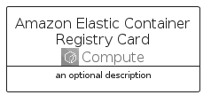

# AmazonElasticContainerRegistry


```text
aws-q1-2023/Architecture/Compute/AmazonElasticContainerRegistry
```

```text
include('aws-q1-2023/Architecture/Compute/AmazonElasticContainerRegistry')
```


| Illustration | AmazonElasticContainerRegistry | AmazonElasticContainerRegistryCard | AmazonElasticContainerRegistryGroup |
| :---: | :---: | :---: | :---: |
|  |  |  |  |


## AmazonElasticContainerRegistry

### Load remotely
```plantuml
@startuml
' configures the library
!global $LIB_BASE_LOCATION="https://raw.githubusercontent.com/tmorin/plantuml-libs/master/distribution"

' loads the library's bootstrap
!include $LIB_BASE_LOCATION/bootstrap.puml

' loads the package bootstrap
include('aws-q1-2023/bootstrap')

' loads the Item which embeds the element AmazonElasticContainerRegistry
include('aws-q1-2023/Architecture/Compute/AmazonElasticContainerRegistry')

' renders the element
AmazonElasticContainerRegistry('AmazonElasticContainerRegistry', 'Amazon Elastic Container Registry', 'an optional tech label', 'an optional description')
@enduml
```

### Load locally
```plantuml
@startuml
' configures the library
!global $INCLUSION_MODE="local"
!global $LIB_BASE_LOCATION="../../.."

' loads the library's bootstrap
!include $LIB_BASE_LOCATION/bootstrap.puml

' loads the package bootstrap
include('aws-q1-2023/bootstrap')

' loads the Item which embeds the element AmazonElasticContainerRegistry
include('aws-q1-2023/Architecture/Compute/AmazonElasticContainerRegistry')

' renders the element
AmazonElasticContainerRegistry('AmazonElasticContainerRegistry', 'Amazon Elastic Container Registry', 'an optional tech label', 'an optional description')
@enduml
```

## AmazonElasticContainerRegistryCard

### Load remotely
```plantuml
@startuml
' configures the library
!global $LIB_BASE_LOCATION="https://raw.githubusercontent.com/tmorin/plantuml-libs/master/distribution"

' loads the library's bootstrap
!include $LIB_BASE_LOCATION/bootstrap.puml

' loads the package bootstrap
include('aws-q1-2023/bootstrap')

' loads the Item which embeds the element AmazonElasticContainerRegistryCard
include('aws-q1-2023/Architecture/Compute/AmazonElasticContainerRegistry')

' renders the element
AmazonElasticContainerRegistryCard('AmazonElasticContainerRegistryCard', 'Amazon Elastic Container Registry Card', 'an optional description')
@enduml
```

### Load locally
```plantuml
@startuml
' configures the library
!global $INCLUSION_MODE="local"
!global $LIB_BASE_LOCATION="../../.."

' loads the library's bootstrap
!include $LIB_BASE_LOCATION/bootstrap.puml

' loads the package bootstrap
include('aws-q1-2023/bootstrap')

' loads the Item which embeds the element AmazonElasticContainerRegistryCard
include('aws-q1-2023/Architecture/Compute/AmazonElasticContainerRegistry')

' renders the element
AmazonElasticContainerRegistryCard('AmazonElasticContainerRegistryCard', 'Amazon Elastic Container Registry Card', 'an optional description')
@enduml
```

## AmazonElasticContainerRegistryGroup

### Load remotely
```plantuml
@startuml
' configures the library
!global $LIB_BASE_LOCATION="https://raw.githubusercontent.com/tmorin/plantuml-libs/master/distribution"

' loads the library's bootstrap
!include $LIB_BASE_LOCATION/bootstrap.puml

' loads the package bootstrap
include('aws-q1-2023/bootstrap')

' loads the Item which embeds the element AmazonElasticContainerRegistryGroup
include('aws-q1-2023/Architecture/Compute/AmazonElasticContainerRegistry')

' renders the element
AmazonElasticContainerRegistryGroup('AmazonElasticContainerRegistryGroup', 'Amazon Elastic Container Registry Group', 'an optional tech label') {
    note as note
        the content of the group
    end note
}
@enduml
```

### Load locally
```plantuml
@startuml
' configures the library
!global $INCLUSION_MODE="local"
!global $LIB_BASE_LOCATION="../../.."

' loads the library's bootstrap
!include $LIB_BASE_LOCATION/bootstrap.puml

' loads the package bootstrap
include('aws-q1-2023/bootstrap')

' loads the Item which embeds the element AmazonElasticContainerRegistryGroup
include('aws-q1-2023/Architecture/Compute/AmazonElasticContainerRegistry')

' renders the element
AmazonElasticContainerRegistryGroup('AmazonElasticContainerRegistryGroup', 'Amazon Elastic Container Registry Group', 'an optional tech label') {
    note as note
        the content of the group
    end note
}
@enduml
```

