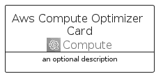

# AwsComputeOptimizer


```text
aws-q1-2023/Architecture/Compute/AwsComputeOptimizer
```

```text
include('aws-q1-2023/Architecture/Compute/AwsComputeOptimizer')
```


| Illustration | AwsComputeOptimizer | AwsComputeOptimizerCard | AwsComputeOptimizerGroup |
| :---: | :---: | :---: | :---: |
|  |  |  |  |


## AwsComputeOptimizer

### Load remotely
```plantuml
@startuml
' configures the library
!global $LIB_BASE_LOCATION="https://raw.githubusercontent.com/tmorin/plantuml-libs/master/distribution"

' loads the library's bootstrap
!include $LIB_BASE_LOCATION/bootstrap.puml

' loads the package bootstrap
include('aws-q1-2023/bootstrap')

' loads the Item which embeds the element AwsComputeOptimizer
include('aws-q1-2023/Architecture/Compute/AwsComputeOptimizer')

' renders the element
AwsComputeOptimizer('AwsComputeOptimizer', 'Aws Compute Optimizer', 'an optional tech label', 'an optional description')
@enduml
```

### Load locally
```plantuml
@startuml
' configures the library
!global $INCLUSION_MODE="local"
!global $LIB_BASE_LOCATION="../../.."

' loads the library's bootstrap
!include $LIB_BASE_LOCATION/bootstrap.puml

' loads the package bootstrap
include('aws-q1-2023/bootstrap')

' loads the Item which embeds the element AwsComputeOptimizer
include('aws-q1-2023/Architecture/Compute/AwsComputeOptimizer')

' renders the element
AwsComputeOptimizer('AwsComputeOptimizer', 'Aws Compute Optimizer', 'an optional tech label', 'an optional description')
@enduml
```

## AwsComputeOptimizerCard

### Load remotely
```plantuml
@startuml
' configures the library
!global $LIB_BASE_LOCATION="https://raw.githubusercontent.com/tmorin/plantuml-libs/master/distribution"

' loads the library's bootstrap
!include $LIB_BASE_LOCATION/bootstrap.puml

' loads the package bootstrap
include('aws-q1-2023/bootstrap')

' loads the Item which embeds the element AwsComputeOptimizerCard
include('aws-q1-2023/Architecture/Compute/AwsComputeOptimizer')

' renders the element
AwsComputeOptimizerCard('AwsComputeOptimizerCard', 'Aws Compute Optimizer Card', 'an optional description')
@enduml
```

### Load locally
```plantuml
@startuml
' configures the library
!global $INCLUSION_MODE="local"
!global $LIB_BASE_LOCATION="../../.."

' loads the library's bootstrap
!include $LIB_BASE_LOCATION/bootstrap.puml

' loads the package bootstrap
include('aws-q1-2023/bootstrap')

' loads the Item which embeds the element AwsComputeOptimizerCard
include('aws-q1-2023/Architecture/Compute/AwsComputeOptimizer')

' renders the element
AwsComputeOptimizerCard('AwsComputeOptimizerCard', 'Aws Compute Optimizer Card', 'an optional description')
@enduml
```

## AwsComputeOptimizerGroup

### Load remotely
```plantuml
@startuml
' configures the library
!global $LIB_BASE_LOCATION="https://raw.githubusercontent.com/tmorin/plantuml-libs/master/distribution"

' loads the library's bootstrap
!include $LIB_BASE_LOCATION/bootstrap.puml

' loads the package bootstrap
include('aws-q1-2023/bootstrap')

' loads the Item which embeds the element AwsComputeOptimizerGroup
include('aws-q1-2023/Architecture/Compute/AwsComputeOptimizer')

' renders the element
AwsComputeOptimizerGroup('AwsComputeOptimizerGroup', 'Aws Compute Optimizer Group', 'an optional tech label') {
    note as note
        the content of the group
    end note
}
@enduml
```

### Load locally
```plantuml
@startuml
' configures the library
!global $INCLUSION_MODE="local"
!global $LIB_BASE_LOCATION="../../.."

' loads the library's bootstrap
!include $LIB_BASE_LOCATION/bootstrap.puml

' loads the package bootstrap
include('aws-q1-2023/bootstrap')

' loads the Item which embeds the element AwsComputeOptimizerGroup
include('aws-q1-2023/Architecture/Compute/AwsComputeOptimizer')

' renders the element
AwsComputeOptimizerGroup('AwsComputeOptimizerGroup', 'Aws Compute Optimizer Group', 'an optional tech label') {
    note as note
        the content of the group
    end note
}
@enduml
```

