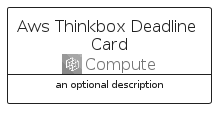

# AwsThinkboxDeadline


```text
aws-q1-2023/Architecture/Compute/AwsThinkboxDeadline
```

```text
include('aws-q1-2023/Architecture/Compute/AwsThinkboxDeadline')
```


| Illustration | AwsThinkboxDeadline | AwsThinkboxDeadlineCard | AwsThinkboxDeadlineGroup |
| :---: | :---: | :---: | :---: |
|  |  |  |  |


## AwsThinkboxDeadline

### Load remotely
```plantuml
@startuml
' configures the library
!global $LIB_BASE_LOCATION="https://raw.githubusercontent.com/tmorin/plantuml-libs/master/distribution"

' loads the library's bootstrap
!include $LIB_BASE_LOCATION/bootstrap.puml

' loads the package bootstrap
include('aws-q1-2023/bootstrap')

' loads the Item which embeds the element AwsThinkboxDeadline
include('aws-q1-2023/Architecture/Compute/AwsThinkboxDeadline')

' renders the element
AwsThinkboxDeadline('AwsThinkboxDeadline', 'Aws Thinkbox Deadline', 'an optional tech label', 'an optional description')
@enduml
```

### Load locally
```plantuml
@startuml
' configures the library
!global $INCLUSION_MODE="local"
!global $LIB_BASE_LOCATION="../../.."

' loads the library's bootstrap
!include $LIB_BASE_LOCATION/bootstrap.puml

' loads the package bootstrap
include('aws-q1-2023/bootstrap')

' loads the Item which embeds the element AwsThinkboxDeadline
include('aws-q1-2023/Architecture/Compute/AwsThinkboxDeadline')

' renders the element
AwsThinkboxDeadline('AwsThinkboxDeadline', 'Aws Thinkbox Deadline', 'an optional tech label', 'an optional description')
@enduml
```

## AwsThinkboxDeadlineCard

### Load remotely
```plantuml
@startuml
' configures the library
!global $LIB_BASE_LOCATION="https://raw.githubusercontent.com/tmorin/plantuml-libs/master/distribution"

' loads the library's bootstrap
!include $LIB_BASE_LOCATION/bootstrap.puml

' loads the package bootstrap
include('aws-q1-2023/bootstrap')

' loads the Item which embeds the element AwsThinkboxDeadlineCard
include('aws-q1-2023/Architecture/Compute/AwsThinkboxDeadline')

' renders the element
AwsThinkboxDeadlineCard('AwsThinkboxDeadlineCard', 'Aws Thinkbox Deadline Card', 'an optional description')
@enduml
```

### Load locally
```plantuml
@startuml
' configures the library
!global $INCLUSION_MODE="local"
!global $LIB_BASE_LOCATION="../../.."

' loads the library's bootstrap
!include $LIB_BASE_LOCATION/bootstrap.puml

' loads the package bootstrap
include('aws-q1-2023/bootstrap')

' loads the Item which embeds the element AwsThinkboxDeadlineCard
include('aws-q1-2023/Architecture/Compute/AwsThinkboxDeadline')

' renders the element
AwsThinkboxDeadlineCard('AwsThinkboxDeadlineCard', 'Aws Thinkbox Deadline Card', 'an optional description')
@enduml
```

## AwsThinkboxDeadlineGroup

### Load remotely
```plantuml
@startuml
' configures the library
!global $LIB_BASE_LOCATION="https://raw.githubusercontent.com/tmorin/plantuml-libs/master/distribution"

' loads the library's bootstrap
!include $LIB_BASE_LOCATION/bootstrap.puml

' loads the package bootstrap
include('aws-q1-2023/bootstrap')

' loads the Item which embeds the element AwsThinkboxDeadlineGroup
include('aws-q1-2023/Architecture/Compute/AwsThinkboxDeadline')

' renders the element
AwsThinkboxDeadlineGroup('AwsThinkboxDeadlineGroup', 'Aws Thinkbox Deadline Group', 'an optional tech label') {
    note as note
        the content of the group
    end note
}
@enduml
```

### Load locally
```plantuml
@startuml
' configures the library
!global $INCLUSION_MODE="local"
!global $LIB_BASE_LOCATION="../../.."

' loads the library's bootstrap
!include $LIB_BASE_LOCATION/bootstrap.puml

' loads the package bootstrap
include('aws-q1-2023/bootstrap')

' loads the Item which embeds the element AwsThinkboxDeadlineGroup
include('aws-q1-2023/Architecture/Compute/AwsThinkboxDeadline')

' renders the element
AwsThinkboxDeadlineGroup('AwsThinkboxDeadlineGroup', 'Aws Thinkbox Deadline Group', 'an optional tech label') {
    note as note
        the content of the group
    end note
}
@enduml
```

