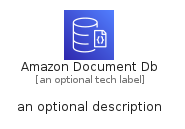
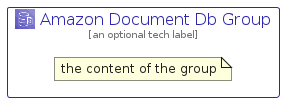

# AmazonDocumentDb


```text
aws-q1-2023/Architecture/Database/AmazonDocumentDb
```

```text
include('aws-q1-2023/Architecture/Database/AmazonDocumentDb')
```


| Illustration | AmazonDocumentDb | AmazonDocumentDbCard | AmazonDocumentDbGroup |
| :---: | :---: | :---: | :---: |
|  |  |  |  |


## AmazonDocumentDb

### Load remotely
```plantuml
@startuml
' configures the library
!global $LIB_BASE_LOCATION="https://raw.githubusercontent.com/tmorin/plantuml-libs/master/distribution"

' loads the library's bootstrap
!include $LIB_BASE_LOCATION/bootstrap.puml

' loads the package bootstrap
include('aws-q1-2023/bootstrap')

' loads the Item which embeds the element AmazonDocumentDb
include('aws-q1-2023/Architecture/Database/AmazonDocumentDb')

' renders the element
AmazonDocumentDb('AmazonDocumentDb', 'Amazon Document Db', 'an optional tech label', 'an optional description')
@enduml
```

### Load locally
```plantuml
@startuml
' configures the library
!global $INCLUSION_MODE="local"
!global $LIB_BASE_LOCATION="../../.."

' loads the library's bootstrap
!include $LIB_BASE_LOCATION/bootstrap.puml

' loads the package bootstrap
include('aws-q1-2023/bootstrap')

' loads the Item which embeds the element AmazonDocumentDb
include('aws-q1-2023/Architecture/Database/AmazonDocumentDb')

' renders the element
AmazonDocumentDb('AmazonDocumentDb', 'Amazon Document Db', 'an optional tech label', 'an optional description')
@enduml
```

## AmazonDocumentDbCard

### Load remotely
```plantuml
@startuml
' configures the library
!global $LIB_BASE_LOCATION="https://raw.githubusercontent.com/tmorin/plantuml-libs/master/distribution"

' loads the library's bootstrap
!include $LIB_BASE_LOCATION/bootstrap.puml

' loads the package bootstrap
include('aws-q1-2023/bootstrap')

' loads the Item which embeds the element AmazonDocumentDbCard
include('aws-q1-2023/Architecture/Database/AmazonDocumentDb')

' renders the element
AmazonDocumentDbCard('AmazonDocumentDbCard', 'Amazon Document Db Card', 'an optional description')
@enduml
```

### Load locally
```plantuml
@startuml
' configures the library
!global $INCLUSION_MODE="local"
!global $LIB_BASE_LOCATION="../../.."

' loads the library's bootstrap
!include $LIB_BASE_LOCATION/bootstrap.puml

' loads the package bootstrap
include('aws-q1-2023/bootstrap')

' loads the Item which embeds the element AmazonDocumentDbCard
include('aws-q1-2023/Architecture/Database/AmazonDocumentDb')

' renders the element
AmazonDocumentDbCard('AmazonDocumentDbCard', 'Amazon Document Db Card', 'an optional description')
@enduml
```

## AmazonDocumentDbGroup

### Load remotely
```plantuml
@startuml
' configures the library
!global $LIB_BASE_LOCATION="https://raw.githubusercontent.com/tmorin/plantuml-libs/master/distribution"

' loads the library's bootstrap
!include $LIB_BASE_LOCATION/bootstrap.puml

' loads the package bootstrap
include('aws-q1-2023/bootstrap')

' loads the Item which embeds the element AmazonDocumentDbGroup
include('aws-q1-2023/Architecture/Database/AmazonDocumentDb')

' renders the element
AmazonDocumentDbGroup('AmazonDocumentDbGroup', 'Amazon Document Db Group', 'an optional tech label') {
    note as note
        the content of the group
    end note
}
@enduml
```

### Load locally
```plantuml
@startuml
' configures the library
!global $INCLUSION_MODE="local"
!global $LIB_BASE_LOCATION="../../.."

' loads the library's bootstrap
!include $LIB_BASE_LOCATION/bootstrap.puml

' loads the package bootstrap
include('aws-q1-2023/bootstrap')

' loads the Item which embeds the element AmazonDocumentDbGroup
include('aws-q1-2023/Architecture/Database/AmazonDocumentDb')

' renders the element
AmazonDocumentDbGroup('AmazonDocumentDbGroup', 'Amazon Document Db Group', 'an optional tech label') {
    note as note
        the content of the group
    end note
}
@enduml
```

