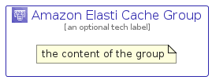

# AmazonElastiCache


```text
aws-q1-2023/Architecture/Database/AmazonElastiCache
```

```text
include('aws-q1-2023/Architecture/Database/AmazonElastiCache')
```


| Illustration | AmazonElastiCache | AmazonElastiCacheCard | AmazonElastiCacheGroup |
| :---: | :---: | :---: | :---: |
|  |  |  |  |


## Sprites
The item provides the following sriptes:

- `<$AmazonElastiCacheXs>`
- `<$AmazonElastiCacheSm>`
- `<$AmazonElastiCacheMd>`
- `<$AmazonElastiCacheLg>`


## AmazonElastiCache

### Load remotely
```plantuml
@startuml
' configures the library
!global $LIB_BASE_LOCATION="https://raw.githubusercontent.com/tmorin/plantuml-libs/master/distribution"

' loads the library's bootstrap
!include $LIB_BASE_LOCATION/bootstrap.puml

' loads the package bootstrap
include('aws-q1-2023/bootstrap')

' loads the Item which embeds the element AmazonElastiCache
include('aws-q1-2023/Architecture/Database/AmazonElastiCache')

' renders the element
AmazonElastiCache('AmazonElastiCache', 'Amazon Elasti Cache', 'an optional tech label', 'an optional description')
@enduml
```

### Load locally
```plantuml
@startuml
' configures the library
!global $INCLUSION_MODE="local"
!global $LIB_BASE_LOCATION="../../.."

' loads the library's bootstrap
!include $LIB_BASE_LOCATION/bootstrap.puml

' loads the package bootstrap
include('aws-q1-2023/bootstrap')

' loads the Item which embeds the element AmazonElastiCache
include('aws-q1-2023/Architecture/Database/AmazonElastiCache')

' renders the element
AmazonElastiCache('AmazonElastiCache', 'Amazon Elasti Cache', 'an optional tech label', 'an optional description')
@enduml
```

## AmazonElastiCacheCard

### Load remotely
```plantuml
@startuml
' configures the library
!global $LIB_BASE_LOCATION="https://raw.githubusercontent.com/tmorin/plantuml-libs/master/distribution"

' loads the library's bootstrap
!include $LIB_BASE_LOCATION/bootstrap.puml

' loads the package bootstrap
include('aws-q1-2023/bootstrap')

' loads the Item which embeds the element AmazonElastiCacheCard
include('aws-q1-2023/Architecture/Database/AmazonElastiCache')

' renders the element
AmazonElastiCacheCard('AmazonElastiCacheCard', 'Amazon Elasti Cache Card', 'an optional description')
@enduml
```

### Load locally
```plantuml
@startuml
' configures the library
!global $INCLUSION_MODE="local"
!global $LIB_BASE_LOCATION="../../.."

' loads the library's bootstrap
!include $LIB_BASE_LOCATION/bootstrap.puml

' loads the package bootstrap
include('aws-q1-2023/bootstrap')

' loads the Item which embeds the element AmazonElastiCacheCard
include('aws-q1-2023/Architecture/Database/AmazonElastiCache')

' renders the element
AmazonElastiCacheCard('AmazonElastiCacheCard', 'Amazon Elasti Cache Card', 'an optional description')
@enduml
```

## AmazonElastiCacheGroup

### Load remotely
```plantuml
@startuml
' configures the library
!global $LIB_BASE_LOCATION="https://raw.githubusercontent.com/tmorin/plantuml-libs/master/distribution"

' loads the library's bootstrap
!include $LIB_BASE_LOCATION/bootstrap.puml

' loads the package bootstrap
include('aws-q1-2023/bootstrap')

' loads the Item which embeds the element AmazonElastiCacheGroup
include('aws-q1-2023/Architecture/Database/AmazonElastiCache')

' renders the element
AmazonElastiCacheGroup('AmazonElastiCacheGroup', 'Amazon Elasti Cache Group', 'an optional tech label') {
    note as note
        the content of the group
    end note
}
@enduml
```

### Load locally
```plantuml
@startuml
' configures the library
!global $INCLUSION_MODE="local"
!global $LIB_BASE_LOCATION="../../.."

' loads the library's bootstrap
!include $LIB_BASE_LOCATION/bootstrap.puml

' loads the package bootstrap
include('aws-q1-2023/bootstrap')

' loads the Item which embeds the element AmazonElastiCacheGroup
include('aws-q1-2023/Architecture/Database/AmazonElastiCache')

' renders the element
AmazonElastiCacheGroup('AmazonElastiCacheGroup', 'Amazon Elasti Cache Group', 'an optional tech label') {
    note as note
        the content of the group
    end note
}
@enduml
```

