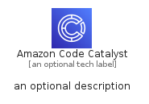

# AmazonCodeCatalyst


```text
aws-q1-2023/Architecture/DeveloperTools/AmazonCodeCatalyst
```

```text
include('aws-q1-2023/Architecture/DeveloperTools/AmazonCodeCatalyst')
```


| Illustration | AmazonCodeCatalyst | AmazonCodeCatalystCard | AmazonCodeCatalystGroup |
| :---: | :---: | :---: | :---: |
|  |  |  |  |


## Sprites
The item provides the following sriptes:

- `<$AmazonCodeCatalystXs>`
- `<$AmazonCodeCatalystSm>`
- `<$AmazonCodeCatalystMd>`
- `<$AmazonCodeCatalystLg>`


## AmazonCodeCatalyst

### Load remotely
```plantuml
@startuml
' configures the library
!global $LIB_BASE_LOCATION="https://raw.githubusercontent.com/tmorin/plantuml-libs/master/distribution"

' loads the library's bootstrap
!include $LIB_BASE_LOCATION/bootstrap.puml

' loads the package bootstrap
include('aws-q1-2023/bootstrap')

' loads the Item which embeds the element AmazonCodeCatalyst
include('aws-q1-2023/Architecture/DeveloperTools/AmazonCodeCatalyst')

' renders the element
AmazonCodeCatalyst('AmazonCodeCatalyst', 'Amazon Code Catalyst', 'an optional tech label', 'an optional description')
@enduml
```

### Load locally
```plantuml
@startuml
' configures the library
!global $INCLUSION_MODE="local"
!global $LIB_BASE_LOCATION="../../.."

' loads the library's bootstrap
!include $LIB_BASE_LOCATION/bootstrap.puml

' loads the package bootstrap
include('aws-q1-2023/bootstrap')

' loads the Item which embeds the element AmazonCodeCatalyst
include('aws-q1-2023/Architecture/DeveloperTools/AmazonCodeCatalyst')

' renders the element
AmazonCodeCatalyst('AmazonCodeCatalyst', 'Amazon Code Catalyst', 'an optional tech label', 'an optional description')
@enduml
```

## AmazonCodeCatalystCard

### Load remotely
```plantuml
@startuml
' configures the library
!global $LIB_BASE_LOCATION="https://raw.githubusercontent.com/tmorin/plantuml-libs/master/distribution"

' loads the library's bootstrap
!include $LIB_BASE_LOCATION/bootstrap.puml

' loads the package bootstrap
include('aws-q1-2023/bootstrap')

' loads the Item which embeds the element AmazonCodeCatalystCard
include('aws-q1-2023/Architecture/DeveloperTools/AmazonCodeCatalyst')

' renders the element
AmazonCodeCatalystCard('AmazonCodeCatalystCard', 'Amazon Code Catalyst Card', 'an optional description')
@enduml
```

### Load locally
```plantuml
@startuml
' configures the library
!global $INCLUSION_MODE="local"
!global $LIB_BASE_LOCATION="../../.."

' loads the library's bootstrap
!include $LIB_BASE_LOCATION/bootstrap.puml

' loads the package bootstrap
include('aws-q1-2023/bootstrap')

' loads the Item which embeds the element AmazonCodeCatalystCard
include('aws-q1-2023/Architecture/DeveloperTools/AmazonCodeCatalyst')

' renders the element
AmazonCodeCatalystCard('AmazonCodeCatalystCard', 'Amazon Code Catalyst Card', 'an optional description')
@enduml
```

## AmazonCodeCatalystGroup

### Load remotely
```plantuml
@startuml
' configures the library
!global $LIB_BASE_LOCATION="https://raw.githubusercontent.com/tmorin/plantuml-libs/master/distribution"

' loads the library's bootstrap
!include $LIB_BASE_LOCATION/bootstrap.puml

' loads the package bootstrap
include('aws-q1-2023/bootstrap')

' loads the Item which embeds the element AmazonCodeCatalystGroup
include('aws-q1-2023/Architecture/DeveloperTools/AmazonCodeCatalyst')

' renders the element
AmazonCodeCatalystGroup('AmazonCodeCatalystGroup', 'Amazon Code Catalyst Group', 'an optional tech label') {
    note as note
        the content of the group
    end note
}
@enduml
```

### Load locally
```plantuml
@startuml
' configures the library
!global $INCLUSION_MODE="local"
!global $LIB_BASE_LOCATION="../../.."

' loads the library's bootstrap
!include $LIB_BASE_LOCATION/bootstrap.puml

' loads the package bootstrap
include('aws-q1-2023/bootstrap')

' loads the Item which embeds the element AmazonCodeCatalystGroup
include('aws-q1-2023/Architecture/DeveloperTools/AmazonCodeCatalyst')

' renders the element
AmazonCodeCatalystGroup('AmazonCodeCatalystGroup', 'Amazon Code Catalyst Group', 'an optional tech label') {
    note as note
        the content of the group
    end note
}
@enduml
```

