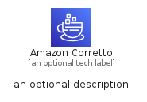

# AmazonCorretto


```text
aws-q1-2023/Architecture/DeveloperTools/AmazonCorretto
```

```text
include('aws-q1-2023/Architecture/DeveloperTools/AmazonCorretto')
```


| Illustration | AmazonCorretto | AmazonCorrettoCard | AmazonCorrettoGroup |
| :---: | :---: | :---: | :---: |
|  |  |  |  |


## AmazonCorretto

### Load remotely
```plantuml
@startuml
' configures the library
!global $LIB_BASE_LOCATION="https://raw.githubusercontent.com/tmorin/plantuml-libs/master/distribution"

' loads the library's bootstrap
!include $LIB_BASE_LOCATION/bootstrap.puml

' loads the package bootstrap
include('aws-q1-2023/bootstrap')

' loads the Item which embeds the element AmazonCorretto
include('aws-q1-2023/Architecture/DeveloperTools/AmazonCorretto')

' renders the element
AmazonCorretto('AmazonCorretto', 'Amazon Corretto', 'an optional tech label', 'an optional description')
@enduml
```

### Load locally
```plantuml
@startuml
' configures the library
!global $INCLUSION_MODE="local"
!global $LIB_BASE_LOCATION="../../.."

' loads the library's bootstrap
!include $LIB_BASE_LOCATION/bootstrap.puml

' loads the package bootstrap
include('aws-q1-2023/bootstrap')

' loads the Item which embeds the element AmazonCorretto
include('aws-q1-2023/Architecture/DeveloperTools/AmazonCorretto')

' renders the element
AmazonCorretto('AmazonCorretto', 'Amazon Corretto', 'an optional tech label', 'an optional description')
@enduml
```

## AmazonCorrettoCard

### Load remotely
```plantuml
@startuml
' configures the library
!global $LIB_BASE_LOCATION="https://raw.githubusercontent.com/tmorin/plantuml-libs/master/distribution"

' loads the library's bootstrap
!include $LIB_BASE_LOCATION/bootstrap.puml

' loads the package bootstrap
include('aws-q1-2023/bootstrap')

' loads the Item which embeds the element AmazonCorrettoCard
include('aws-q1-2023/Architecture/DeveloperTools/AmazonCorretto')

' renders the element
AmazonCorrettoCard('AmazonCorrettoCard', 'Amazon Corretto Card', 'an optional description')
@enduml
```

### Load locally
```plantuml
@startuml
' configures the library
!global $INCLUSION_MODE="local"
!global $LIB_BASE_LOCATION="../../.."

' loads the library's bootstrap
!include $LIB_BASE_LOCATION/bootstrap.puml

' loads the package bootstrap
include('aws-q1-2023/bootstrap')

' loads the Item which embeds the element AmazonCorrettoCard
include('aws-q1-2023/Architecture/DeveloperTools/AmazonCorretto')

' renders the element
AmazonCorrettoCard('AmazonCorrettoCard', 'Amazon Corretto Card', 'an optional description')
@enduml
```

## AmazonCorrettoGroup

### Load remotely
```plantuml
@startuml
' configures the library
!global $LIB_BASE_LOCATION="https://raw.githubusercontent.com/tmorin/plantuml-libs/master/distribution"

' loads the library's bootstrap
!include $LIB_BASE_LOCATION/bootstrap.puml

' loads the package bootstrap
include('aws-q1-2023/bootstrap')

' loads the Item which embeds the element AmazonCorrettoGroup
include('aws-q1-2023/Architecture/DeveloperTools/AmazonCorretto')

' renders the element
AmazonCorrettoGroup('AmazonCorrettoGroup', 'Amazon Corretto Group', 'an optional tech label') {
    note as note
        the content of the group
    end note
}
@enduml
```

### Load locally
```plantuml
@startuml
' configures the library
!global $INCLUSION_MODE="local"
!global $LIB_BASE_LOCATION="../../.."

' loads the library's bootstrap
!include $LIB_BASE_LOCATION/bootstrap.puml

' loads the package bootstrap
include('aws-q1-2023/bootstrap')

' loads the Item which embeds the element AmazonCorrettoGroup
include('aws-q1-2023/Architecture/DeveloperTools/AmazonCorretto')

' renders the element
AmazonCorrettoGroup('AmazonCorrettoGroup', 'Amazon Corretto Group', 'an optional tech label') {
    note as note
        the content of the group
    end note
}
@enduml
```

