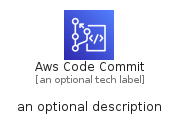
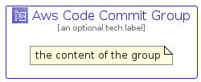

# AwsCodeCommit


```text
aws-q1-2023/Architecture/DeveloperTools/AwsCodeCommit
```

```text
include('aws-q1-2023/Architecture/DeveloperTools/AwsCodeCommit')
```


| Illustration | AwsCodeCommit | AwsCodeCommitCard | AwsCodeCommitGroup |
| :---: | :---: | :---: | :---: |
|  |  |  |  |


## Sprites
The item provides the following sriptes:

- `<$AwsCodeCommitXs>`
- `<$AwsCodeCommitSm>`
- `<$AwsCodeCommitMd>`
- `<$AwsCodeCommitLg>`


## AwsCodeCommit

### Load remotely
```plantuml
@startuml
' configures the library
!global $LIB_BASE_LOCATION="https://raw.githubusercontent.com/tmorin/plantuml-libs/master/distribution"

' loads the library's bootstrap
!include $LIB_BASE_LOCATION/bootstrap.puml

' loads the package bootstrap
include('aws-q1-2023/bootstrap')

' loads the Item which embeds the element AwsCodeCommit
include('aws-q1-2023/Architecture/DeveloperTools/AwsCodeCommit')

' renders the element
AwsCodeCommit('AwsCodeCommit', 'Aws Code Commit', 'an optional tech label', 'an optional description')
@enduml
```

### Load locally
```plantuml
@startuml
' configures the library
!global $INCLUSION_MODE="local"
!global $LIB_BASE_LOCATION="../../.."

' loads the library's bootstrap
!include $LIB_BASE_LOCATION/bootstrap.puml

' loads the package bootstrap
include('aws-q1-2023/bootstrap')

' loads the Item which embeds the element AwsCodeCommit
include('aws-q1-2023/Architecture/DeveloperTools/AwsCodeCommit')

' renders the element
AwsCodeCommit('AwsCodeCommit', 'Aws Code Commit', 'an optional tech label', 'an optional description')
@enduml
```

## AwsCodeCommitCard

### Load remotely
```plantuml
@startuml
' configures the library
!global $LIB_BASE_LOCATION="https://raw.githubusercontent.com/tmorin/plantuml-libs/master/distribution"

' loads the library's bootstrap
!include $LIB_BASE_LOCATION/bootstrap.puml

' loads the package bootstrap
include('aws-q1-2023/bootstrap')

' loads the Item which embeds the element AwsCodeCommitCard
include('aws-q1-2023/Architecture/DeveloperTools/AwsCodeCommit')

' renders the element
AwsCodeCommitCard('AwsCodeCommitCard', 'Aws Code Commit Card', 'an optional description')
@enduml
```

### Load locally
```plantuml
@startuml
' configures the library
!global $INCLUSION_MODE="local"
!global $LIB_BASE_LOCATION="../../.."

' loads the library's bootstrap
!include $LIB_BASE_LOCATION/bootstrap.puml

' loads the package bootstrap
include('aws-q1-2023/bootstrap')

' loads the Item which embeds the element AwsCodeCommitCard
include('aws-q1-2023/Architecture/DeveloperTools/AwsCodeCommit')

' renders the element
AwsCodeCommitCard('AwsCodeCommitCard', 'Aws Code Commit Card', 'an optional description')
@enduml
```

## AwsCodeCommitGroup

### Load remotely
```plantuml
@startuml
' configures the library
!global $LIB_BASE_LOCATION="https://raw.githubusercontent.com/tmorin/plantuml-libs/master/distribution"

' loads the library's bootstrap
!include $LIB_BASE_LOCATION/bootstrap.puml

' loads the package bootstrap
include('aws-q1-2023/bootstrap')

' loads the Item which embeds the element AwsCodeCommitGroup
include('aws-q1-2023/Architecture/DeveloperTools/AwsCodeCommit')

' renders the element
AwsCodeCommitGroup('AwsCodeCommitGroup', 'Aws Code Commit Group', 'an optional tech label') {
    note as note
        the content of the group
    end note
}
@enduml
```

### Load locally
```plantuml
@startuml
' configures the library
!global $INCLUSION_MODE="local"
!global $LIB_BASE_LOCATION="../../.."

' loads the library's bootstrap
!include $LIB_BASE_LOCATION/bootstrap.puml

' loads the package bootstrap
include('aws-q1-2023/bootstrap')

' loads the Item which embeds the element AwsCodeCommitGroup
include('aws-q1-2023/Architecture/DeveloperTools/AwsCodeCommit')

' renders the element
AwsCodeCommitGroup('AwsCodeCommitGroup', 'Aws Code Commit Group', 'an optional tech label') {
    note as note
        the content of the group
    end note
}
@enduml
```

