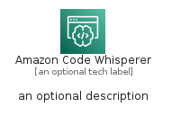
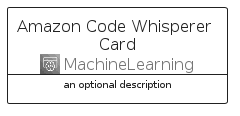
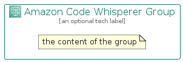

# AmazonCodeWhisperer


```text
aws-q1-2023/Architecture/MachineLearning/AmazonCodeWhisperer
```

```text
include('aws-q1-2023/Architecture/MachineLearning/AmazonCodeWhisperer')
```


| Illustration | AmazonCodeWhisperer | AmazonCodeWhispererCard | AmazonCodeWhispererGroup |
| :---: | :---: | :---: | :---: |
|  |  |  |  |


## AmazonCodeWhisperer

### Load remotely
```plantuml
@startuml
' configures the library
!global $LIB_BASE_LOCATION="https://raw.githubusercontent.com/tmorin/plantuml-libs/master/distribution"

' loads the library's bootstrap
!include $LIB_BASE_LOCATION/bootstrap.puml

' loads the package bootstrap
include('aws-q1-2023/bootstrap')

' loads the Item which embeds the element AmazonCodeWhisperer
include('aws-q1-2023/Architecture/MachineLearning/AmazonCodeWhisperer')

' renders the element
AmazonCodeWhisperer('AmazonCodeWhisperer', 'Amazon Code Whisperer', 'an optional tech label', 'an optional description')
@enduml
```

### Load locally
```plantuml
@startuml
' configures the library
!global $INCLUSION_MODE="local"
!global $LIB_BASE_LOCATION="../../.."

' loads the library's bootstrap
!include $LIB_BASE_LOCATION/bootstrap.puml

' loads the package bootstrap
include('aws-q1-2023/bootstrap')

' loads the Item which embeds the element AmazonCodeWhisperer
include('aws-q1-2023/Architecture/MachineLearning/AmazonCodeWhisperer')

' renders the element
AmazonCodeWhisperer('AmazonCodeWhisperer', 'Amazon Code Whisperer', 'an optional tech label', 'an optional description')
@enduml
```

## AmazonCodeWhispererCard

### Load remotely
```plantuml
@startuml
' configures the library
!global $LIB_BASE_LOCATION="https://raw.githubusercontent.com/tmorin/plantuml-libs/master/distribution"

' loads the library's bootstrap
!include $LIB_BASE_LOCATION/bootstrap.puml

' loads the package bootstrap
include('aws-q1-2023/bootstrap')

' loads the Item which embeds the element AmazonCodeWhispererCard
include('aws-q1-2023/Architecture/MachineLearning/AmazonCodeWhisperer')

' renders the element
AmazonCodeWhispererCard('AmazonCodeWhispererCard', 'Amazon Code Whisperer Card', 'an optional description')
@enduml
```

### Load locally
```plantuml
@startuml
' configures the library
!global $INCLUSION_MODE="local"
!global $LIB_BASE_LOCATION="../../.."

' loads the library's bootstrap
!include $LIB_BASE_LOCATION/bootstrap.puml

' loads the package bootstrap
include('aws-q1-2023/bootstrap')

' loads the Item which embeds the element AmazonCodeWhispererCard
include('aws-q1-2023/Architecture/MachineLearning/AmazonCodeWhisperer')

' renders the element
AmazonCodeWhispererCard('AmazonCodeWhispererCard', 'Amazon Code Whisperer Card', 'an optional description')
@enduml
```

## AmazonCodeWhispererGroup

### Load remotely
```plantuml
@startuml
' configures the library
!global $LIB_BASE_LOCATION="https://raw.githubusercontent.com/tmorin/plantuml-libs/master/distribution"

' loads the library's bootstrap
!include $LIB_BASE_LOCATION/bootstrap.puml

' loads the package bootstrap
include('aws-q1-2023/bootstrap')

' loads the Item which embeds the element AmazonCodeWhispererGroup
include('aws-q1-2023/Architecture/MachineLearning/AmazonCodeWhisperer')

' renders the element
AmazonCodeWhispererGroup('AmazonCodeWhispererGroup', 'Amazon Code Whisperer Group', 'an optional tech label') {
    note as note
        the content of the group
    end note
}
@enduml
```

### Load locally
```plantuml
@startuml
' configures the library
!global $INCLUSION_MODE="local"
!global $LIB_BASE_LOCATION="../../.."

' loads the library's bootstrap
!include $LIB_BASE_LOCATION/bootstrap.puml

' loads the package bootstrap
include('aws-q1-2023/bootstrap')

' loads the Item which embeds the element AmazonCodeWhispererGroup
include('aws-q1-2023/Architecture/MachineLearning/AmazonCodeWhisperer')

' renders the element
AmazonCodeWhispererGroup('AmazonCodeWhispererGroup', 'Amazon Code Whisperer Group', 'an optional tech label') {
    note as note
        the content of the group
    end note
}
@enduml
```

