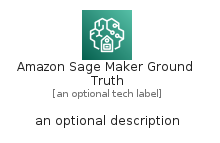
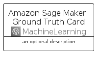
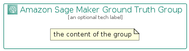

# AmazonSageMakerGroundTruth


```text
aws-q1-2023/Architecture/MachineLearning/AmazonSageMakerGroundTruth
```

```text
include('aws-q1-2023/Architecture/MachineLearning/AmazonSageMakerGroundTruth')
```


| Illustration | AmazonSageMakerGroundTruth | AmazonSageMakerGroundTruthCard | AmazonSageMakerGroundTruthGroup |
| :---: | :---: | :---: | :---: |
|  |  |  |  |


## AmazonSageMakerGroundTruth

### Load remotely
```plantuml
@startuml
' configures the library
!global $LIB_BASE_LOCATION="https://raw.githubusercontent.com/tmorin/plantuml-libs/master/distribution"

' loads the library's bootstrap
!include $LIB_BASE_LOCATION/bootstrap.puml

' loads the package bootstrap
include('aws-q1-2023/bootstrap')

' loads the Item which embeds the element AmazonSageMakerGroundTruth
include('aws-q1-2023/Architecture/MachineLearning/AmazonSageMakerGroundTruth')

' renders the element
AmazonSageMakerGroundTruth('AmazonSageMakerGroundTruth', 'Amazon Sage Maker Ground Truth', 'an optional tech label', 'an optional description')
@enduml
```

### Load locally
```plantuml
@startuml
' configures the library
!global $INCLUSION_MODE="local"
!global $LIB_BASE_LOCATION="../../.."

' loads the library's bootstrap
!include $LIB_BASE_LOCATION/bootstrap.puml

' loads the package bootstrap
include('aws-q1-2023/bootstrap')

' loads the Item which embeds the element AmazonSageMakerGroundTruth
include('aws-q1-2023/Architecture/MachineLearning/AmazonSageMakerGroundTruth')

' renders the element
AmazonSageMakerGroundTruth('AmazonSageMakerGroundTruth', 'Amazon Sage Maker Ground Truth', 'an optional tech label', 'an optional description')
@enduml
```

## AmazonSageMakerGroundTruthCard

### Load remotely
```plantuml
@startuml
' configures the library
!global $LIB_BASE_LOCATION="https://raw.githubusercontent.com/tmorin/plantuml-libs/master/distribution"

' loads the library's bootstrap
!include $LIB_BASE_LOCATION/bootstrap.puml

' loads the package bootstrap
include('aws-q1-2023/bootstrap')

' loads the Item which embeds the element AmazonSageMakerGroundTruthCard
include('aws-q1-2023/Architecture/MachineLearning/AmazonSageMakerGroundTruth')

' renders the element
AmazonSageMakerGroundTruthCard('AmazonSageMakerGroundTruthCard', 'Amazon Sage Maker Ground Truth Card', 'an optional description')
@enduml
```

### Load locally
```plantuml
@startuml
' configures the library
!global $INCLUSION_MODE="local"
!global $LIB_BASE_LOCATION="../../.."

' loads the library's bootstrap
!include $LIB_BASE_LOCATION/bootstrap.puml

' loads the package bootstrap
include('aws-q1-2023/bootstrap')

' loads the Item which embeds the element AmazonSageMakerGroundTruthCard
include('aws-q1-2023/Architecture/MachineLearning/AmazonSageMakerGroundTruth')

' renders the element
AmazonSageMakerGroundTruthCard('AmazonSageMakerGroundTruthCard', 'Amazon Sage Maker Ground Truth Card', 'an optional description')
@enduml
```

## AmazonSageMakerGroundTruthGroup

### Load remotely
```plantuml
@startuml
' configures the library
!global $LIB_BASE_LOCATION="https://raw.githubusercontent.com/tmorin/plantuml-libs/master/distribution"

' loads the library's bootstrap
!include $LIB_BASE_LOCATION/bootstrap.puml

' loads the package bootstrap
include('aws-q1-2023/bootstrap')

' loads the Item which embeds the element AmazonSageMakerGroundTruthGroup
include('aws-q1-2023/Architecture/MachineLearning/AmazonSageMakerGroundTruth')

' renders the element
AmazonSageMakerGroundTruthGroup('AmazonSageMakerGroundTruthGroup', 'Amazon Sage Maker Ground Truth Group', 'an optional tech label') {
    note as note
        the content of the group
    end note
}
@enduml
```

### Load locally
```plantuml
@startuml
' configures the library
!global $INCLUSION_MODE="local"
!global $LIB_BASE_LOCATION="../../.."

' loads the library's bootstrap
!include $LIB_BASE_LOCATION/bootstrap.puml

' loads the package bootstrap
include('aws-q1-2023/bootstrap')

' loads the Item which embeds the element AmazonSageMakerGroundTruthGroup
include('aws-q1-2023/Architecture/MachineLearning/AmazonSageMakerGroundTruth')

' renders the element
AmazonSageMakerGroundTruthGroup('AmazonSageMakerGroundTruthGroup', 'Amazon Sage Maker Ground Truth Group', 'an optional tech label') {
    note as note
        the content of the group
    end note
}
@enduml
```

