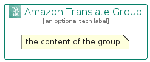

# AmazonTranslate


```text
aws-q1-2023/Architecture/MachineLearning/AmazonTranslate
```

```text
include('aws-q1-2023/Architecture/MachineLearning/AmazonTranslate')
```


| Illustration | AmazonTranslate | AmazonTranslateCard | AmazonTranslateGroup |
| :---: | :---: | :---: | :---: |
|  |  |  |  |


## Sprites
The item provides the following sriptes:

- `<$AmazonTranslateXs>`
- `<$AmazonTranslateSm>`
- `<$AmazonTranslateMd>`
- `<$AmazonTranslateLg>`


## AmazonTranslate

### Load remotely
```plantuml
@startuml
' configures the library
!global $LIB_BASE_LOCATION="https://raw.githubusercontent.com/tmorin/plantuml-libs/master/distribution"

' loads the library's bootstrap
!include $LIB_BASE_LOCATION/bootstrap.puml

' loads the package bootstrap
include('aws-q1-2023/bootstrap')

' loads the Item which embeds the element AmazonTranslate
include('aws-q1-2023/Architecture/MachineLearning/AmazonTranslate')

' renders the element
AmazonTranslate('AmazonTranslate', 'Amazon Translate', 'an optional tech label', 'an optional description')
@enduml
```

### Load locally
```plantuml
@startuml
' configures the library
!global $INCLUSION_MODE="local"
!global $LIB_BASE_LOCATION="../../.."

' loads the library's bootstrap
!include $LIB_BASE_LOCATION/bootstrap.puml

' loads the package bootstrap
include('aws-q1-2023/bootstrap')

' loads the Item which embeds the element AmazonTranslate
include('aws-q1-2023/Architecture/MachineLearning/AmazonTranslate')

' renders the element
AmazonTranslate('AmazonTranslate', 'Amazon Translate', 'an optional tech label', 'an optional description')
@enduml
```

## AmazonTranslateCard

### Load remotely
```plantuml
@startuml
' configures the library
!global $LIB_BASE_LOCATION="https://raw.githubusercontent.com/tmorin/plantuml-libs/master/distribution"

' loads the library's bootstrap
!include $LIB_BASE_LOCATION/bootstrap.puml

' loads the package bootstrap
include('aws-q1-2023/bootstrap')

' loads the Item which embeds the element AmazonTranslateCard
include('aws-q1-2023/Architecture/MachineLearning/AmazonTranslate')

' renders the element
AmazonTranslateCard('AmazonTranslateCard', 'Amazon Translate Card', 'an optional description')
@enduml
```

### Load locally
```plantuml
@startuml
' configures the library
!global $INCLUSION_MODE="local"
!global $LIB_BASE_LOCATION="../../.."

' loads the library's bootstrap
!include $LIB_BASE_LOCATION/bootstrap.puml

' loads the package bootstrap
include('aws-q1-2023/bootstrap')

' loads the Item which embeds the element AmazonTranslateCard
include('aws-q1-2023/Architecture/MachineLearning/AmazonTranslate')

' renders the element
AmazonTranslateCard('AmazonTranslateCard', 'Amazon Translate Card', 'an optional description')
@enduml
```

## AmazonTranslateGroup

### Load remotely
```plantuml
@startuml
' configures the library
!global $LIB_BASE_LOCATION="https://raw.githubusercontent.com/tmorin/plantuml-libs/master/distribution"

' loads the library's bootstrap
!include $LIB_BASE_LOCATION/bootstrap.puml

' loads the package bootstrap
include('aws-q1-2023/bootstrap')

' loads the Item which embeds the element AmazonTranslateGroup
include('aws-q1-2023/Architecture/MachineLearning/AmazonTranslate')

' renders the element
AmazonTranslateGroup('AmazonTranslateGroup', 'Amazon Translate Group', 'an optional tech label') {
    note as note
        the content of the group
    end note
}
@enduml
```

### Load locally
```plantuml
@startuml
' configures the library
!global $INCLUSION_MODE="local"
!global $LIB_BASE_LOCATION="../../.."

' loads the library's bootstrap
!include $LIB_BASE_LOCATION/bootstrap.puml

' loads the package bootstrap
include('aws-q1-2023/bootstrap')

' loads the Item which embeds the element AmazonTranslateGroup
include('aws-q1-2023/Architecture/MachineLearning/AmazonTranslate')

' renders the element
AmazonTranslateGroup('AmazonTranslateGroup', 'Amazon Translate Group', 'an optional tech label') {
    note as note
        the content of the group
    end note
}
@enduml
```

