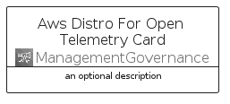
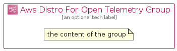

# AwsDistroForOpenTelemetry


```text
aws-q1-2023/Architecture/ManagementGovernance/AwsDistroForOpenTelemetry
```

```text
include('aws-q1-2023/Architecture/ManagementGovernance/AwsDistroForOpenTelemetry')
```


| Illustration | AwsDistroForOpenTelemetry | AwsDistroForOpenTelemetryCard | AwsDistroForOpenTelemetryGroup |
| :---: | :---: | :---: | :---: |
|  |  |  |  |


## AwsDistroForOpenTelemetry

### Load remotely
```plantuml
@startuml
' configures the library
!global $LIB_BASE_LOCATION="https://raw.githubusercontent.com/tmorin/plantuml-libs/master/distribution"

' loads the library's bootstrap
!include $LIB_BASE_LOCATION/bootstrap.puml

' loads the package bootstrap
include('aws-q1-2023/bootstrap')

' loads the Item which embeds the element AwsDistroForOpenTelemetry
include('aws-q1-2023/Architecture/ManagementGovernance/AwsDistroForOpenTelemetry')

' renders the element
AwsDistroForOpenTelemetry('AwsDistroForOpenTelemetry', 'Aws Distro For Open Telemetry', 'an optional tech label', 'an optional description')
@enduml
```

### Load locally
```plantuml
@startuml
' configures the library
!global $INCLUSION_MODE="local"
!global $LIB_BASE_LOCATION="../../.."

' loads the library's bootstrap
!include $LIB_BASE_LOCATION/bootstrap.puml

' loads the package bootstrap
include('aws-q1-2023/bootstrap')

' loads the Item which embeds the element AwsDistroForOpenTelemetry
include('aws-q1-2023/Architecture/ManagementGovernance/AwsDistroForOpenTelemetry')

' renders the element
AwsDistroForOpenTelemetry('AwsDistroForOpenTelemetry', 'Aws Distro For Open Telemetry', 'an optional tech label', 'an optional description')
@enduml
```

## AwsDistroForOpenTelemetryCard

### Load remotely
```plantuml
@startuml
' configures the library
!global $LIB_BASE_LOCATION="https://raw.githubusercontent.com/tmorin/plantuml-libs/master/distribution"

' loads the library's bootstrap
!include $LIB_BASE_LOCATION/bootstrap.puml

' loads the package bootstrap
include('aws-q1-2023/bootstrap')

' loads the Item which embeds the element AwsDistroForOpenTelemetryCard
include('aws-q1-2023/Architecture/ManagementGovernance/AwsDistroForOpenTelemetry')

' renders the element
AwsDistroForOpenTelemetryCard('AwsDistroForOpenTelemetryCard', 'Aws Distro For Open Telemetry Card', 'an optional description')
@enduml
```

### Load locally
```plantuml
@startuml
' configures the library
!global $INCLUSION_MODE="local"
!global $LIB_BASE_LOCATION="../../.."

' loads the library's bootstrap
!include $LIB_BASE_LOCATION/bootstrap.puml

' loads the package bootstrap
include('aws-q1-2023/bootstrap')

' loads the Item which embeds the element AwsDistroForOpenTelemetryCard
include('aws-q1-2023/Architecture/ManagementGovernance/AwsDistroForOpenTelemetry')

' renders the element
AwsDistroForOpenTelemetryCard('AwsDistroForOpenTelemetryCard', 'Aws Distro For Open Telemetry Card', 'an optional description')
@enduml
```

## AwsDistroForOpenTelemetryGroup

### Load remotely
```plantuml
@startuml
' configures the library
!global $LIB_BASE_LOCATION="https://raw.githubusercontent.com/tmorin/plantuml-libs/master/distribution"

' loads the library's bootstrap
!include $LIB_BASE_LOCATION/bootstrap.puml

' loads the package bootstrap
include('aws-q1-2023/bootstrap')

' loads the Item which embeds the element AwsDistroForOpenTelemetryGroup
include('aws-q1-2023/Architecture/ManagementGovernance/AwsDistroForOpenTelemetry')

' renders the element
AwsDistroForOpenTelemetryGroup('AwsDistroForOpenTelemetryGroup', 'Aws Distro For Open Telemetry Group', 'an optional tech label') {
    note as note
        the content of the group
    end note
}
@enduml
```

### Load locally
```plantuml
@startuml
' configures the library
!global $INCLUSION_MODE="local"
!global $LIB_BASE_LOCATION="../../.."

' loads the library's bootstrap
!include $LIB_BASE_LOCATION/bootstrap.puml

' loads the package bootstrap
include('aws-q1-2023/bootstrap')

' loads the Item which embeds the element AwsDistroForOpenTelemetryGroup
include('aws-q1-2023/Architecture/ManagementGovernance/AwsDistroForOpenTelemetry')

' renders the element
AwsDistroForOpenTelemetryGroup('AwsDistroForOpenTelemetryGroup', 'Aws Distro For Open Telemetry Group', 'an optional tech label') {
    note as note
        the content of the group
    end note
}
@enduml
```

