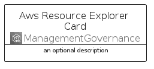
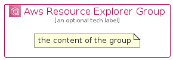

# AwsResourceExplorer


```text
aws-q1-2023/Architecture/ManagementGovernance/AwsResourceExplorer
```

```text
include('aws-q1-2023/Architecture/ManagementGovernance/AwsResourceExplorer')
```


| Illustration | AwsResourceExplorer | AwsResourceExplorerCard | AwsResourceExplorerGroup |
| :---: | :---: | :---: | :---: |
|  |  |  |  |


## Sprites
The item provides the following sriptes:

- `<$AwsResourceExplorerXs>`
- `<$AwsResourceExplorerSm>`
- `<$AwsResourceExplorerMd>`
- `<$AwsResourceExplorerLg>`


## AwsResourceExplorer

### Load remotely
```plantuml
@startuml
' configures the library
!global $LIB_BASE_LOCATION="https://raw.githubusercontent.com/tmorin/plantuml-libs/master/distribution"

' loads the library's bootstrap
!include $LIB_BASE_LOCATION/bootstrap.puml

' loads the package bootstrap
include('aws-q1-2023/bootstrap')

' loads the Item which embeds the element AwsResourceExplorer
include('aws-q1-2023/Architecture/ManagementGovernance/AwsResourceExplorer')

' renders the element
AwsResourceExplorer('AwsResourceExplorer', 'Aws Resource Explorer', 'an optional tech label', 'an optional description')
@enduml
```

### Load locally
```plantuml
@startuml
' configures the library
!global $INCLUSION_MODE="local"
!global $LIB_BASE_LOCATION="../../.."

' loads the library's bootstrap
!include $LIB_BASE_LOCATION/bootstrap.puml

' loads the package bootstrap
include('aws-q1-2023/bootstrap')

' loads the Item which embeds the element AwsResourceExplorer
include('aws-q1-2023/Architecture/ManagementGovernance/AwsResourceExplorer')

' renders the element
AwsResourceExplorer('AwsResourceExplorer', 'Aws Resource Explorer', 'an optional tech label', 'an optional description')
@enduml
```

## AwsResourceExplorerCard

### Load remotely
```plantuml
@startuml
' configures the library
!global $LIB_BASE_LOCATION="https://raw.githubusercontent.com/tmorin/plantuml-libs/master/distribution"

' loads the library's bootstrap
!include $LIB_BASE_LOCATION/bootstrap.puml

' loads the package bootstrap
include('aws-q1-2023/bootstrap')

' loads the Item which embeds the element AwsResourceExplorerCard
include('aws-q1-2023/Architecture/ManagementGovernance/AwsResourceExplorer')

' renders the element
AwsResourceExplorerCard('AwsResourceExplorerCard', 'Aws Resource Explorer Card', 'an optional description')
@enduml
```

### Load locally
```plantuml
@startuml
' configures the library
!global $INCLUSION_MODE="local"
!global $LIB_BASE_LOCATION="../../.."

' loads the library's bootstrap
!include $LIB_BASE_LOCATION/bootstrap.puml

' loads the package bootstrap
include('aws-q1-2023/bootstrap')

' loads the Item which embeds the element AwsResourceExplorerCard
include('aws-q1-2023/Architecture/ManagementGovernance/AwsResourceExplorer')

' renders the element
AwsResourceExplorerCard('AwsResourceExplorerCard', 'Aws Resource Explorer Card', 'an optional description')
@enduml
```

## AwsResourceExplorerGroup

### Load remotely
```plantuml
@startuml
' configures the library
!global $LIB_BASE_LOCATION="https://raw.githubusercontent.com/tmorin/plantuml-libs/master/distribution"

' loads the library's bootstrap
!include $LIB_BASE_LOCATION/bootstrap.puml

' loads the package bootstrap
include('aws-q1-2023/bootstrap')

' loads the Item which embeds the element AwsResourceExplorerGroup
include('aws-q1-2023/Architecture/ManagementGovernance/AwsResourceExplorer')

' renders the element
AwsResourceExplorerGroup('AwsResourceExplorerGroup', 'Aws Resource Explorer Group', 'an optional tech label') {
    note as note
        the content of the group
    end note
}
@enduml
```

### Load locally
```plantuml
@startuml
' configures the library
!global $INCLUSION_MODE="local"
!global $LIB_BASE_LOCATION="../../.."

' loads the library's bootstrap
!include $LIB_BASE_LOCATION/bootstrap.puml

' loads the package bootstrap
include('aws-q1-2023/bootstrap')

' loads the Item which embeds the element AwsResourceExplorerGroup
include('aws-q1-2023/Architecture/ManagementGovernance/AwsResourceExplorer')

' renders the element
AwsResourceExplorerGroup('AwsResourceExplorerGroup', 'Aws Resource Explorer Group', 'an optional tech label') {
    note as note
        the content of the group
    end note
}
@enduml
```

