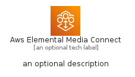

# AwsElementalMediaConnect


```text
aws-q1-2023/Architecture/MediaServices/AwsElementalMediaConnect
```

```text
include('aws-q1-2023/Architecture/MediaServices/AwsElementalMediaConnect')
```


| Illustration | AwsElementalMediaConnect | AwsElementalMediaConnectCard | AwsElementalMediaConnectGroup |
| :---: | :---: | :---: | :---: |
|  |  |  |  |


## AwsElementalMediaConnect

### Load remotely
```plantuml
@startuml
' configures the library
!global $LIB_BASE_LOCATION="https://raw.githubusercontent.com/tmorin/plantuml-libs/master/distribution"

' loads the library's bootstrap
!include $LIB_BASE_LOCATION/bootstrap.puml

' loads the package bootstrap
include('aws-q1-2023/bootstrap')

' loads the Item which embeds the element AwsElementalMediaConnect
include('aws-q1-2023/Architecture/MediaServices/AwsElementalMediaConnect')

' renders the element
AwsElementalMediaConnect('AwsElementalMediaConnect', 'Aws Elemental Media Connect', 'an optional tech label', 'an optional description')
@enduml
```

### Load locally
```plantuml
@startuml
' configures the library
!global $INCLUSION_MODE="local"
!global $LIB_BASE_LOCATION="../../.."

' loads the library's bootstrap
!include $LIB_BASE_LOCATION/bootstrap.puml

' loads the package bootstrap
include('aws-q1-2023/bootstrap')

' loads the Item which embeds the element AwsElementalMediaConnect
include('aws-q1-2023/Architecture/MediaServices/AwsElementalMediaConnect')

' renders the element
AwsElementalMediaConnect('AwsElementalMediaConnect', 'Aws Elemental Media Connect', 'an optional tech label', 'an optional description')
@enduml
```

## AwsElementalMediaConnectCard

### Load remotely
```plantuml
@startuml
' configures the library
!global $LIB_BASE_LOCATION="https://raw.githubusercontent.com/tmorin/plantuml-libs/master/distribution"

' loads the library's bootstrap
!include $LIB_BASE_LOCATION/bootstrap.puml

' loads the package bootstrap
include('aws-q1-2023/bootstrap')

' loads the Item which embeds the element AwsElementalMediaConnectCard
include('aws-q1-2023/Architecture/MediaServices/AwsElementalMediaConnect')

' renders the element
AwsElementalMediaConnectCard('AwsElementalMediaConnectCard', 'Aws Elemental Media Connect Card', 'an optional description')
@enduml
```

### Load locally
```plantuml
@startuml
' configures the library
!global $INCLUSION_MODE="local"
!global $LIB_BASE_LOCATION="../../.."

' loads the library's bootstrap
!include $LIB_BASE_LOCATION/bootstrap.puml

' loads the package bootstrap
include('aws-q1-2023/bootstrap')

' loads the Item which embeds the element AwsElementalMediaConnectCard
include('aws-q1-2023/Architecture/MediaServices/AwsElementalMediaConnect')

' renders the element
AwsElementalMediaConnectCard('AwsElementalMediaConnectCard', 'Aws Elemental Media Connect Card', 'an optional description')
@enduml
```

## AwsElementalMediaConnectGroup

### Load remotely
```plantuml
@startuml
' configures the library
!global $LIB_BASE_LOCATION="https://raw.githubusercontent.com/tmorin/plantuml-libs/master/distribution"

' loads the library's bootstrap
!include $LIB_BASE_LOCATION/bootstrap.puml

' loads the package bootstrap
include('aws-q1-2023/bootstrap')

' loads the Item which embeds the element AwsElementalMediaConnectGroup
include('aws-q1-2023/Architecture/MediaServices/AwsElementalMediaConnect')

' renders the element
AwsElementalMediaConnectGroup('AwsElementalMediaConnectGroup', 'Aws Elemental Media Connect Group', 'an optional tech label') {
    note as note
        the content of the group
    end note
}
@enduml
```

### Load locally
```plantuml
@startuml
' configures the library
!global $INCLUSION_MODE="local"
!global $LIB_BASE_LOCATION="../../.."

' loads the library's bootstrap
!include $LIB_BASE_LOCATION/bootstrap.puml

' loads the package bootstrap
include('aws-q1-2023/bootstrap')

' loads the Item which embeds the element AwsElementalMediaConnectGroup
include('aws-q1-2023/Architecture/MediaServices/AwsElementalMediaConnect')

' renders the element
AwsElementalMediaConnectGroup('AwsElementalMediaConnectGroup', 'Aws Elemental Media Connect Group', 'an optional tech label') {
    note as note
        the content of the group
    end note
}
@enduml
```

