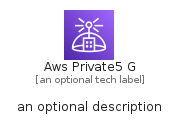

# AwsPrivate5G


```text
aws-q1-2023/Architecture/NetworkingContentDelivery/AwsPrivate5G
```

```text
include('aws-q1-2023/Architecture/NetworkingContentDelivery/AwsPrivate5G')
```


| Illustration | AwsPrivate5G | AwsPrivate5GCard | AwsPrivate5GGroup |
| :---: | :---: | :---: | :---: |
|  |  |  |  |


## AwsPrivate5G

### Load remotely
```plantuml
@startuml
' configures the library
!global $LIB_BASE_LOCATION="https://raw.githubusercontent.com/tmorin/plantuml-libs/master/distribution"

' loads the library's bootstrap
!include $LIB_BASE_LOCATION/bootstrap.puml

' loads the package bootstrap
include('aws-q1-2023/bootstrap')

' loads the Item which embeds the element AwsPrivate5G
include('aws-q1-2023/Architecture/NetworkingContentDelivery/AwsPrivate5G')

' renders the element
AwsPrivate5G('AwsPrivate5G', 'Aws Private5 G', 'an optional tech label', 'an optional description')
@enduml
```

### Load locally
```plantuml
@startuml
' configures the library
!global $INCLUSION_MODE="local"
!global $LIB_BASE_LOCATION="../../.."

' loads the library's bootstrap
!include $LIB_BASE_LOCATION/bootstrap.puml

' loads the package bootstrap
include('aws-q1-2023/bootstrap')

' loads the Item which embeds the element AwsPrivate5G
include('aws-q1-2023/Architecture/NetworkingContentDelivery/AwsPrivate5G')

' renders the element
AwsPrivate5G('AwsPrivate5G', 'Aws Private5 G', 'an optional tech label', 'an optional description')
@enduml
```

## AwsPrivate5GCard

### Load remotely
```plantuml
@startuml
' configures the library
!global $LIB_BASE_LOCATION="https://raw.githubusercontent.com/tmorin/plantuml-libs/master/distribution"

' loads the library's bootstrap
!include $LIB_BASE_LOCATION/bootstrap.puml

' loads the package bootstrap
include('aws-q1-2023/bootstrap')

' loads the Item which embeds the element AwsPrivate5GCard
include('aws-q1-2023/Architecture/NetworkingContentDelivery/AwsPrivate5G')

' renders the element
AwsPrivate5GCard('AwsPrivate5GCard', 'Aws Private5 G Card', 'an optional description')
@enduml
```

### Load locally
```plantuml
@startuml
' configures the library
!global $INCLUSION_MODE="local"
!global $LIB_BASE_LOCATION="../../.."

' loads the library's bootstrap
!include $LIB_BASE_LOCATION/bootstrap.puml

' loads the package bootstrap
include('aws-q1-2023/bootstrap')

' loads the Item which embeds the element AwsPrivate5GCard
include('aws-q1-2023/Architecture/NetworkingContentDelivery/AwsPrivate5G')

' renders the element
AwsPrivate5GCard('AwsPrivate5GCard', 'Aws Private5 G Card', 'an optional description')
@enduml
```

## AwsPrivate5GGroup

### Load remotely
```plantuml
@startuml
' configures the library
!global $LIB_BASE_LOCATION="https://raw.githubusercontent.com/tmorin/plantuml-libs/master/distribution"

' loads the library's bootstrap
!include $LIB_BASE_LOCATION/bootstrap.puml

' loads the package bootstrap
include('aws-q1-2023/bootstrap')

' loads the Item which embeds the element AwsPrivate5GGroup
include('aws-q1-2023/Architecture/NetworkingContentDelivery/AwsPrivate5G')

' renders the element
AwsPrivate5GGroup('AwsPrivate5GGroup', 'Aws Private5 G Group', 'an optional tech label') {
    note as note
        the content of the group
    end note
}
@enduml
```

### Load locally
```plantuml
@startuml
' configures the library
!global $INCLUSION_MODE="local"
!global $LIB_BASE_LOCATION="../../.."

' loads the library's bootstrap
!include $LIB_BASE_LOCATION/bootstrap.puml

' loads the package bootstrap
include('aws-q1-2023/bootstrap')

' loads the Item which embeds the element AwsPrivate5GGroup
include('aws-q1-2023/Architecture/NetworkingContentDelivery/AwsPrivate5G')

' renders the element
AwsPrivate5GGroup('AwsPrivate5GGroup', 'Aws Private5 G Group', 'an optional tech label') {
    note as note
        the content of the group
    end note
}
@enduml
```

