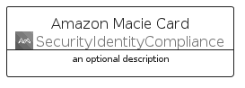

# AmazonMacie


```text
aws-q1-2023/Architecture/SecurityIdentityCompliance/AmazonMacie
```

```text
include('aws-q1-2023/Architecture/SecurityIdentityCompliance/AmazonMacie')
```


| Illustration | AmazonMacie | AmazonMacieCard | AmazonMacieGroup |
| :---: | :---: | :---: | :---: |
|  |  |  |  |


## AmazonMacie

### Load remotely
```plantuml
@startuml
' configures the library
!global $LIB_BASE_LOCATION="https://raw.githubusercontent.com/tmorin/plantuml-libs/master/distribution"

' loads the library's bootstrap
!include $LIB_BASE_LOCATION/bootstrap.puml

' loads the package bootstrap
include('aws-q1-2023/bootstrap')

' loads the Item which embeds the element AmazonMacie
include('aws-q1-2023/Architecture/SecurityIdentityCompliance/AmazonMacie')

' renders the element
AmazonMacie('AmazonMacie', 'Amazon Macie', 'an optional tech label', 'an optional description')
@enduml
```

### Load locally
```plantuml
@startuml
' configures the library
!global $INCLUSION_MODE="local"
!global $LIB_BASE_LOCATION="../../.."

' loads the library's bootstrap
!include $LIB_BASE_LOCATION/bootstrap.puml

' loads the package bootstrap
include('aws-q1-2023/bootstrap')

' loads the Item which embeds the element AmazonMacie
include('aws-q1-2023/Architecture/SecurityIdentityCompliance/AmazonMacie')

' renders the element
AmazonMacie('AmazonMacie', 'Amazon Macie', 'an optional tech label', 'an optional description')
@enduml
```

## AmazonMacieCard

### Load remotely
```plantuml
@startuml
' configures the library
!global $LIB_BASE_LOCATION="https://raw.githubusercontent.com/tmorin/plantuml-libs/master/distribution"

' loads the library's bootstrap
!include $LIB_BASE_LOCATION/bootstrap.puml

' loads the package bootstrap
include('aws-q1-2023/bootstrap')

' loads the Item which embeds the element AmazonMacieCard
include('aws-q1-2023/Architecture/SecurityIdentityCompliance/AmazonMacie')

' renders the element
AmazonMacieCard('AmazonMacieCard', 'Amazon Macie Card', 'an optional description')
@enduml
```

### Load locally
```plantuml
@startuml
' configures the library
!global $INCLUSION_MODE="local"
!global $LIB_BASE_LOCATION="../../.."

' loads the library's bootstrap
!include $LIB_BASE_LOCATION/bootstrap.puml

' loads the package bootstrap
include('aws-q1-2023/bootstrap')

' loads the Item which embeds the element AmazonMacieCard
include('aws-q1-2023/Architecture/SecurityIdentityCompliance/AmazonMacie')

' renders the element
AmazonMacieCard('AmazonMacieCard', 'Amazon Macie Card', 'an optional description')
@enduml
```

## AmazonMacieGroup

### Load remotely
```plantuml
@startuml
' configures the library
!global $LIB_BASE_LOCATION="https://raw.githubusercontent.com/tmorin/plantuml-libs/master/distribution"

' loads the library's bootstrap
!include $LIB_BASE_LOCATION/bootstrap.puml

' loads the package bootstrap
include('aws-q1-2023/bootstrap')

' loads the Item which embeds the element AmazonMacieGroup
include('aws-q1-2023/Architecture/SecurityIdentityCompliance/AmazonMacie')

' renders the element
AmazonMacieGroup('AmazonMacieGroup', 'Amazon Macie Group', 'an optional tech label') {
    note as note
        the content of the group
    end note
}
@enduml
```

### Load locally
```plantuml
@startuml
' configures the library
!global $INCLUSION_MODE="local"
!global $LIB_BASE_LOCATION="../../.."

' loads the library's bootstrap
!include $LIB_BASE_LOCATION/bootstrap.puml

' loads the package bootstrap
include('aws-q1-2023/bootstrap')

' loads the Item which embeds the element AmazonMacieGroup
include('aws-q1-2023/Architecture/SecurityIdentityCompliance/AmazonMacie')

' renders the element
AmazonMacieGroup('AmazonMacieGroup', 'Amazon Macie Group', 'an optional tech label') {
    note as note
        the content of the group
    end note
}
@enduml
```

