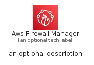
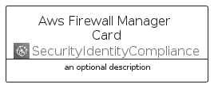
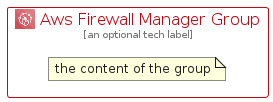

# AwsFirewallManager


```text
aws-q1-2023/Architecture/SecurityIdentityCompliance/AwsFirewallManager
```

```text
include('aws-q1-2023/Architecture/SecurityIdentityCompliance/AwsFirewallManager')
```


| Illustration | AwsFirewallManager | AwsFirewallManagerCard | AwsFirewallManagerGroup |
| :---: | :---: | :---: | :---: |
|  |  |  |  |


## Sprites
The item provides the following sriptes:

- `<$AwsFirewallManagerXs>`
- `<$AwsFirewallManagerSm>`
- `<$AwsFirewallManagerMd>`
- `<$AwsFirewallManagerLg>`


## AwsFirewallManager

### Load remotely
```plantuml
@startuml
' configures the library
!global $LIB_BASE_LOCATION="https://raw.githubusercontent.com/tmorin/plantuml-libs/master/distribution"

' loads the library's bootstrap
!include $LIB_BASE_LOCATION/bootstrap.puml

' loads the package bootstrap
include('aws-q1-2023/bootstrap')

' loads the Item which embeds the element AwsFirewallManager
include('aws-q1-2023/Architecture/SecurityIdentityCompliance/AwsFirewallManager')

' renders the element
AwsFirewallManager('AwsFirewallManager', 'Aws Firewall Manager', 'an optional tech label', 'an optional description')
@enduml
```

### Load locally
```plantuml
@startuml
' configures the library
!global $INCLUSION_MODE="local"
!global $LIB_BASE_LOCATION="../../.."

' loads the library's bootstrap
!include $LIB_BASE_LOCATION/bootstrap.puml

' loads the package bootstrap
include('aws-q1-2023/bootstrap')

' loads the Item which embeds the element AwsFirewallManager
include('aws-q1-2023/Architecture/SecurityIdentityCompliance/AwsFirewallManager')

' renders the element
AwsFirewallManager('AwsFirewallManager', 'Aws Firewall Manager', 'an optional tech label', 'an optional description')
@enduml
```

## AwsFirewallManagerCard

### Load remotely
```plantuml
@startuml
' configures the library
!global $LIB_BASE_LOCATION="https://raw.githubusercontent.com/tmorin/plantuml-libs/master/distribution"

' loads the library's bootstrap
!include $LIB_BASE_LOCATION/bootstrap.puml

' loads the package bootstrap
include('aws-q1-2023/bootstrap')

' loads the Item which embeds the element AwsFirewallManagerCard
include('aws-q1-2023/Architecture/SecurityIdentityCompliance/AwsFirewallManager')

' renders the element
AwsFirewallManagerCard('AwsFirewallManagerCard', 'Aws Firewall Manager Card', 'an optional description')
@enduml
```

### Load locally
```plantuml
@startuml
' configures the library
!global $INCLUSION_MODE="local"
!global $LIB_BASE_LOCATION="../../.."

' loads the library's bootstrap
!include $LIB_BASE_LOCATION/bootstrap.puml

' loads the package bootstrap
include('aws-q1-2023/bootstrap')

' loads the Item which embeds the element AwsFirewallManagerCard
include('aws-q1-2023/Architecture/SecurityIdentityCompliance/AwsFirewallManager')

' renders the element
AwsFirewallManagerCard('AwsFirewallManagerCard', 'Aws Firewall Manager Card', 'an optional description')
@enduml
```

## AwsFirewallManagerGroup

### Load remotely
```plantuml
@startuml
' configures the library
!global $LIB_BASE_LOCATION="https://raw.githubusercontent.com/tmorin/plantuml-libs/master/distribution"

' loads the library's bootstrap
!include $LIB_BASE_LOCATION/bootstrap.puml

' loads the package bootstrap
include('aws-q1-2023/bootstrap')

' loads the Item which embeds the element AwsFirewallManagerGroup
include('aws-q1-2023/Architecture/SecurityIdentityCompliance/AwsFirewallManager')

' renders the element
AwsFirewallManagerGroup('AwsFirewallManagerGroup', 'Aws Firewall Manager Group', 'an optional tech label') {
    note as note
        the content of the group
    end note
}
@enduml
```

### Load locally
```plantuml
@startuml
' configures the library
!global $INCLUSION_MODE="local"
!global $LIB_BASE_LOCATION="../../.."

' loads the library's bootstrap
!include $LIB_BASE_LOCATION/bootstrap.puml

' loads the package bootstrap
include('aws-q1-2023/bootstrap')

' loads the Item which embeds the element AwsFirewallManagerGroup
include('aws-q1-2023/Architecture/SecurityIdentityCompliance/AwsFirewallManager')

' renders the element
AwsFirewallManagerGroup('AwsFirewallManagerGroup', 'Aws Firewall Manager Group', 'an optional tech label') {
    note as note
        the content of the group
    end note
}
@enduml
```

