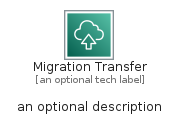

# MigrationTransfer


```text
aws-q1-2023/Category/MigrationTransfer
```

```text
include('aws-q1-2023/Category/MigrationTransfer')
```


| Illustration | MigrationTransfer | MigrationTransferCard | MigrationTransferGroup |
| :---: | :---: | :---: | :---: |
|  |  |  |  |


## MigrationTransfer

### Load remotely
```plantuml
@startuml
' configures the library
!global $LIB_BASE_LOCATION="https://raw.githubusercontent.com/tmorin/plantuml-libs/master/distribution"

' loads the library's bootstrap
!include $LIB_BASE_LOCATION/bootstrap.puml

' loads the package bootstrap
include('aws-q1-2023/bootstrap')

' loads the Item which embeds the element MigrationTransfer
include('aws-q1-2023/Category/MigrationTransfer')

' renders the element
MigrationTransfer('MigrationTransfer', 'Migration Transfer', 'an optional tech label', 'an optional description')
@enduml
```

### Load locally
```plantuml
@startuml
' configures the library
!global $INCLUSION_MODE="local"
!global $LIB_BASE_LOCATION="../.."

' loads the library's bootstrap
!include $LIB_BASE_LOCATION/bootstrap.puml

' loads the package bootstrap
include('aws-q1-2023/bootstrap')

' loads the Item which embeds the element MigrationTransfer
include('aws-q1-2023/Category/MigrationTransfer')

' renders the element
MigrationTransfer('MigrationTransfer', 'Migration Transfer', 'an optional tech label', 'an optional description')
@enduml
```

## MigrationTransferCard

### Load remotely
```plantuml
@startuml
' configures the library
!global $LIB_BASE_LOCATION="https://raw.githubusercontent.com/tmorin/plantuml-libs/master/distribution"

' loads the library's bootstrap
!include $LIB_BASE_LOCATION/bootstrap.puml

' loads the package bootstrap
include('aws-q1-2023/bootstrap')

' loads the Item which embeds the element MigrationTransferCard
include('aws-q1-2023/Category/MigrationTransfer')

' renders the element
MigrationTransferCard('MigrationTransferCard', 'Migration Transfer Card', 'an optional description')
@enduml
```

### Load locally
```plantuml
@startuml
' configures the library
!global $INCLUSION_MODE="local"
!global $LIB_BASE_LOCATION="../.."

' loads the library's bootstrap
!include $LIB_BASE_LOCATION/bootstrap.puml

' loads the package bootstrap
include('aws-q1-2023/bootstrap')

' loads the Item which embeds the element MigrationTransferCard
include('aws-q1-2023/Category/MigrationTransfer')

' renders the element
MigrationTransferCard('MigrationTransferCard', 'Migration Transfer Card', 'an optional description')
@enduml
```

## MigrationTransferGroup

### Load remotely
```plantuml
@startuml
' configures the library
!global $LIB_BASE_LOCATION="https://raw.githubusercontent.com/tmorin/plantuml-libs/master/distribution"

' loads the library's bootstrap
!include $LIB_BASE_LOCATION/bootstrap.puml

' loads the package bootstrap
include('aws-q1-2023/bootstrap')

' loads the Item which embeds the element MigrationTransferGroup
include('aws-q1-2023/Category/MigrationTransfer')

' renders the element
MigrationTransferGroup('MigrationTransferGroup', 'Migration Transfer Group', 'an optional tech label') {
    note as note
        the content of the group
    end note
}
@enduml
```

### Load locally
```plantuml
@startuml
' configures the library
!global $INCLUSION_MODE="local"
!global $LIB_BASE_LOCATION="../.."

' loads the library's bootstrap
!include $LIB_BASE_LOCATION/bootstrap.puml

' loads the package bootstrap
include('aws-q1-2023/bootstrap')

' loads the Item which embeds the element MigrationTransferGroup
include('aws-q1-2023/Category/MigrationTransfer')

' renders the element
MigrationTransferGroup('MigrationTransferGroup', 'Migration Transfer Group', 'an optional tech label') {
    note as note
        the content of the group
    end note
}
@enduml
```

