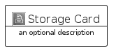
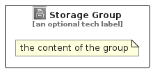

# Storage


```text
aws-q1-2023/Category/Storage
```

```text
include('aws-q1-2023/Category/Storage')
```


| Illustration | Storage | StorageCard | StorageGroup |
| :---: | :---: | :---: | :---: |
|  |  |  |  |


## Sprites
The item provides the following sriptes:

- `<$StorageXs>`
- `<$StorageSm>`
- `<$StorageMd>`
- `<$StorageLg>`


## Storage

### Load remotely
```plantuml
@startuml
' configures the library
!global $LIB_BASE_LOCATION="https://raw.githubusercontent.com/tmorin/plantuml-libs/master/distribution"

' loads the library's bootstrap
!include $LIB_BASE_LOCATION/bootstrap.puml

' loads the package bootstrap
include('aws-q1-2023/bootstrap')

' loads the Item which embeds the element Storage
include('aws-q1-2023/Category/Storage')

' renders the element
Storage('Storage', 'Storage', 'an optional tech label', 'an optional description')
@enduml
```

### Load locally
```plantuml
@startuml
' configures the library
!global $INCLUSION_MODE="local"
!global $LIB_BASE_LOCATION="../.."

' loads the library's bootstrap
!include $LIB_BASE_LOCATION/bootstrap.puml

' loads the package bootstrap
include('aws-q1-2023/bootstrap')

' loads the Item which embeds the element Storage
include('aws-q1-2023/Category/Storage')

' renders the element
Storage('Storage', 'Storage', 'an optional tech label', 'an optional description')
@enduml
```

## StorageCard

### Load remotely
```plantuml
@startuml
' configures the library
!global $LIB_BASE_LOCATION="https://raw.githubusercontent.com/tmorin/plantuml-libs/master/distribution"

' loads the library's bootstrap
!include $LIB_BASE_LOCATION/bootstrap.puml

' loads the package bootstrap
include('aws-q1-2023/bootstrap')

' loads the Item which embeds the element StorageCard
include('aws-q1-2023/Category/Storage')

' renders the element
StorageCard('StorageCard', 'Storage Card', 'an optional description')
@enduml
```

### Load locally
```plantuml
@startuml
' configures the library
!global $INCLUSION_MODE="local"
!global $LIB_BASE_LOCATION="../.."

' loads the library's bootstrap
!include $LIB_BASE_LOCATION/bootstrap.puml

' loads the package bootstrap
include('aws-q1-2023/bootstrap')

' loads the Item which embeds the element StorageCard
include('aws-q1-2023/Category/Storage')

' renders the element
StorageCard('StorageCard', 'Storage Card', 'an optional description')
@enduml
```

## StorageGroup

### Load remotely
```plantuml
@startuml
' configures the library
!global $LIB_BASE_LOCATION="https://raw.githubusercontent.com/tmorin/plantuml-libs/master/distribution"

' loads the library's bootstrap
!include $LIB_BASE_LOCATION/bootstrap.puml

' loads the package bootstrap
include('aws-q1-2023/bootstrap')

' loads the Item which embeds the element StorageGroup
include('aws-q1-2023/Category/Storage')

' renders the element
StorageGroup('StorageGroup', 'Storage Group', 'an optional tech label') {
    note as note
        the content of the group
    end note
}
@enduml
```

### Load locally
```plantuml
@startuml
' configures the library
!global $INCLUSION_MODE="local"
!global $LIB_BASE_LOCATION="../.."

' loads the library's bootstrap
!include $LIB_BASE_LOCATION/bootstrap.puml

' loads the package bootstrap
include('aws-q1-2023/bootstrap')

' loads the Item which embeds the element StorageGroup
include('aws-q1-2023/Category/Storage')

' renders the element
StorageGroup('StorageGroup', 'Storage Group', 'an optional tech label') {
    note as note
        the content of the group
    end note
}
@enduml
```

