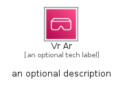

# VrAr


```text
aws-q1-2023/Category/VrAr
```

```text
include('aws-q1-2023/Category/VrAr')
```


| Illustration | VrAr | VrArCard | VrArGroup |
| :---: | :---: | :---: | :---: |
|  |  |  |  |


## VrAr

### Load remotely
```plantuml
@startuml
' configures the library
!global $LIB_BASE_LOCATION="https://raw.githubusercontent.com/tmorin/plantuml-libs/master/distribution"

' loads the library's bootstrap
!include $LIB_BASE_LOCATION/bootstrap.puml

' loads the package bootstrap
include('aws-q1-2023/bootstrap')

' loads the Item which embeds the element VrAr
include('aws-q1-2023/Category/VrAr')

' renders the element
VrAr('VrAr', 'Vr Ar', 'an optional tech label', 'an optional description')
@enduml
```

### Load locally
```plantuml
@startuml
' configures the library
!global $INCLUSION_MODE="local"
!global $LIB_BASE_LOCATION="../.."

' loads the library's bootstrap
!include $LIB_BASE_LOCATION/bootstrap.puml

' loads the package bootstrap
include('aws-q1-2023/bootstrap')

' loads the Item which embeds the element VrAr
include('aws-q1-2023/Category/VrAr')

' renders the element
VrAr('VrAr', 'Vr Ar', 'an optional tech label', 'an optional description')
@enduml
```

## VrArCard

### Load remotely
```plantuml
@startuml
' configures the library
!global $LIB_BASE_LOCATION="https://raw.githubusercontent.com/tmorin/plantuml-libs/master/distribution"

' loads the library's bootstrap
!include $LIB_BASE_LOCATION/bootstrap.puml

' loads the package bootstrap
include('aws-q1-2023/bootstrap')

' loads the Item which embeds the element VrArCard
include('aws-q1-2023/Category/VrAr')

' renders the element
VrArCard('VrArCard', 'Vr Ar Card', 'an optional description')
@enduml
```

### Load locally
```plantuml
@startuml
' configures the library
!global $INCLUSION_MODE="local"
!global $LIB_BASE_LOCATION="../.."

' loads the library's bootstrap
!include $LIB_BASE_LOCATION/bootstrap.puml

' loads the package bootstrap
include('aws-q1-2023/bootstrap')

' loads the Item which embeds the element VrArCard
include('aws-q1-2023/Category/VrAr')

' renders the element
VrArCard('VrArCard', 'Vr Ar Card', 'an optional description')
@enduml
```

## VrArGroup

### Load remotely
```plantuml
@startuml
' configures the library
!global $LIB_BASE_LOCATION="https://raw.githubusercontent.com/tmorin/plantuml-libs/master/distribution"

' loads the library's bootstrap
!include $LIB_BASE_LOCATION/bootstrap.puml

' loads the package bootstrap
include('aws-q1-2023/bootstrap')

' loads the Item which embeds the element VrArGroup
include('aws-q1-2023/Category/VrAr')

' renders the element
VrArGroup('VrArGroup', 'Vr Ar Group', 'an optional tech label') {
    note as note
        the content of the group
    end note
}
@enduml
```

### Load locally
```plantuml
@startuml
' configures the library
!global $INCLUSION_MODE="local"
!global $LIB_BASE_LOCATION="../.."

' loads the library's bootstrap
!include $LIB_BASE_LOCATION/bootstrap.puml

' loads the package bootstrap
include('aws-q1-2023/bootstrap')

' loads the Item which embeds the element VrArGroup
include('aws-q1-2023/Category/VrAr')

' renders the element
VrArGroup('VrArGroup', 'Vr Ar Group', 'an optional tech label') {
    note as note
        the content of the group
    end note
}
@enduml
```

