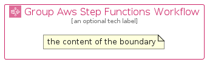

# GroupAwsStepFunctionsWorkflow


```text
aws-q1-2023/Group/GroupAwsStepFunctionsWorkflow
```

```text
include('aws-q1-2023/Group/GroupAwsStepFunctionsWorkflow')
```


| Illustration | GroupAwsStepFunctionsWorkflow |
| :---: | :---: |
|  |  |


## Sprites
The item provides the following sriptes:

- `<$GroupAwsStepFunctionsWorkflowXs>`
- `<$GroupAwsStepFunctionsWorkflowSm>`
- `<$GroupAwsStepFunctionsWorkflowMd>`
- `<$GroupAwsStepFunctionsWorkflowLg>`


## GroupAwsStepFunctionsWorkflow

### Load remotely
```plantuml
@startuml
' configures the library
!global $LIB_BASE_LOCATION="https://raw.githubusercontent.com/tmorin/plantuml-libs/master/distribution"

' loads the library's bootstrap
!include $LIB_BASE_LOCATION/bootstrap.puml

' loads the package bootstrap
include('aws-q1-2023/bootstrap')

' loads the Item which embeds the element GroupAwsStepFunctionsWorkflow
include('aws-q1-2023/Group/GroupAwsStepFunctionsWorkflow')

GroupAwsStepFunctionsWorkflow('GroupAwsStepFunctionsWorkflow', 'Group Aws Step Functions Workflow', 'an optional tech label') {
  note as note
  the content of the boundary
  end note
}
@enduml
```

### Load locally
```plantuml
@startuml
' configures the library
!global $INCLUSION_MODE="local"
!global $LIB_BASE_LOCATION="../.."

' loads the library's bootstrap
!include $LIB_BASE_LOCATION/bootstrap.puml

' loads the package bootstrap
include('aws-q1-2023/bootstrap')

' loads the Item which embeds the element GroupAwsStepFunctionsWorkflow
include('aws-q1-2023/Group/GroupAwsStepFunctionsWorkflow')

GroupAwsStepFunctionsWorkflow('GroupAwsStepFunctionsWorkflow', 'Group Aws Step Functions Workflow', 'an optional tech label') {
  note as note
  the content of the boundary
  end note
}
@enduml
```

