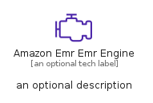
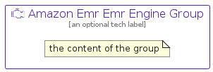

# AmazonEmrEmrEngine


```text
aws-q1-2023/Resource/Analytics/AmazonEmrEmrEngine
```

```text
include('aws-q1-2023/Resource/Analytics/AmazonEmrEmrEngine')
```


| Illustration | AmazonEmrEmrEngine | AmazonEmrEmrEngineCard | AmazonEmrEmrEngineGroup |
| :---: | :---: | :---: | :---: |
|  |  |  |  |


## Sprites
The item provides the following sriptes:

- `<$AmazonEmrEmrEngineXs>`
- `<$AmazonEmrEmrEngineSm>`
- `<$AmazonEmrEmrEngineMd>`
- `<$AmazonEmrEmrEngineLg>`


## AmazonEmrEmrEngine

### Load remotely
```plantuml
@startuml
' configures the library
!global $LIB_BASE_LOCATION="https://raw.githubusercontent.com/tmorin/plantuml-libs/master/distribution"

' loads the library's bootstrap
!include $LIB_BASE_LOCATION/bootstrap.puml

' loads the package bootstrap
include('aws-q1-2023/bootstrap')

' loads the Item which embeds the element AmazonEmrEmrEngine
include('aws-q1-2023/Resource/Analytics/AmazonEmrEmrEngine')

' renders the element
AmazonEmrEmrEngine('AmazonEmrEmrEngine', 'Amazon Emr Emr Engine', 'an optional tech label', 'an optional description')
@enduml
```

### Load locally
```plantuml
@startuml
' configures the library
!global $INCLUSION_MODE="local"
!global $LIB_BASE_LOCATION="../../.."

' loads the library's bootstrap
!include $LIB_BASE_LOCATION/bootstrap.puml

' loads the package bootstrap
include('aws-q1-2023/bootstrap')

' loads the Item which embeds the element AmazonEmrEmrEngine
include('aws-q1-2023/Resource/Analytics/AmazonEmrEmrEngine')

' renders the element
AmazonEmrEmrEngine('AmazonEmrEmrEngine', 'Amazon Emr Emr Engine', 'an optional tech label', 'an optional description')
@enduml
```

## AmazonEmrEmrEngineCard

### Load remotely
```plantuml
@startuml
' configures the library
!global $LIB_BASE_LOCATION="https://raw.githubusercontent.com/tmorin/plantuml-libs/master/distribution"

' loads the library's bootstrap
!include $LIB_BASE_LOCATION/bootstrap.puml

' loads the package bootstrap
include('aws-q1-2023/bootstrap')

' loads the Item which embeds the element AmazonEmrEmrEngineCard
include('aws-q1-2023/Resource/Analytics/AmazonEmrEmrEngine')

' renders the element
AmazonEmrEmrEngineCard('AmazonEmrEmrEngineCard', 'Amazon Emr Emr Engine Card', 'an optional description')
@enduml
```

### Load locally
```plantuml
@startuml
' configures the library
!global $INCLUSION_MODE="local"
!global $LIB_BASE_LOCATION="../../.."

' loads the library's bootstrap
!include $LIB_BASE_LOCATION/bootstrap.puml

' loads the package bootstrap
include('aws-q1-2023/bootstrap')

' loads the Item which embeds the element AmazonEmrEmrEngineCard
include('aws-q1-2023/Resource/Analytics/AmazonEmrEmrEngine')

' renders the element
AmazonEmrEmrEngineCard('AmazonEmrEmrEngineCard', 'Amazon Emr Emr Engine Card', 'an optional description')
@enduml
```

## AmazonEmrEmrEngineGroup

### Load remotely
```plantuml
@startuml
' configures the library
!global $LIB_BASE_LOCATION="https://raw.githubusercontent.com/tmorin/plantuml-libs/master/distribution"

' loads the library's bootstrap
!include $LIB_BASE_LOCATION/bootstrap.puml

' loads the package bootstrap
include('aws-q1-2023/bootstrap')

' loads the Item which embeds the element AmazonEmrEmrEngineGroup
include('aws-q1-2023/Resource/Analytics/AmazonEmrEmrEngine')

' renders the element
AmazonEmrEmrEngineGroup('AmazonEmrEmrEngineGroup', 'Amazon Emr Emr Engine Group', 'an optional tech label') {
    note as note
        the content of the group
    end note
}
@enduml
```

### Load locally
```plantuml
@startuml
' configures the library
!global $INCLUSION_MODE="local"
!global $LIB_BASE_LOCATION="../../.."

' loads the library's bootstrap
!include $LIB_BASE_LOCATION/bootstrap.puml

' loads the package bootstrap
include('aws-q1-2023/bootstrap')

' loads the Item which embeds the element AmazonEmrEmrEngineGroup
include('aws-q1-2023/Resource/Analytics/AmazonEmrEmrEngine')

' renders the element
AmazonEmrEmrEngineGroup('AmazonEmrEmrEngineGroup', 'Amazon Emr Emr Engine Group', 'an optional tech label') {
    note as note
        the content of the group
    end note
}
@enduml
```

