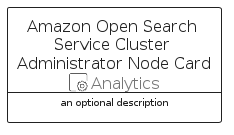

# AmazonOpenSearchServiceClusterAdministratorNode


```text
aws-q1-2023/Resource/Analytics/AmazonOpenSearchServiceClusterAdministratorNode
```

```text
include('aws-q1-2023/Resource/Analytics/AmazonOpenSearchServiceClusterAdministratorNode')
```


| Illustration | AmazonOpenSearchServiceClusterAdministratorNode | AmazonOpenSearchServiceClusterAdministratorNodeCard | AmazonOpenSearchServiceClusterAdministratorNodeGroup |
| :---: | :---: | :---: | :---: |
|  |  |  |  |


## AmazonOpenSearchServiceClusterAdministratorNode

### Load remotely
```plantuml
@startuml
' configures the library
!global $LIB_BASE_LOCATION="https://raw.githubusercontent.com/tmorin/plantuml-libs/master/distribution"

' loads the library's bootstrap
!include $LIB_BASE_LOCATION/bootstrap.puml

' loads the package bootstrap
include('aws-q1-2023/bootstrap')

' loads the Item which embeds the element AmazonOpenSearchServiceClusterAdministratorNode
include('aws-q1-2023/Resource/Analytics/AmazonOpenSearchServiceClusterAdministratorNode')

' renders the element
AmazonOpenSearchServiceClusterAdministratorNode('AmazonOpenSearchServiceClusterAdministratorNode', 'Amazon Open Search Service Cluster Administrator Node', 'an optional tech label', 'an optional description')
@enduml
```

### Load locally
```plantuml
@startuml
' configures the library
!global $INCLUSION_MODE="local"
!global $LIB_BASE_LOCATION="../../.."

' loads the library's bootstrap
!include $LIB_BASE_LOCATION/bootstrap.puml

' loads the package bootstrap
include('aws-q1-2023/bootstrap')

' loads the Item which embeds the element AmazonOpenSearchServiceClusterAdministratorNode
include('aws-q1-2023/Resource/Analytics/AmazonOpenSearchServiceClusterAdministratorNode')

' renders the element
AmazonOpenSearchServiceClusterAdministratorNode('AmazonOpenSearchServiceClusterAdministratorNode', 'Amazon Open Search Service Cluster Administrator Node', 'an optional tech label', 'an optional description')
@enduml
```

## AmazonOpenSearchServiceClusterAdministratorNodeCard

### Load remotely
```plantuml
@startuml
' configures the library
!global $LIB_BASE_LOCATION="https://raw.githubusercontent.com/tmorin/plantuml-libs/master/distribution"

' loads the library's bootstrap
!include $LIB_BASE_LOCATION/bootstrap.puml

' loads the package bootstrap
include('aws-q1-2023/bootstrap')

' loads the Item which embeds the element AmazonOpenSearchServiceClusterAdministratorNodeCard
include('aws-q1-2023/Resource/Analytics/AmazonOpenSearchServiceClusterAdministratorNode')

' renders the element
AmazonOpenSearchServiceClusterAdministratorNodeCard('AmazonOpenSearchServiceClusterAdministratorNodeCard', 'Amazon Open Search Service Cluster Administrator Node Card', 'an optional description')
@enduml
```

### Load locally
```plantuml
@startuml
' configures the library
!global $INCLUSION_MODE="local"
!global $LIB_BASE_LOCATION="../../.."

' loads the library's bootstrap
!include $LIB_BASE_LOCATION/bootstrap.puml

' loads the package bootstrap
include('aws-q1-2023/bootstrap')

' loads the Item which embeds the element AmazonOpenSearchServiceClusterAdministratorNodeCard
include('aws-q1-2023/Resource/Analytics/AmazonOpenSearchServiceClusterAdministratorNode')

' renders the element
AmazonOpenSearchServiceClusterAdministratorNodeCard('AmazonOpenSearchServiceClusterAdministratorNodeCard', 'Amazon Open Search Service Cluster Administrator Node Card', 'an optional description')
@enduml
```

## AmazonOpenSearchServiceClusterAdministratorNodeGroup

### Load remotely
```plantuml
@startuml
' configures the library
!global $LIB_BASE_LOCATION="https://raw.githubusercontent.com/tmorin/plantuml-libs/master/distribution"

' loads the library's bootstrap
!include $LIB_BASE_LOCATION/bootstrap.puml

' loads the package bootstrap
include('aws-q1-2023/bootstrap')

' loads the Item which embeds the element AmazonOpenSearchServiceClusterAdministratorNodeGroup
include('aws-q1-2023/Resource/Analytics/AmazonOpenSearchServiceClusterAdministratorNode')

' renders the element
AmazonOpenSearchServiceClusterAdministratorNodeGroup('AmazonOpenSearchServiceClusterAdministratorNodeGroup', 'Amazon Open Search Service Cluster Administrator Node Group', 'an optional tech label') {
    note as note
        the content of the group
    end note
}
@enduml
```

### Load locally
```plantuml
@startuml
' configures the library
!global $INCLUSION_MODE="local"
!global $LIB_BASE_LOCATION="../../.."

' loads the library's bootstrap
!include $LIB_BASE_LOCATION/bootstrap.puml

' loads the package bootstrap
include('aws-q1-2023/bootstrap')

' loads the Item which embeds the element AmazonOpenSearchServiceClusterAdministratorNodeGroup
include('aws-q1-2023/Resource/Analytics/AmazonOpenSearchServiceClusterAdministratorNode')

' renders the element
AmazonOpenSearchServiceClusterAdministratorNodeGroup('AmazonOpenSearchServiceClusterAdministratorNodeGroup', 'Amazon Open Search Service Cluster Administrator Node Group', 'an optional tech label') {
    note as note
        the content of the group
    end note
}
@enduml
```

