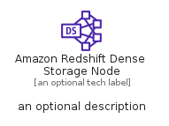
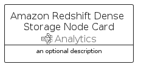

# AmazonRedshiftDenseStorageNode


```text
aws-q1-2023/Resource/Analytics/AmazonRedshiftDenseStorageNode
```

```text
include('aws-q1-2023/Resource/Analytics/AmazonRedshiftDenseStorageNode')
```


| Illustration | AmazonRedshiftDenseStorageNode | AmazonRedshiftDenseStorageNodeCard | AmazonRedshiftDenseStorageNodeGroup |
| :---: | :---: | :---: | :---: |
|  |  |  |  |


## AmazonRedshiftDenseStorageNode

### Load remotely
```plantuml
@startuml
' configures the library
!global $LIB_BASE_LOCATION="https://raw.githubusercontent.com/tmorin/plantuml-libs/master/distribution"

' loads the library's bootstrap
!include $LIB_BASE_LOCATION/bootstrap.puml

' loads the package bootstrap
include('aws-q1-2023/bootstrap')

' loads the Item which embeds the element AmazonRedshiftDenseStorageNode
include('aws-q1-2023/Resource/Analytics/AmazonRedshiftDenseStorageNode')

' renders the element
AmazonRedshiftDenseStorageNode('AmazonRedshiftDenseStorageNode', 'Amazon Redshift Dense Storage Node', 'an optional tech label', 'an optional description')
@enduml
```

### Load locally
```plantuml
@startuml
' configures the library
!global $INCLUSION_MODE="local"
!global $LIB_BASE_LOCATION="../../.."

' loads the library's bootstrap
!include $LIB_BASE_LOCATION/bootstrap.puml

' loads the package bootstrap
include('aws-q1-2023/bootstrap')

' loads the Item which embeds the element AmazonRedshiftDenseStorageNode
include('aws-q1-2023/Resource/Analytics/AmazonRedshiftDenseStorageNode')

' renders the element
AmazonRedshiftDenseStorageNode('AmazonRedshiftDenseStorageNode', 'Amazon Redshift Dense Storage Node', 'an optional tech label', 'an optional description')
@enduml
```

## AmazonRedshiftDenseStorageNodeCard

### Load remotely
```plantuml
@startuml
' configures the library
!global $LIB_BASE_LOCATION="https://raw.githubusercontent.com/tmorin/plantuml-libs/master/distribution"

' loads the library's bootstrap
!include $LIB_BASE_LOCATION/bootstrap.puml

' loads the package bootstrap
include('aws-q1-2023/bootstrap')

' loads the Item which embeds the element AmazonRedshiftDenseStorageNodeCard
include('aws-q1-2023/Resource/Analytics/AmazonRedshiftDenseStorageNode')

' renders the element
AmazonRedshiftDenseStorageNodeCard('AmazonRedshiftDenseStorageNodeCard', 'Amazon Redshift Dense Storage Node Card', 'an optional description')
@enduml
```

### Load locally
```plantuml
@startuml
' configures the library
!global $INCLUSION_MODE="local"
!global $LIB_BASE_LOCATION="../../.."

' loads the library's bootstrap
!include $LIB_BASE_LOCATION/bootstrap.puml

' loads the package bootstrap
include('aws-q1-2023/bootstrap')

' loads the Item which embeds the element AmazonRedshiftDenseStorageNodeCard
include('aws-q1-2023/Resource/Analytics/AmazonRedshiftDenseStorageNode')

' renders the element
AmazonRedshiftDenseStorageNodeCard('AmazonRedshiftDenseStorageNodeCard', 'Amazon Redshift Dense Storage Node Card', 'an optional description')
@enduml
```

## AmazonRedshiftDenseStorageNodeGroup

### Load remotely
```plantuml
@startuml
' configures the library
!global $LIB_BASE_LOCATION="https://raw.githubusercontent.com/tmorin/plantuml-libs/master/distribution"

' loads the library's bootstrap
!include $LIB_BASE_LOCATION/bootstrap.puml

' loads the package bootstrap
include('aws-q1-2023/bootstrap')

' loads the Item which embeds the element AmazonRedshiftDenseStorageNodeGroup
include('aws-q1-2023/Resource/Analytics/AmazonRedshiftDenseStorageNode')

' renders the element
AmazonRedshiftDenseStorageNodeGroup('AmazonRedshiftDenseStorageNodeGroup', 'Amazon Redshift Dense Storage Node Group', 'an optional tech label') {
    note as note
        the content of the group
    end note
}
@enduml
```

### Load locally
```plantuml
@startuml
' configures the library
!global $INCLUSION_MODE="local"
!global $LIB_BASE_LOCATION="../../.."

' loads the library's bootstrap
!include $LIB_BASE_LOCATION/bootstrap.puml

' loads the package bootstrap
include('aws-q1-2023/bootstrap')

' loads the Item which embeds the element AmazonRedshiftDenseStorageNodeGroup
include('aws-q1-2023/Resource/Analytics/AmazonRedshiftDenseStorageNode')

' renders the element
AmazonRedshiftDenseStorageNodeGroup('AmazonRedshiftDenseStorageNodeGroup', 'Amazon Redshift Dense Storage Node Group', 'an optional tech label') {
    note as note
        the content of the group
    end note
}
@enduml
```

