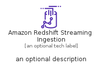
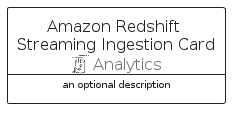

# AmazonRedshiftStreamingIngestion


```text
aws-q1-2023/Resource/Analytics/AmazonRedshiftStreamingIngestion
```

```text
include('aws-q1-2023/Resource/Analytics/AmazonRedshiftStreamingIngestion')
```


| Illustration | AmazonRedshiftStreamingIngestion | AmazonRedshiftStreamingIngestionCard | AmazonRedshiftStreamingIngestionGroup |
| :---: | :---: | :---: | :---: |
|  |  |  |  |


## AmazonRedshiftStreamingIngestion

### Load remotely
```plantuml
@startuml
' configures the library
!global $LIB_BASE_LOCATION="https://raw.githubusercontent.com/tmorin/plantuml-libs/master/distribution"

' loads the library's bootstrap
!include $LIB_BASE_LOCATION/bootstrap.puml

' loads the package bootstrap
include('aws-q1-2023/bootstrap')

' loads the Item which embeds the element AmazonRedshiftStreamingIngestion
include('aws-q1-2023/Resource/Analytics/AmazonRedshiftStreamingIngestion')

' renders the element
AmazonRedshiftStreamingIngestion('AmazonRedshiftStreamingIngestion', 'Amazon Redshift Streaming Ingestion', 'an optional tech label', 'an optional description')
@enduml
```

### Load locally
```plantuml
@startuml
' configures the library
!global $INCLUSION_MODE="local"
!global $LIB_BASE_LOCATION="../../.."

' loads the library's bootstrap
!include $LIB_BASE_LOCATION/bootstrap.puml

' loads the package bootstrap
include('aws-q1-2023/bootstrap')

' loads the Item which embeds the element AmazonRedshiftStreamingIngestion
include('aws-q1-2023/Resource/Analytics/AmazonRedshiftStreamingIngestion')

' renders the element
AmazonRedshiftStreamingIngestion('AmazonRedshiftStreamingIngestion', 'Amazon Redshift Streaming Ingestion', 'an optional tech label', 'an optional description')
@enduml
```

## AmazonRedshiftStreamingIngestionCard

### Load remotely
```plantuml
@startuml
' configures the library
!global $LIB_BASE_LOCATION="https://raw.githubusercontent.com/tmorin/plantuml-libs/master/distribution"

' loads the library's bootstrap
!include $LIB_BASE_LOCATION/bootstrap.puml

' loads the package bootstrap
include('aws-q1-2023/bootstrap')

' loads the Item which embeds the element AmazonRedshiftStreamingIngestionCard
include('aws-q1-2023/Resource/Analytics/AmazonRedshiftStreamingIngestion')

' renders the element
AmazonRedshiftStreamingIngestionCard('AmazonRedshiftStreamingIngestionCard', 'Amazon Redshift Streaming Ingestion Card', 'an optional description')
@enduml
```

### Load locally
```plantuml
@startuml
' configures the library
!global $INCLUSION_MODE="local"
!global $LIB_BASE_LOCATION="../../.."

' loads the library's bootstrap
!include $LIB_BASE_LOCATION/bootstrap.puml

' loads the package bootstrap
include('aws-q1-2023/bootstrap')

' loads the Item which embeds the element AmazonRedshiftStreamingIngestionCard
include('aws-q1-2023/Resource/Analytics/AmazonRedshiftStreamingIngestion')

' renders the element
AmazonRedshiftStreamingIngestionCard('AmazonRedshiftStreamingIngestionCard', 'Amazon Redshift Streaming Ingestion Card', 'an optional description')
@enduml
```

## AmazonRedshiftStreamingIngestionGroup

### Load remotely
```plantuml
@startuml
' configures the library
!global $LIB_BASE_LOCATION="https://raw.githubusercontent.com/tmorin/plantuml-libs/master/distribution"

' loads the library's bootstrap
!include $LIB_BASE_LOCATION/bootstrap.puml

' loads the package bootstrap
include('aws-q1-2023/bootstrap')

' loads the Item which embeds the element AmazonRedshiftStreamingIngestionGroup
include('aws-q1-2023/Resource/Analytics/AmazonRedshiftStreamingIngestion')

' renders the element
AmazonRedshiftStreamingIngestionGroup('AmazonRedshiftStreamingIngestionGroup', 'Amazon Redshift Streaming Ingestion Group', 'an optional tech label') {
    note as note
        the content of the group
    end note
}
@enduml
```

### Load locally
```plantuml
@startuml
' configures the library
!global $INCLUSION_MODE="local"
!global $LIB_BASE_LOCATION="../../.."

' loads the library's bootstrap
!include $LIB_BASE_LOCATION/bootstrap.puml

' loads the package bootstrap
include('aws-q1-2023/bootstrap')

' loads the Item which embeds the element AmazonRedshiftStreamingIngestionGroup
include('aws-q1-2023/Resource/Analytics/AmazonRedshiftStreamingIngestion')

' renders the element
AmazonRedshiftStreamingIngestionGroup('AmazonRedshiftStreamingIngestionGroup', 'Amazon Redshift Streaming Ingestion Group', 'an optional tech label') {
    note as note
        the content of the group
    end note
}
@enduml
```

