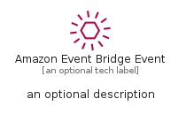
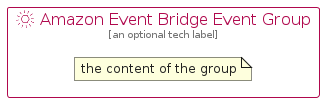

# AmazonEventBridgeEvent


```text
aws-q1-2023/Resource/ApplicationIntegration/AmazonEventBridgeEvent
```

```text
include('aws-q1-2023/Resource/ApplicationIntegration/AmazonEventBridgeEvent')
```


| Illustration | AmazonEventBridgeEvent | AmazonEventBridgeEventCard | AmazonEventBridgeEventGroup |
| :---: | :---: | :---: | :---: |
|  |  |  |  |


## Sprites
The item provides the following sriptes:

- `<$AmazonEventBridgeEventXs>`
- `<$AmazonEventBridgeEventSm>`
- `<$AmazonEventBridgeEventMd>`
- `<$AmazonEventBridgeEventLg>`


## AmazonEventBridgeEvent

### Load remotely
```plantuml
@startuml
' configures the library
!global $LIB_BASE_LOCATION="https://raw.githubusercontent.com/tmorin/plantuml-libs/master/distribution"

' loads the library's bootstrap
!include $LIB_BASE_LOCATION/bootstrap.puml

' loads the package bootstrap
include('aws-q1-2023/bootstrap')

' loads the Item which embeds the element AmazonEventBridgeEvent
include('aws-q1-2023/Resource/ApplicationIntegration/AmazonEventBridgeEvent')

' renders the element
AmazonEventBridgeEvent('AmazonEventBridgeEvent', 'Amazon Event Bridge Event', 'an optional tech label', 'an optional description')
@enduml
```

### Load locally
```plantuml
@startuml
' configures the library
!global $INCLUSION_MODE="local"
!global $LIB_BASE_LOCATION="../../.."

' loads the library's bootstrap
!include $LIB_BASE_LOCATION/bootstrap.puml

' loads the package bootstrap
include('aws-q1-2023/bootstrap')

' loads the Item which embeds the element AmazonEventBridgeEvent
include('aws-q1-2023/Resource/ApplicationIntegration/AmazonEventBridgeEvent')

' renders the element
AmazonEventBridgeEvent('AmazonEventBridgeEvent', 'Amazon Event Bridge Event', 'an optional tech label', 'an optional description')
@enduml
```

## AmazonEventBridgeEventCard

### Load remotely
```plantuml
@startuml
' configures the library
!global $LIB_BASE_LOCATION="https://raw.githubusercontent.com/tmorin/plantuml-libs/master/distribution"

' loads the library's bootstrap
!include $LIB_BASE_LOCATION/bootstrap.puml

' loads the package bootstrap
include('aws-q1-2023/bootstrap')

' loads the Item which embeds the element AmazonEventBridgeEventCard
include('aws-q1-2023/Resource/ApplicationIntegration/AmazonEventBridgeEvent')

' renders the element
AmazonEventBridgeEventCard('AmazonEventBridgeEventCard', 'Amazon Event Bridge Event Card', 'an optional description')
@enduml
```

### Load locally
```plantuml
@startuml
' configures the library
!global $INCLUSION_MODE="local"
!global $LIB_BASE_LOCATION="../../.."

' loads the library's bootstrap
!include $LIB_BASE_LOCATION/bootstrap.puml

' loads the package bootstrap
include('aws-q1-2023/bootstrap')

' loads the Item which embeds the element AmazonEventBridgeEventCard
include('aws-q1-2023/Resource/ApplicationIntegration/AmazonEventBridgeEvent')

' renders the element
AmazonEventBridgeEventCard('AmazonEventBridgeEventCard', 'Amazon Event Bridge Event Card', 'an optional description')
@enduml
```

## AmazonEventBridgeEventGroup

### Load remotely
```plantuml
@startuml
' configures the library
!global $LIB_BASE_LOCATION="https://raw.githubusercontent.com/tmorin/plantuml-libs/master/distribution"

' loads the library's bootstrap
!include $LIB_BASE_LOCATION/bootstrap.puml

' loads the package bootstrap
include('aws-q1-2023/bootstrap')

' loads the Item which embeds the element AmazonEventBridgeEventGroup
include('aws-q1-2023/Resource/ApplicationIntegration/AmazonEventBridgeEvent')

' renders the element
AmazonEventBridgeEventGroup('AmazonEventBridgeEventGroup', 'Amazon Event Bridge Event Group', 'an optional tech label') {
    note as note
        the content of the group
    end note
}
@enduml
```

### Load locally
```plantuml
@startuml
' configures the library
!global $INCLUSION_MODE="local"
!global $LIB_BASE_LOCATION="../../.."

' loads the library's bootstrap
!include $LIB_BASE_LOCATION/bootstrap.puml

' loads the package bootstrap
include('aws-q1-2023/bootstrap')

' loads the Item which embeds the element AmazonEventBridgeEventGroup
include('aws-q1-2023/Resource/ApplicationIntegration/AmazonEventBridgeEvent')

' renders the element
AmazonEventBridgeEventGroup('AmazonEventBridgeEventGroup', 'Amazon Event Bridge Event Group', 'an optional tech label') {
    note as note
        the content of the group
    end note
}
@enduml
```

