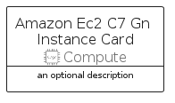

# AmazonEc2C7GnInstance


```text
aws-q1-2023/Resource/Compute/AmazonEc2C7GnInstance
```

```text
include('aws-q1-2023/Resource/Compute/AmazonEc2C7GnInstance')
```


| Illustration | AmazonEc2C7GnInstance | AmazonEc2C7GnInstanceCard | AmazonEc2C7GnInstanceGroup |
| :---: | :---: | :---: | :---: |
|  |  |  |  |


## Sprites
The item provides the following sriptes:

- `<$AmazonEc2C7GnInstanceXs>`
- `<$AmazonEc2C7GnInstanceSm>`
- `<$AmazonEc2C7GnInstanceMd>`
- `<$AmazonEc2C7GnInstanceLg>`


## AmazonEc2C7GnInstance

### Load remotely
```plantuml
@startuml
' configures the library
!global $LIB_BASE_LOCATION="https://raw.githubusercontent.com/tmorin/plantuml-libs/master/distribution"

' loads the library's bootstrap
!include $LIB_BASE_LOCATION/bootstrap.puml

' loads the package bootstrap
include('aws-q1-2023/bootstrap')

' loads the Item which embeds the element AmazonEc2C7GnInstance
include('aws-q1-2023/Resource/Compute/AmazonEc2C7GnInstance')

' renders the element
AmazonEc2C7GnInstance('AmazonEc2C7GnInstance', 'Amazon Ec2 C7 Gn Instance', 'an optional tech label', 'an optional description')
@enduml
```

### Load locally
```plantuml
@startuml
' configures the library
!global $INCLUSION_MODE="local"
!global $LIB_BASE_LOCATION="../../.."

' loads the library's bootstrap
!include $LIB_BASE_LOCATION/bootstrap.puml

' loads the package bootstrap
include('aws-q1-2023/bootstrap')

' loads the Item which embeds the element AmazonEc2C7GnInstance
include('aws-q1-2023/Resource/Compute/AmazonEc2C7GnInstance')

' renders the element
AmazonEc2C7GnInstance('AmazonEc2C7GnInstance', 'Amazon Ec2 C7 Gn Instance', 'an optional tech label', 'an optional description')
@enduml
```

## AmazonEc2C7GnInstanceCard

### Load remotely
```plantuml
@startuml
' configures the library
!global $LIB_BASE_LOCATION="https://raw.githubusercontent.com/tmorin/plantuml-libs/master/distribution"

' loads the library's bootstrap
!include $LIB_BASE_LOCATION/bootstrap.puml

' loads the package bootstrap
include('aws-q1-2023/bootstrap')

' loads the Item which embeds the element AmazonEc2C7GnInstanceCard
include('aws-q1-2023/Resource/Compute/AmazonEc2C7GnInstance')

' renders the element
AmazonEc2C7GnInstanceCard('AmazonEc2C7GnInstanceCard', 'Amazon Ec2 C7 Gn Instance Card', 'an optional description')
@enduml
```

### Load locally
```plantuml
@startuml
' configures the library
!global $INCLUSION_MODE="local"
!global $LIB_BASE_LOCATION="../../.."

' loads the library's bootstrap
!include $LIB_BASE_LOCATION/bootstrap.puml

' loads the package bootstrap
include('aws-q1-2023/bootstrap')

' loads the Item which embeds the element AmazonEc2C7GnInstanceCard
include('aws-q1-2023/Resource/Compute/AmazonEc2C7GnInstance')

' renders the element
AmazonEc2C7GnInstanceCard('AmazonEc2C7GnInstanceCard', 'Amazon Ec2 C7 Gn Instance Card', 'an optional description')
@enduml
```

## AmazonEc2C7GnInstanceGroup

### Load remotely
```plantuml
@startuml
' configures the library
!global $LIB_BASE_LOCATION="https://raw.githubusercontent.com/tmorin/plantuml-libs/master/distribution"

' loads the library's bootstrap
!include $LIB_BASE_LOCATION/bootstrap.puml

' loads the package bootstrap
include('aws-q1-2023/bootstrap')

' loads the Item which embeds the element AmazonEc2C7GnInstanceGroup
include('aws-q1-2023/Resource/Compute/AmazonEc2C7GnInstance')

' renders the element
AmazonEc2C7GnInstanceGroup('AmazonEc2C7GnInstanceGroup', 'Amazon Ec2 C7 Gn Instance Group', 'an optional tech label') {
    note as note
        the content of the group
    end note
}
@enduml
```

### Load locally
```plantuml
@startuml
' configures the library
!global $INCLUSION_MODE="local"
!global $LIB_BASE_LOCATION="../../.."

' loads the library's bootstrap
!include $LIB_BASE_LOCATION/bootstrap.puml

' loads the package bootstrap
include('aws-q1-2023/bootstrap')

' loads the Item which embeds the element AmazonEc2C7GnInstanceGroup
include('aws-q1-2023/Resource/Compute/AmazonEc2C7GnInstance')

' renders the element
AmazonEc2C7GnInstanceGroup('AmazonEc2C7GnInstanceGroup', 'Amazon Ec2 C7 Gn Instance Group', 'an optional tech label') {
    note as note
        the content of the group
    end note
}
@enduml
```

