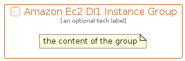

# AmazonEc2Dl1Instance


```text
aws-q1-2023/Resource/Compute/AmazonEc2Dl1Instance
```

```text
include('aws-q1-2023/Resource/Compute/AmazonEc2Dl1Instance')
```


| Illustration | AmazonEc2Dl1Instance | AmazonEc2Dl1InstanceCard | AmazonEc2Dl1InstanceGroup |
| :---: | :---: | :---: | :---: |
|  |  |  |  |


## Sprites
The item provides the following sriptes:

- `<$AmazonEc2Dl1InstanceXs>`
- `<$AmazonEc2Dl1InstanceSm>`
- `<$AmazonEc2Dl1InstanceMd>`
- `<$AmazonEc2Dl1InstanceLg>`


## AmazonEc2Dl1Instance

### Load remotely
```plantuml
@startuml
' configures the library
!global $LIB_BASE_LOCATION="https://raw.githubusercontent.com/tmorin/plantuml-libs/master/distribution"

' loads the library's bootstrap
!include $LIB_BASE_LOCATION/bootstrap.puml

' loads the package bootstrap
include('aws-q1-2023/bootstrap')

' loads the Item which embeds the element AmazonEc2Dl1Instance
include('aws-q1-2023/Resource/Compute/AmazonEc2Dl1Instance')

' renders the element
AmazonEc2Dl1Instance('AmazonEc2Dl1Instance', 'Amazon Ec2 Dl1 Instance', 'an optional tech label', 'an optional description')
@enduml
```

### Load locally
```plantuml
@startuml
' configures the library
!global $INCLUSION_MODE="local"
!global $LIB_BASE_LOCATION="../../.."

' loads the library's bootstrap
!include $LIB_BASE_LOCATION/bootstrap.puml

' loads the package bootstrap
include('aws-q1-2023/bootstrap')

' loads the Item which embeds the element AmazonEc2Dl1Instance
include('aws-q1-2023/Resource/Compute/AmazonEc2Dl1Instance')

' renders the element
AmazonEc2Dl1Instance('AmazonEc2Dl1Instance', 'Amazon Ec2 Dl1 Instance', 'an optional tech label', 'an optional description')
@enduml
```

## AmazonEc2Dl1InstanceCard

### Load remotely
```plantuml
@startuml
' configures the library
!global $LIB_BASE_LOCATION="https://raw.githubusercontent.com/tmorin/plantuml-libs/master/distribution"

' loads the library's bootstrap
!include $LIB_BASE_LOCATION/bootstrap.puml

' loads the package bootstrap
include('aws-q1-2023/bootstrap')

' loads the Item which embeds the element AmazonEc2Dl1InstanceCard
include('aws-q1-2023/Resource/Compute/AmazonEc2Dl1Instance')

' renders the element
AmazonEc2Dl1InstanceCard('AmazonEc2Dl1InstanceCard', 'Amazon Ec2 Dl1 Instance Card', 'an optional description')
@enduml
```

### Load locally
```plantuml
@startuml
' configures the library
!global $INCLUSION_MODE="local"
!global $LIB_BASE_LOCATION="../../.."

' loads the library's bootstrap
!include $LIB_BASE_LOCATION/bootstrap.puml

' loads the package bootstrap
include('aws-q1-2023/bootstrap')

' loads the Item which embeds the element AmazonEc2Dl1InstanceCard
include('aws-q1-2023/Resource/Compute/AmazonEc2Dl1Instance')

' renders the element
AmazonEc2Dl1InstanceCard('AmazonEc2Dl1InstanceCard', 'Amazon Ec2 Dl1 Instance Card', 'an optional description')
@enduml
```

## AmazonEc2Dl1InstanceGroup

### Load remotely
```plantuml
@startuml
' configures the library
!global $LIB_BASE_LOCATION="https://raw.githubusercontent.com/tmorin/plantuml-libs/master/distribution"

' loads the library's bootstrap
!include $LIB_BASE_LOCATION/bootstrap.puml

' loads the package bootstrap
include('aws-q1-2023/bootstrap')

' loads the Item which embeds the element AmazonEc2Dl1InstanceGroup
include('aws-q1-2023/Resource/Compute/AmazonEc2Dl1Instance')

' renders the element
AmazonEc2Dl1InstanceGroup('AmazonEc2Dl1InstanceGroup', 'Amazon Ec2 Dl1 Instance Group', 'an optional tech label') {
    note as note
        the content of the group
    end note
}
@enduml
```

### Load locally
```plantuml
@startuml
' configures the library
!global $INCLUSION_MODE="local"
!global $LIB_BASE_LOCATION="../../.."

' loads the library's bootstrap
!include $LIB_BASE_LOCATION/bootstrap.puml

' loads the package bootstrap
include('aws-q1-2023/bootstrap')

' loads the Item which embeds the element AmazonEc2Dl1InstanceGroup
include('aws-q1-2023/Resource/Compute/AmazonEc2Dl1Instance')

' renders the element
AmazonEc2Dl1InstanceGroup('AmazonEc2Dl1InstanceGroup', 'Amazon Ec2 Dl1 Instance Group', 'an optional tech label') {
    note as note
        the content of the group
    end note
}
@enduml
```

