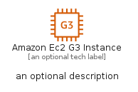
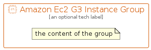

# AmazonEc2G3Instance


```text
aws-q1-2023/Resource/Compute/AmazonEc2G3Instance
```

```text
include('aws-q1-2023/Resource/Compute/AmazonEc2G3Instance')
```


| Illustration | AmazonEc2G3Instance | AmazonEc2G3InstanceCard | AmazonEc2G3InstanceGroup |
| :---: | :---: | :---: | :---: |
|  |  |  |  |


## AmazonEc2G3Instance

### Load remotely
```plantuml
@startuml
' configures the library
!global $LIB_BASE_LOCATION="https://raw.githubusercontent.com/tmorin/plantuml-libs/master/distribution"

' loads the library's bootstrap
!include $LIB_BASE_LOCATION/bootstrap.puml

' loads the package bootstrap
include('aws-q1-2023/bootstrap')

' loads the Item which embeds the element AmazonEc2G3Instance
include('aws-q1-2023/Resource/Compute/AmazonEc2G3Instance')

' renders the element
AmazonEc2G3Instance('AmazonEc2G3Instance', 'Amazon Ec2 G3 Instance', 'an optional tech label', 'an optional description')
@enduml
```

### Load locally
```plantuml
@startuml
' configures the library
!global $INCLUSION_MODE="local"
!global $LIB_BASE_LOCATION="../../.."

' loads the library's bootstrap
!include $LIB_BASE_LOCATION/bootstrap.puml

' loads the package bootstrap
include('aws-q1-2023/bootstrap')

' loads the Item which embeds the element AmazonEc2G3Instance
include('aws-q1-2023/Resource/Compute/AmazonEc2G3Instance')

' renders the element
AmazonEc2G3Instance('AmazonEc2G3Instance', 'Amazon Ec2 G3 Instance', 'an optional tech label', 'an optional description')
@enduml
```

## AmazonEc2G3InstanceCard

### Load remotely
```plantuml
@startuml
' configures the library
!global $LIB_BASE_LOCATION="https://raw.githubusercontent.com/tmorin/plantuml-libs/master/distribution"

' loads the library's bootstrap
!include $LIB_BASE_LOCATION/bootstrap.puml

' loads the package bootstrap
include('aws-q1-2023/bootstrap')

' loads the Item which embeds the element AmazonEc2G3InstanceCard
include('aws-q1-2023/Resource/Compute/AmazonEc2G3Instance')

' renders the element
AmazonEc2G3InstanceCard('AmazonEc2G3InstanceCard', 'Amazon Ec2 G3 Instance Card', 'an optional description')
@enduml
```

### Load locally
```plantuml
@startuml
' configures the library
!global $INCLUSION_MODE="local"
!global $LIB_BASE_LOCATION="../../.."

' loads the library's bootstrap
!include $LIB_BASE_LOCATION/bootstrap.puml

' loads the package bootstrap
include('aws-q1-2023/bootstrap')

' loads the Item which embeds the element AmazonEc2G3InstanceCard
include('aws-q1-2023/Resource/Compute/AmazonEc2G3Instance')

' renders the element
AmazonEc2G3InstanceCard('AmazonEc2G3InstanceCard', 'Amazon Ec2 G3 Instance Card', 'an optional description')
@enduml
```

## AmazonEc2G3InstanceGroup

### Load remotely
```plantuml
@startuml
' configures the library
!global $LIB_BASE_LOCATION="https://raw.githubusercontent.com/tmorin/plantuml-libs/master/distribution"

' loads the library's bootstrap
!include $LIB_BASE_LOCATION/bootstrap.puml

' loads the package bootstrap
include('aws-q1-2023/bootstrap')

' loads the Item which embeds the element AmazonEc2G3InstanceGroup
include('aws-q1-2023/Resource/Compute/AmazonEc2G3Instance')

' renders the element
AmazonEc2G3InstanceGroup('AmazonEc2G3InstanceGroup', 'Amazon Ec2 G3 Instance Group', 'an optional tech label') {
    note as note
        the content of the group
    end note
}
@enduml
```

### Load locally
```plantuml
@startuml
' configures the library
!global $INCLUSION_MODE="local"
!global $LIB_BASE_LOCATION="../../.."

' loads the library's bootstrap
!include $LIB_BASE_LOCATION/bootstrap.puml

' loads the package bootstrap
include('aws-q1-2023/bootstrap')

' loads the Item which embeds the element AmazonEc2G3InstanceGroup
include('aws-q1-2023/Resource/Compute/AmazonEc2G3Instance')

' renders the element
AmazonEc2G3InstanceGroup('AmazonEc2G3InstanceGroup', 'Amazon Ec2 G3 Instance Group', 'an optional tech label') {
    note as note
        the content of the group
    end note
}
@enduml
```

