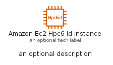
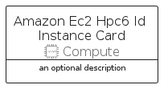

# AmazonEc2Hpc6IdInstance


```text
aws-q1-2023/Resource/Compute/AmazonEc2Hpc6IdInstance
```

```text
include('aws-q1-2023/Resource/Compute/AmazonEc2Hpc6IdInstance')
```


| Illustration | AmazonEc2Hpc6IdInstance | AmazonEc2Hpc6IdInstanceCard | AmazonEc2Hpc6IdInstanceGroup |
| :---: | :---: | :---: | :---: |
|  |  |  |  |


## AmazonEc2Hpc6IdInstance

### Load remotely
```plantuml
@startuml
' configures the library
!global $LIB_BASE_LOCATION="https://raw.githubusercontent.com/tmorin/plantuml-libs/master/distribution"

' loads the library's bootstrap
!include $LIB_BASE_LOCATION/bootstrap.puml

' loads the package bootstrap
include('aws-q1-2023/bootstrap')

' loads the Item which embeds the element AmazonEc2Hpc6IdInstance
include('aws-q1-2023/Resource/Compute/AmazonEc2Hpc6IdInstance')

' renders the element
AmazonEc2Hpc6IdInstance('AmazonEc2Hpc6IdInstance', 'Amazon Ec2 Hpc6 Id Instance', 'an optional tech label', 'an optional description')
@enduml
```

### Load locally
```plantuml
@startuml
' configures the library
!global $INCLUSION_MODE="local"
!global $LIB_BASE_LOCATION="../../.."

' loads the library's bootstrap
!include $LIB_BASE_LOCATION/bootstrap.puml

' loads the package bootstrap
include('aws-q1-2023/bootstrap')

' loads the Item which embeds the element AmazonEc2Hpc6IdInstance
include('aws-q1-2023/Resource/Compute/AmazonEc2Hpc6IdInstance')

' renders the element
AmazonEc2Hpc6IdInstance('AmazonEc2Hpc6IdInstance', 'Amazon Ec2 Hpc6 Id Instance', 'an optional tech label', 'an optional description')
@enduml
```

## AmazonEc2Hpc6IdInstanceCard

### Load remotely
```plantuml
@startuml
' configures the library
!global $LIB_BASE_LOCATION="https://raw.githubusercontent.com/tmorin/plantuml-libs/master/distribution"

' loads the library's bootstrap
!include $LIB_BASE_LOCATION/bootstrap.puml

' loads the package bootstrap
include('aws-q1-2023/bootstrap')

' loads the Item which embeds the element AmazonEc2Hpc6IdInstanceCard
include('aws-q1-2023/Resource/Compute/AmazonEc2Hpc6IdInstance')

' renders the element
AmazonEc2Hpc6IdInstanceCard('AmazonEc2Hpc6IdInstanceCard', 'Amazon Ec2 Hpc6 Id Instance Card', 'an optional description')
@enduml
```

### Load locally
```plantuml
@startuml
' configures the library
!global $INCLUSION_MODE="local"
!global $LIB_BASE_LOCATION="../../.."

' loads the library's bootstrap
!include $LIB_BASE_LOCATION/bootstrap.puml

' loads the package bootstrap
include('aws-q1-2023/bootstrap')

' loads the Item which embeds the element AmazonEc2Hpc6IdInstanceCard
include('aws-q1-2023/Resource/Compute/AmazonEc2Hpc6IdInstance')

' renders the element
AmazonEc2Hpc6IdInstanceCard('AmazonEc2Hpc6IdInstanceCard', 'Amazon Ec2 Hpc6 Id Instance Card', 'an optional description')
@enduml
```

## AmazonEc2Hpc6IdInstanceGroup

### Load remotely
```plantuml
@startuml
' configures the library
!global $LIB_BASE_LOCATION="https://raw.githubusercontent.com/tmorin/plantuml-libs/master/distribution"

' loads the library's bootstrap
!include $LIB_BASE_LOCATION/bootstrap.puml

' loads the package bootstrap
include('aws-q1-2023/bootstrap')

' loads the Item which embeds the element AmazonEc2Hpc6IdInstanceGroup
include('aws-q1-2023/Resource/Compute/AmazonEc2Hpc6IdInstance')

' renders the element
AmazonEc2Hpc6IdInstanceGroup('AmazonEc2Hpc6IdInstanceGroup', 'Amazon Ec2 Hpc6 Id Instance Group', 'an optional tech label') {
    note as note
        the content of the group
    end note
}
@enduml
```

### Load locally
```plantuml
@startuml
' configures the library
!global $INCLUSION_MODE="local"
!global $LIB_BASE_LOCATION="../../.."

' loads the library's bootstrap
!include $LIB_BASE_LOCATION/bootstrap.puml

' loads the package bootstrap
include('aws-q1-2023/bootstrap')

' loads the Item which embeds the element AmazonEc2Hpc6IdInstanceGroup
include('aws-q1-2023/Resource/Compute/AmazonEc2Hpc6IdInstance')

' renders the element
AmazonEc2Hpc6IdInstanceGroup('AmazonEc2Hpc6IdInstanceGroup', 'Amazon Ec2 Hpc6 Id Instance Group', 'an optional tech label') {
    note as note
        the content of the group
    end note
}
@enduml
```

