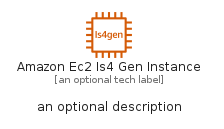
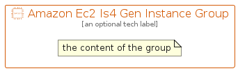

# AmazonEc2Is4GenInstance


```text
aws-q1-2023/Resource/Compute/AmazonEc2Is4GenInstance
```

```text
include('aws-q1-2023/Resource/Compute/AmazonEc2Is4GenInstance')
```


| Illustration | AmazonEc2Is4GenInstance | AmazonEc2Is4GenInstanceCard | AmazonEc2Is4GenInstanceGroup |
| :---: | :---: | :---: | :---: |
|  |  |  |  |


## AmazonEc2Is4GenInstance

### Load remotely
```plantuml
@startuml
' configures the library
!global $LIB_BASE_LOCATION="https://raw.githubusercontent.com/tmorin/plantuml-libs/master/distribution"

' loads the library's bootstrap
!include $LIB_BASE_LOCATION/bootstrap.puml

' loads the package bootstrap
include('aws-q1-2023/bootstrap')

' loads the Item which embeds the element AmazonEc2Is4GenInstance
include('aws-q1-2023/Resource/Compute/AmazonEc2Is4GenInstance')

' renders the element
AmazonEc2Is4GenInstance('AmazonEc2Is4GenInstance', 'Amazon Ec2 Is4 Gen Instance', 'an optional tech label', 'an optional description')
@enduml
```

### Load locally
```plantuml
@startuml
' configures the library
!global $INCLUSION_MODE="local"
!global $LIB_BASE_LOCATION="../../.."

' loads the library's bootstrap
!include $LIB_BASE_LOCATION/bootstrap.puml

' loads the package bootstrap
include('aws-q1-2023/bootstrap')

' loads the Item which embeds the element AmazonEc2Is4GenInstance
include('aws-q1-2023/Resource/Compute/AmazonEc2Is4GenInstance')

' renders the element
AmazonEc2Is4GenInstance('AmazonEc2Is4GenInstance', 'Amazon Ec2 Is4 Gen Instance', 'an optional tech label', 'an optional description')
@enduml
```

## AmazonEc2Is4GenInstanceCard

### Load remotely
```plantuml
@startuml
' configures the library
!global $LIB_BASE_LOCATION="https://raw.githubusercontent.com/tmorin/plantuml-libs/master/distribution"

' loads the library's bootstrap
!include $LIB_BASE_LOCATION/bootstrap.puml

' loads the package bootstrap
include('aws-q1-2023/bootstrap')

' loads the Item which embeds the element AmazonEc2Is4GenInstanceCard
include('aws-q1-2023/Resource/Compute/AmazonEc2Is4GenInstance')

' renders the element
AmazonEc2Is4GenInstanceCard('AmazonEc2Is4GenInstanceCard', 'Amazon Ec2 Is4 Gen Instance Card', 'an optional description')
@enduml
```

### Load locally
```plantuml
@startuml
' configures the library
!global $INCLUSION_MODE="local"
!global $LIB_BASE_LOCATION="../../.."

' loads the library's bootstrap
!include $LIB_BASE_LOCATION/bootstrap.puml

' loads the package bootstrap
include('aws-q1-2023/bootstrap')

' loads the Item which embeds the element AmazonEc2Is4GenInstanceCard
include('aws-q1-2023/Resource/Compute/AmazonEc2Is4GenInstance')

' renders the element
AmazonEc2Is4GenInstanceCard('AmazonEc2Is4GenInstanceCard', 'Amazon Ec2 Is4 Gen Instance Card', 'an optional description')
@enduml
```

## AmazonEc2Is4GenInstanceGroup

### Load remotely
```plantuml
@startuml
' configures the library
!global $LIB_BASE_LOCATION="https://raw.githubusercontent.com/tmorin/plantuml-libs/master/distribution"

' loads the library's bootstrap
!include $LIB_BASE_LOCATION/bootstrap.puml

' loads the package bootstrap
include('aws-q1-2023/bootstrap')

' loads the Item which embeds the element AmazonEc2Is4GenInstanceGroup
include('aws-q1-2023/Resource/Compute/AmazonEc2Is4GenInstance')

' renders the element
AmazonEc2Is4GenInstanceGroup('AmazonEc2Is4GenInstanceGroup', 'Amazon Ec2 Is4 Gen Instance Group', 'an optional tech label') {
    note as note
        the content of the group
    end note
}
@enduml
```

### Load locally
```plantuml
@startuml
' configures the library
!global $INCLUSION_MODE="local"
!global $LIB_BASE_LOCATION="../../.."

' loads the library's bootstrap
!include $LIB_BASE_LOCATION/bootstrap.puml

' loads the package bootstrap
include('aws-q1-2023/bootstrap')

' loads the Item which embeds the element AmazonEc2Is4GenInstanceGroup
include('aws-q1-2023/Resource/Compute/AmazonEc2Is4GenInstance')

' renders the element
AmazonEc2Is4GenInstanceGroup('AmazonEc2Is4GenInstanceGroup', 'Amazon Ec2 Is4 Gen Instance Group', 'an optional tech label') {
    note as note
        the content of the group
    end note
}
@enduml
```

