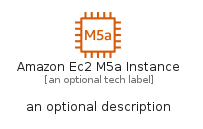

# AmazonEc2M5AInstance


```text
aws-q1-2023/Resource/Compute/AmazonEc2M5AInstance
```

```text
include('aws-q1-2023/Resource/Compute/AmazonEc2M5AInstance')
```


| Illustration | AmazonEc2M5AInstance | AmazonEc2M5AInstanceCard | AmazonEc2M5AInstanceGroup |
| :---: | :---: | :---: | :---: |
|  |  |  |  |


## AmazonEc2M5AInstance

### Load remotely
```plantuml
@startuml
' configures the library
!global $LIB_BASE_LOCATION="https://raw.githubusercontent.com/tmorin/plantuml-libs/master/distribution"

' loads the library's bootstrap
!include $LIB_BASE_LOCATION/bootstrap.puml

' loads the package bootstrap
include('aws-q1-2023/bootstrap')

' loads the Item which embeds the element AmazonEc2M5AInstance
include('aws-q1-2023/Resource/Compute/AmazonEc2M5AInstance')

' renders the element
AmazonEc2M5AInstance('AmazonEc2M5aInstance', 'Amazon Ec2 M5a Instance', 'an optional tech label', 'an optional description')
@enduml
```

### Load locally
```plantuml
@startuml
' configures the library
!global $INCLUSION_MODE="local"
!global $LIB_BASE_LOCATION="../../.."

' loads the library's bootstrap
!include $LIB_BASE_LOCATION/bootstrap.puml

' loads the package bootstrap
include('aws-q1-2023/bootstrap')

' loads the Item which embeds the element AmazonEc2M5AInstance
include('aws-q1-2023/Resource/Compute/AmazonEc2M5AInstance')

' renders the element
AmazonEc2M5AInstance('AmazonEc2M5aInstance', 'Amazon Ec2 M5a Instance', 'an optional tech label', 'an optional description')
@enduml
```

## AmazonEc2M5AInstanceCard

### Load remotely
```plantuml
@startuml
' configures the library
!global $LIB_BASE_LOCATION="https://raw.githubusercontent.com/tmorin/plantuml-libs/master/distribution"

' loads the library's bootstrap
!include $LIB_BASE_LOCATION/bootstrap.puml

' loads the package bootstrap
include('aws-q1-2023/bootstrap')

' loads the Item which embeds the element AmazonEc2M5AInstanceCard
include('aws-q1-2023/Resource/Compute/AmazonEc2M5AInstance')

' renders the element
AmazonEc2M5AInstanceCard('AmazonEc2M5aInstanceCard', 'Amazon Ec2 M5a Instance Card', 'an optional description')
@enduml
```

### Load locally
```plantuml
@startuml
' configures the library
!global $INCLUSION_MODE="local"
!global $LIB_BASE_LOCATION="../../.."

' loads the library's bootstrap
!include $LIB_BASE_LOCATION/bootstrap.puml

' loads the package bootstrap
include('aws-q1-2023/bootstrap')

' loads the Item which embeds the element AmazonEc2M5AInstanceCard
include('aws-q1-2023/Resource/Compute/AmazonEc2M5AInstance')

' renders the element
AmazonEc2M5AInstanceCard('AmazonEc2M5aInstanceCard', 'Amazon Ec2 M5a Instance Card', 'an optional description')
@enduml
```

## AmazonEc2M5AInstanceGroup

### Load remotely
```plantuml
@startuml
' configures the library
!global $LIB_BASE_LOCATION="https://raw.githubusercontent.com/tmorin/plantuml-libs/master/distribution"

' loads the library's bootstrap
!include $LIB_BASE_LOCATION/bootstrap.puml

' loads the package bootstrap
include('aws-q1-2023/bootstrap')

' loads the Item which embeds the element AmazonEc2M5AInstanceGroup
include('aws-q1-2023/Resource/Compute/AmazonEc2M5AInstance')

' renders the element
AmazonEc2M5AInstanceGroup('AmazonEc2M5aInstanceGroup', 'Amazon Ec2 M5a Instance Group', 'an optional tech label') {
    note as note
        the content of the group
    end note
}
@enduml
```

### Load locally
```plantuml
@startuml
' configures the library
!global $INCLUSION_MODE="local"
!global $LIB_BASE_LOCATION="../../.."

' loads the library's bootstrap
!include $LIB_BASE_LOCATION/bootstrap.puml

' loads the package bootstrap
include('aws-q1-2023/bootstrap')

' loads the Item which embeds the element AmazonEc2M5AInstanceGroup
include('aws-q1-2023/Resource/Compute/AmazonEc2M5AInstance')

' renders the element
AmazonEc2M5AInstanceGroup('AmazonEc2M5aInstanceGroup', 'Amazon Ec2 M5a Instance Group', 'an optional tech label') {
    note as note
        the content of the group
    end note
}
@enduml
```

