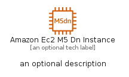
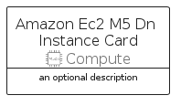

# AmazonEc2M5DnInstance


```text
aws-q1-2023/Resource/Compute/AmazonEc2M5DnInstance
```

```text
include('aws-q1-2023/Resource/Compute/AmazonEc2M5DnInstance')
```


| Illustration | AmazonEc2M5DnInstance | AmazonEc2M5DnInstanceCard | AmazonEc2M5DnInstanceGroup |
| :---: | :---: | :---: | :---: |
|  |  |  |  |


## Sprites
The item provides the following sriptes:

- `<$AmazonEc2M5DnInstanceXs>`
- `<$AmazonEc2M5DnInstanceSm>`
- `<$AmazonEc2M5DnInstanceMd>`
- `<$AmazonEc2M5DnInstanceLg>`


## AmazonEc2M5DnInstance

### Load remotely
```plantuml
@startuml
' configures the library
!global $LIB_BASE_LOCATION="https://raw.githubusercontent.com/tmorin/plantuml-libs/master/distribution"

' loads the library's bootstrap
!include $LIB_BASE_LOCATION/bootstrap.puml

' loads the package bootstrap
include('aws-q1-2023/bootstrap')

' loads the Item which embeds the element AmazonEc2M5DnInstance
include('aws-q1-2023/Resource/Compute/AmazonEc2M5DnInstance')

' renders the element
AmazonEc2M5DnInstance('AmazonEc2M5DnInstance', 'Amazon Ec2 M5 Dn Instance', 'an optional tech label', 'an optional description')
@enduml
```

### Load locally
```plantuml
@startuml
' configures the library
!global $INCLUSION_MODE="local"
!global $LIB_BASE_LOCATION="../../.."

' loads the library's bootstrap
!include $LIB_BASE_LOCATION/bootstrap.puml

' loads the package bootstrap
include('aws-q1-2023/bootstrap')

' loads the Item which embeds the element AmazonEc2M5DnInstance
include('aws-q1-2023/Resource/Compute/AmazonEc2M5DnInstance')

' renders the element
AmazonEc2M5DnInstance('AmazonEc2M5DnInstance', 'Amazon Ec2 M5 Dn Instance', 'an optional tech label', 'an optional description')
@enduml
```

## AmazonEc2M5DnInstanceCard

### Load remotely
```plantuml
@startuml
' configures the library
!global $LIB_BASE_LOCATION="https://raw.githubusercontent.com/tmorin/plantuml-libs/master/distribution"

' loads the library's bootstrap
!include $LIB_BASE_LOCATION/bootstrap.puml

' loads the package bootstrap
include('aws-q1-2023/bootstrap')

' loads the Item which embeds the element AmazonEc2M5DnInstanceCard
include('aws-q1-2023/Resource/Compute/AmazonEc2M5DnInstance')

' renders the element
AmazonEc2M5DnInstanceCard('AmazonEc2M5DnInstanceCard', 'Amazon Ec2 M5 Dn Instance Card', 'an optional description')
@enduml
```

### Load locally
```plantuml
@startuml
' configures the library
!global $INCLUSION_MODE="local"
!global $LIB_BASE_LOCATION="../../.."

' loads the library's bootstrap
!include $LIB_BASE_LOCATION/bootstrap.puml

' loads the package bootstrap
include('aws-q1-2023/bootstrap')

' loads the Item which embeds the element AmazonEc2M5DnInstanceCard
include('aws-q1-2023/Resource/Compute/AmazonEc2M5DnInstance')

' renders the element
AmazonEc2M5DnInstanceCard('AmazonEc2M5DnInstanceCard', 'Amazon Ec2 M5 Dn Instance Card', 'an optional description')
@enduml
```

## AmazonEc2M5DnInstanceGroup

### Load remotely
```plantuml
@startuml
' configures the library
!global $LIB_BASE_LOCATION="https://raw.githubusercontent.com/tmorin/plantuml-libs/master/distribution"

' loads the library's bootstrap
!include $LIB_BASE_LOCATION/bootstrap.puml

' loads the package bootstrap
include('aws-q1-2023/bootstrap')

' loads the Item which embeds the element AmazonEc2M5DnInstanceGroup
include('aws-q1-2023/Resource/Compute/AmazonEc2M5DnInstance')

' renders the element
AmazonEc2M5DnInstanceGroup('AmazonEc2M5DnInstanceGroup', 'Amazon Ec2 M5 Dn Instance Group', 'an optional tech label') {
    note as note
        the content of the group
    end note
}
@enduml
```

### Load locally
```plantuml
@startuml
' configures the library
!global $INCLUSION_MODE="local"
!global $LIB_BASE_LOCATION="../../.."

' loads the library's bootstrap
!include $LIB_BASE_LOCATION/bootstrap.puml

' loads the package bootstrap
include('aws-q1-2023/bootstrap')

' loads the Item which embeds the element AmazonEc2M5DnInstanceGroup
include('aws-q1-2023/Resource/Compute/AmazonEc2M5DnInstance')

' renders the element
AmazonEc2M5DnInstanceGroup('AmazonEc2M5DnInstanceGroup', 'Amazon Ec2 M5 Dn Instance Group', 'an optional tech label') {
    note as note
        the content of the group
    end note
}
@enduml
```

