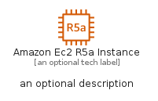
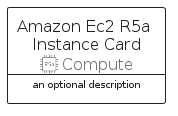

# AmazonEc2R5AInstance


```text
aws-q1-2023/Resource/Compute/AmazonEc2R5AInstance
```

```text
include('aws-q1-2023/Resource/Compute/AmazonEc2R5AInstance')
```


| Illustration | AmazonEc2R5AInstance | AmazonEc2R5AInstanceCard | AmazonEc2R5AInstanceGroup |
| :---: | :---: | :---: | :---: |
|  |  |  |  |


## Sprites
The item provides the following sriptes:

- `<$AmazonEc2R5AInstanceXs>`
- `<$AmazonEc2R5AInstanceSm>`
- `<$AmazonEc2R5AInstanceMd>`
- `<$AmazonEc2R5AInstanceLg>`


## AmazonEc2R5AInstance

### Load remotely
```plantuml
@startuml
' configures the library
!global $LIB_BASE_LOCATION="https://raw.githubusercontent.com/tmorin/plantuml-libs/master/distribution"

' loads the library's bootstrap
!include $LIB_BASE_LOCATION/bootstrap.puml

' loads the package bootstrap
include('aws-q1-2023/bootstrap')

' loads the Item which embeds the element AmazonEc2R5AInstance
include('aws-q1-2023/Resource/Compute/AmazonEc2R5AInstance')

' renders the element
AmazonEc2R5AInstance('AmazonEc2R5aInstance', 'Amazon Ec2 R5a Instance', 'an optional tech label', 'an optional description')
@enduml
```

### Load locally
```plantuml
@startuml
' configures the library
!global $INCLUSION_MODE="local"
!global $LIB_BASE_LOCATION="../../.."

' loads the library's bootstrap
!include $LIB_BASE_LOCATION/bootstrap.puml

' loads the package bootstrap
include('aws-q1-2023/bootstrap')

' loads the Item which embeds the element AmazonEc2R5AInstance
include('aws-q1-2023/Resource/Compute/AmazonEc2R5AInstance')

' renders the element
AmazonEc2R5AInstance('AmazonEc2R5aInstance', 'Amazon Ec2 R5a Instance', 'an optional tech label', 'an optional description')
@enduml
```

## AmazonEc2R5AInstanceCard

### Load remotely
```plantuml
@startuml
' configures the library
!global $LIB_BASE_LOCATION="https://raw.githubusercontent.com/tmorin/plantuml-libs/master/distribution"

' loads the library's bootstrap
!include $LIB_BASE_LOCATION/bootstrap.puml

' loads the package bootstrap
include('aws-q1-2023/bootstrap')

' loads the Item which embeds the element AmazonEc2R5AInstanceCard
include('aws-q1-2023/Resource/Compute/AmazonEc2R5AInstance')

' renders the element
AmazonEc2R5AInstanceCard('AmazonEc2R5aInstanceCard', 'Amazon Ec2 R5a Instance Card', 'an optional description')
@enduml
```

### Load locally
```plantuml
@startuml
' configures the library
!global $INCLUSION_MODE="local"
!global $LIB_BASE_LOCATION="../../.."

' loads the library's bootstrap
!include $LIB_BASE_LOCATION/bootstrap.puml

' loads the package bootstrap
include('aws-q1-2023/bootstrap')

' loads the Item which embeds the element AmazonEc2R5AInstanceCard
include('aws-q1-2023/Resource/Compute/AmazonEc2R5AInstance')

' renders the element
AmazonEc2R5AInstanceCard('AmazonEc2R5aInstanceCard', 'Amazon Ec2 R5a Instance Card', 'an optional description')
@enduml
```

## AmazonEc2R5AInstanceGroup

### Load remotely
```plantuml
@startuml
' configures the library
!global $LIB_BASE_LOCATION="https://raw.githubusercontent.com/tmorin/plantuml-libs/master/distribution"

' loads the library's bootstrap
!include $LIB_BASE_LOCATION/bootstrap.puml

' loads the package bootstrap
include('aws-q1-2023/bootstrap')

' loads the Item which embeds the element AmazonEc2R5AInstanceGroup
include('aws-q1-2023/Resource/Compute/AmazonEc2R5AInstance')

' renders the element
AmazonEc2R5AInstanceGroup('AmazonEc2R5aInstanceGroup', 'Amazon Ec2 R5a Instance Group', 'an optional tech label') {
    note as note
        the content of the group
    end note
}
@enduml
```

### Load locally
```plantuml
@startuml
' configures the library
!global $INCLUSION_MODE="local"
!global $LIB_BASE_LOCATION="../../.."

' loads the library's bootstrap
!include $LIB_BASE_LOCATION/bootstrap.puml

' loads the package bootstrap
include('aws-q1-2023/bootstrap')

' loads the Item which embeds the element AmazonEc2R5AInstanceGroup
include('aws-q1-2023/Resource/Compute/AmazonEc2R5AInstance')

' renders the element
AmazonEc2R5AInstanceGroup('AmazonEc2R5aInstanceGroup', 'Amazon Ec2 R5a Instance Group', 'an optional tech label') {
    note as note
        the content of the group
    end note
}
@enduml
```

