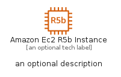

# AmazonEc2R5BInstance


```text
aws-q1-2023/Resource/Compute/AmazonEc2R5BInstance
```

```text
include('aws-q1-2023/Resource/Compute/AmazonEc2R5BInstance')
```


| Illustration | AmazonEc2R5BInstance | AmazonEc2R5BInstanceCard | AmazonEc2R5BInstanceGroup |
| :---: | :---: | :---: | :---: |
|  |  |  |  |


## AmazonEc2R5BInstance

### Load remotely
```plantuml
@startuml
' configures the library
!global $LIB_BASE_LOCATION="https://raw.githubusercontent.com/tmorin/plantuml-libs/master/distribution"

' loads the library's bootstrap
!include $LIB_BASE_LOCATION/bootstrap.puml

' loads the package bootstrap
include('aws-q1-2023/bootstrap')

' loads the Item which embeds the element AmazonEc2R5BInstance
include('aws-q1-2023/Resource/Compute/AmazonEc2R5BInstance')

' renders the element
AmazonEc2R5BInstance('AmazonEc2R5bInstance', 'Amazon Ec2 R5b Instance', 'an optional tech label', 'an optional description')
@enduml
```

### Load locally
```plantuml
@startuml
' configures the library
!global $INCLUSION_MODE="local"
!global $LIB_BASE_LOCATION="../../.."

' loads the library's bootstrap
!include $LIB_BASE_LOCATION/bootstrap.puml

' loads the package bootstrap
include('aws-q1-2023/bootstrap')

' loads the Item which embeds the element AmazonEc2R5BInstance
include('aws-q1-2023/Resource/Compute/AmazonEc2R5BInstance')

' renders the element
AmazonEc2R5BInstance('AmazonEc2R5bInstance', 'Amazon Ec2 R5b Instance', 'an optional tech label', 'an optional description')
@enduml
```

## AmazonEc2R5BInstanceCard

### Load remotely
```plantuml
@startuml
' configures the library
!global $LIB_BASE_LOCATION="https://raw.githubusercontent.com/tmorin/plantuml-libs/master/distribution"

' loads the library's bootstrap
!include $LIB_BASE_LOCATION/bootstrap.puml

' loads the package bootstrap
include('aws-q1-2023/bootstrap')

' loads the Item which embeds the element AmazonEc2R5BInstanceCard
include('aws-q1-2023/Resource/Compute/AmazonEc2R5BInstance')

' renders the element
AmazonEc2R5BInstanceCard('AmazonEc2R5bInstanceCard', 'Amazon Ec2 R5b Instance Card', 'an optional description')
@enduml
```

### Load locally
```plantuml
@startuml
' configures the library
!global $INCLUSION_MODE="local"
!global $LIB_BASE_LOCATION="../../.."

' loads the library's bootstrap
!include $LIB_BASE_LOCATION/bootstrap.puml

' loads the package bootstrap
include('aws-q1-2023/bootstrap')

' loads the Item which embeds the element AmazonEc2R5BInstanceCard
include('aws-q1-2023/Resource/Compute/AmazonEc2R5BInstance')

' renders the element
AmazonEc2R5BInstanceCard('AmazonEc2R5bInstanceCard', 'Amazon Ec2 R5b Instance Card', 'an optional description')
@enduml
```

## AmazonEc2R5BInstanceGroup

### Load remotely
```plantuml
@startuml
' configures the library
!global $LIB_BASE_LOCATION="https://raw.githubusercontent.com/tmorin/plantuml-libs/master/distribution"

' loads the library's bootstrap
!include $LIB_BASE_LOCATION/bootstrap.puml

' loads the package bootstrap
include('aws-q1-2023/bootstrap')

' loads the Item which embeds the element AmazonEc2R5BInstanceGroup
include('aws-q1-2023/Resource/Compute/AmazonEc2R5BInstance')

' renders the element
AmazonEc2R5BInstanceGroup('AmazonEc2R5bInstanceGroup', 'Amazon Ec2 R5b Instance Group', 'an optional tech label') {
    note as note
        the content of the group
    end note
}
@enduml
```

### Load locally
```plantuml
@startuml
' configures the library
!global $INCLUSION_MODE="local"
!global $LIB_BASE_LOCATION="../../.."

' loads the library's bootstrap
!include $LIB_BASE_LOCATION/bootstrap.puml

' loads the package bootstrap
include('aws-q1-2023/bootstrap')

' loads the Item which embeds the element AmazonEc2R5BInstanceGroup
include('aws-q1-2023/Resource/Compute/AmazonEc2R5BInstance')

' renders the element
AmazonEc2R5BInstanceGroup('AmazonEc2R5bInstanceGroup', 'Amazon Ec2 R5b Instance Group', 'an optional tech label') {
    note as note
        the content of the group
    end note
}
@enduml
```

