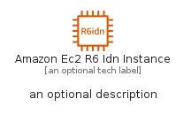

# AmazonEc2R6IdnInstance


```text
aws-q1-2023/Resource/Compute/AmazonEc2R6IdnInstance
```

```text
include('aws-q1-2023/Resource/Compute/AmazonEc2R6IdnInstance')
```


| Illustration | AmazonEc2R6IdnInstance | AmazonEc2R6IdnInstanceCard | AmazonEc2R6IdnInstanceGroup |
| :---: | :---: | :---: | :---: |
|  |  |  |  |


## Sprites
The item provides the following sriptes:

- `<$AmazonEc2R6IdnInstanceXs>`
- `<$AmazonEc2R6IdnInstanceSm>`
- `<$AmazonEc2R6IdnInstanceMd>`
- `<$AmazonEc2R6IdnInstanceLg>`


## AmazonEc2R6IdnInstance

### Load remotely
```plantuml
@startuml
' configures the library
!global $LIB_BASE_LOCATION="https://raw.githubusercontent.com/tmorin/plantuml-libs/master/distribution"

' loads the library's bootstrap
!include $LIB_BASE_LOCATION/bootstrap.puml

' loads the package bootstrap
include('aws-q1-2023/bootstrap')

' loads the Item which embeds the element AmazonEc2R6IdnInstance
include('aws-q1-2023/Resource/Compute/AmazonEc2R6IdnInstance')

' renders the element
AmazonEc2R6IdnInstance('AmazonEc2R6IdnInstance', 'Amazon Ec2 R6 Idn Instance', 'an optional tech label', 'an optional description')
@enduml
```

### Load locally
```plantuml
@startuml
' configures the library
!global $INCLUSION_MODE="local"
!global $LIB_BASE_LOCATION="../../.."

' loads the library's bootstrap
!include $LIB_BASE_LOCATION/bootstrap.puml

' loads the package bootstrap
include('aws-q1-2023/bootstrap')

' loads the Item which embeds the element AmazonEc2R6IdnInstance
include('aws-q1-2023/Resource/Compute/AmazonEc2R6IdnInstance')

' renders the element
AmazonEc2R6IdnInstance('AmazonEc2R6IdnInstance', 'Amazon Ec2 R6 Idn Instance', 'an optional tech label', 'an optional description')
@enduml
```

## AmazonEc2R6IdnInstanceCard

### Load remotely
```plantuml
@startuml
' configures the library
!global $LIB_BASE_LOCATION="https://raw.githubusercontent.com/tmorin/plantuml-libs/master/distribution"

' loads the library's bootstrap
!include $LIB_BASE_LOCATION/bootstrap.puml

' loads the package bootstrap
include('aws-q1-2023/bootstrap')

' loads the Item which embeds the element AmazonEc2R6IdnInstanceCard
include('aws-q1-2023/Resource/Compute/AmazonEc2R6IdnInstance')

' renders the element
AmazonEc2R6IdnInstanceCard('AmazonEc2R6IdnInstanceCard', 'Amazon Ec2 R6 Idn Instance Card', 'an optional description')
@enduml
```

### Load locally
```plantuml
@startuml
' configures the library
!global $INCLUSION_MODE="local"
!global $LIB_BASE_LOCATION="../../.."

' loads the library's bootstrap
!include $LIB_BASE_LOCATION/bootstrap.puml

' loads the package bootstrap
include('aws-q1-2023/bootstrap')

' loads the Item which embeds the element AmazonEc2R6IdnInstanceCard
include('aws-q1-2023/Resource/Compute/AmazonEc2R6IdnInstance')

' renders the element
AmazonEc2R6IdnInstanceCard('AmazonEc2R6IdnInstanceCard', 'Amazon Ec2 R6 Idn Instance Card', 'an optional description')
@enduml
```

## AmazonEc2R6IdnInstanceGroup

### Load remotely
```plantuml
@startuml
' configures the library
!global $LIB_BASE_LOCATION="https://raw.githubusercontent.com/tmorin/plantuml-libs/master/distribution"

' loads the library's bootstrap
!include $LIB_BASE_LOCATION/bootstrap.puml

' loads the package bootstrap
include('aws-q1-2023/bootstrap')

' loads the Item which embeds the element AmazonEc2R6IdnInstanceGroup
include('aws-q1-2023/Resource/Compute/AmazonEc2R6IdnInstance')

' renders the element
AmazonEc2R6IdnInstanceGroup('AmazonEc2R6IdnInstanceGroup', 'Amazon Ec2 R6 Idn Instance Group', 'an optional tech label') {
    note as note
        the content of the group
    end note
}
@enduml
```

### Load locally
```plantuml
@startuml
' configures the library
!global $INCLUSION_MODE="local"
!global $LIB_BASE_LOCATION="../../.."

' loads the library's bootstrap
!include $LIB_BASE_LOCATION/bootstrap.puml

' loads the package bootstrap
include('aws-q1-2023/bootstrap')

' loads the Item which embeds the element AmazonEc2R6IdnInstanceGroup
include('aws-q1-2023/Resource/Compute/AmazonEc2R6IdnInstance')

' renders the element
AmazonEc2R6IdnInstanceGroup('AmazonEc2R6IdnInstanceGroup', 'Amazon Ec2 R6 Idn Instance Group', 'an optional tech label') {
    note as note
        the content of the group
    end note
}
@enduml
```

