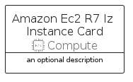

# AmazonEc2R7IzInstance


```text
aws-q1-2023/Resource/Compute/AmazonEc2R7IzInstance
```

```text
include('aws-q1-2023/Resource/Compute/AmazonEc2R7IzInstance')
```


| Illustration | AmazonEc2R7IzInstance | AmazonEc2R7IzInstanceCard | AmazonEc2R7IzInstanceGroup |
| :---: | :---: | :---: | :---: |
|  |  |  |  |


## AmazonEc2R7IzInstance

### Load remotely
```plantuml
@startuml
' configures the library
!global $LIB_BASE_LOCATION="https://raw.githubusercontent.com/tmorin/plantuml-libs/master/distribution"

' loads the library's bootstrap
!include $LIB_BASE_LOCATION/bootstrap.puml

' loads the package bootstrap
include('aws-q1-2023/bootstrap')

' loads the Item which embeds the element AmazonEc2R7IzInstance
include('aws-q1-2023/Resource/Compute/AmazonEc2R7IzInstance')

' renders the element
AmazonEc2R7IzInstance('AmazonEc2R7IzInstance', 'Amazon Ec2 R7 Iz Instance', 'an optional tech label', 'an optional description')
@enduml
```

### Load locally
```plantuml
@startuml
' configures the library
!global $INCLUSION_MODE="local"
!global $LIB_BASE_LOCATION="../../.."

' loads the library's bootstrap
!include $LIB_BASE_LOCATION/bootstrap.puml

' loads the package bootstrap
include('aws-q1-2023/bootstrap')

' loads the Item which embeds the element AmazonEc2R7IzInstance
include('aws-q1-2023/Resource/Compute/AmazonEc2R7IzInstance')

' renders the element
AmazonEc2R7IzInstance('AmazonEc2R7IzInstance', 'Amazon Ec2 R7 Iz Instance', 'an optional tech label', 'an optional description')
@enduml
```

## AmazonEc2R7IzInstanceCard

### Load remotely
```plantuml
@startuml
' configures the library
!global $LIB_BASE_LOCATION="https://raw.githubusercontent.com/tmorin/plantuml-libs/master/distribution"

' loads the library's bootstrap
!include $LIB_BASE_LOCATION/bootstrap.puml

' loads the package bootstrap
include('aws-q1-2023/bootstrap')

' loads the Item which embeds the element AmazonEc2R7IzInstanceCard
include('aws-q1-2023/Resource/Compute/AmazonEc2R7IzInstance')

' renders the element
AmazonEc2R7IzInstanceCard('AmazonEc2R7IzInstanceCard', 'Amazon Ec2 R7 Iz Instance Card', 'an optional description')
@enduml
```

### Load locally
```plantuml
@startuml
' configures the library
!global $INCLUSION_MODE="local"
!global $LIB_BASE_LOCATION="../../.."

' loads the library's bootstrap
!include $LIB_BASE_LOCATION/bootstrap.puml

' loads the package bootstrap
include('aws-q1-2023/bootstrap')

' loads the Item which embeds the element AmazonEc2R7IzInstanceCard
include('aws-q1-2023/Resource/Compute/AmazonEc2R7IzInstance')

' renders the element
AmazonEc2R7IzInstanceCard('AmazonEc2R7IzInstanceCard', 'Amazon Ec2 R7 Iz Instance Card', 'an optional description')
@enduml
```

## AmazonEc2R7IzInstanceGroup

### Load remotely
```plantuml
@startuml
' configures the library
!global $LIB_BASE_LOCATION="https://raw.githubusercontent.com/tmorin/plantuml-libs/master/distribution"

' loads the library's bootstrap
!include $LIB_BASE_LOCATION/bootstrap.puml

' loads the package bootstrap
include('aws-q1-2023/bootstrap')

' loads the Item which embeds the element AmazonEc2R7IzInstanceGroup
include('aws-q1-2023/Resource/Compute/AmazonEc2R7IzInstance')

' renders the element
AmazonEc2R7IzInstanceGroup('AmazonEc2R7IzInstanceGroup', 'Amazon Ec2 R7 Iz Instance Group', 'an optional tech label') {
    note as note
        the content of the group
    end note
}
@enduml
```

### Load locally
```plantuml
@startuml
' configures the library
!global $INCLUSION_MODE="local"
!global $LIB_BASE_LOCATION="../../.."

' loads the library's bootstrap
!include $LIB_BASE_LOCATION/bootstrap.puml

' loads the package bootstrap
include('aws-q1-2023/bootstrap')

' loads the Item which embeds the element AmazonEc2R7IzInstanceGroup
include('aws-q1-2023/Resource/Compute/AmazonEc2R7IzInstance')

' renders the element
AmazonEc2R7IzInstanceGroup('AmazonEc2R7IzInstanceGroup', 'Amazon Ec2 R7 Iz Instance Group', 'an optional tech label') {
    note as note
        the content of the group
    end note
}
@enduml
```

