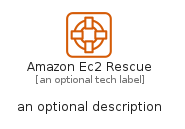

# AmazonEc2Rescue


```text
aws-q1-2023/Resource/Compute/AmazonEc2Rescue
```

```text
include('aws-q1-2023/Resource/Compute/AmazonEc2Rescue')
```


| Illustration | AmazonEc2Rescue | AmazonEc2RescueCard | AmazonEc2RescueGroup |
| :---: | :---: | :---: | :---: |
|  |  |  |  |


## AmazonEc2Rescue

### Load remotely
```plantuml
@startuml
' configures the library
!global $LIB_BASE_LOCATION="https://raw.githubusercontent.com/tmorin/plantuml-libs/master/distribution"

' loads the library's bootstrap
!include $LIB_BASE_LOCATION/bootstrap.puml

' loads the package bootstrap
include('aws-q1-2023/bootstrap')

' loads the Item which embeds the element AmazonEc2Rescue
include('aws-q1-2023/Resource/Compute/AmazonEc2Rescue')

' renders the element
AmazonEc2Rescue('AmazonEc2Rescue', 'Amazon Ec2 Rescue', 'an optional tech label', 'an optional description')
@enduml
```

### Load locally
```plantuml
@startuml
' configures the library
!global $INCLUSION_MODE="local"
!global $LIB_BASE_LOCATION="../../.."

' loads the library's bootstrap
!include $LIB_BASE_LOCATION/bootstrap.puml

' loads the package bootstrap
include('aws-q1-2023/bootstrap')

' loads the Item which embeds the element AmazonEc2Rescue
include('aws-q1-2023/Resource/Compute/AmazonEc2Rescue')

' renders the element
AmazonEc2Rescue('AmazonEc2Rescue', 'Amazon Ec2 Rescue', 'an optional tech label', 'an optional description')
@enduml
```

## AmazonEc2RescueCard

### Load remotely
```plantuml
@startuml
' configures the library
!global $LIB_BASE_LOCATION="https://raw.githubusercontent.com/tmorin/plantuml-libs/master/distribution"

' loads the library's bootstrap
!include $LIB_BASE_LOCATION/bootstrap.puml

' loads the package bootstrap
include('aws-q1-2023/bootstrap')

' loads the Item which embeds the element AmazonEc2RescueCard
include('aws-q1-2023/Resource/Compute/AmazonEc2Rescue')

' renders the element
AmazonEc2RescueCard('AmazonEc2RescueCard', 'Amazon Ec2 Rescue Card', 'an optional description')
@enduml
```

### Load locally
```plantuml
@startuml
' configures the library
!global $INCLUSION_MODE="local"
!global $LIB_BASE_LOCATION="../../.."

' loads the library's bootstrap
!include $LIB_BASE_LOCATION/bootstrap.puml

' loads the package bootstrap
include('aws-q1-2023/bootstrap')

' loads the Item which embeds the element AmazonEc2RescueCard
include('aws-q1-2023/Resource/Compute/AmazonEc2Rescue')

' renders the element
AmazonEc2RescueCard('AmazonEc2RescueCard', 'Amazon Ec2 Rescue Card', 'an optional description')
@enduml
```

## AmazonEc2RescueGroup

### Load remotely
```plantuml
@startuml
' configures the library
!global $LIB_BASE_LOCATION="https://raw.githubusercontent.com/tmorin/plantuml-libs/master/distribution"

' loads the library's bootstrap
!include $LIB_BASE_LOCATION/bootstrap.puml

' loads the package bootstrap
include('aws-q1-2023/bootstrap')

' loads the Item which embeds the element AmazonEc2RescueGroup
include('aws-q1-2023/Resource/Compute/AmazonEc2Rescue')

' renders the element
AmazonEc2RescueGroup('AmazonEc2RescueGroup', 'Amazon Ec2 Rescue Group', 'an optional tech label') {
    note as note
        the content of the group
    end note
}
@enduml
```

### Load locally
```plantuml
@startuml
' configures the library
!global $INCLUSION_MODE="local"
!global $LIB_BASE_LOCATION="../../.."

' loads the library's bootstrap
!include $LIB_BASE_LOCATION/bootstrap.puml

' loads the package bootstrap
include('aws-q1-2023/bootstrap')

' loads the Item which embeds the element AmazonEc2RescueGroup
include('aws-q1-2023/Resource/Compute/AmazonEc2Rescue')

' renders the element
AmazonEc2RescueGroup('AmazonEc2RescueGroup', 'Amazon Ec2 Rescue Group', 'an optional tech label') {
    note as note
        the content of the group
    end note
}
@enduml
```

