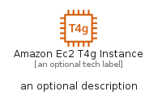
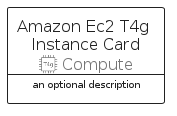

# AmazonEc2T4GInstance


```text
aws-q1-2023/Resource/Compute/AmazonEc2T4GInstance
```

```text
include('aws-q1-2023/Resource/Compute/AmazonEc2T4GInstance')
```


| Illustration | AmazonEc2T4GInstance | AmazonEc2T4GInstanceCard | AmazonEc2T4GInstanceGroup |
| :---: | :---: | :---: | :---: |
|  |  |  |  |


## Sprites
The item provides the following sriptes:

- `<$AmazonEc2T4GInstanceXs>`
- `<$AmazonEc2T4GInstanceSm>`
- `<$AmazonEc2T4GInstanceMd>`
- `<$AmazonEc2T4GInstanceLg>`


## AmazonEc2T4GInstance

### Load remotely
```plantuml
@startuml
' configures the library
!global $LIB_BASE_LOCATION="https://raw.githubusercontent.com/tmorin/plantuml-libs/master/distribution"

' loads the library's bootstrap
!include $LIB_BASE_LOCATION/bootstrap.puml

' loads the package bootstrap
include('aws-q1-2023/bootstrap')

' loads the Item which embeds the element AmazonEc2T4GInstance
include('aws-q1-2023/Resource/Compute/AmazonEc2T4GInstance')

' renders the element
AmazonEc2T4GInstance('AmazonEc2T4gInstance', 'Amazon Ec2 T4g Instance', 'an optional tech label', 'an optional description')
@enduml
```

### Load locally
```plantuml
@startuml
' configures the library
!global $INCLUSION_MODE="local"
!global $LIB_BASE_LOCATION="../../.."

' loads the library's bootstrap
!include $LIB_BASE_LOCATION/bootstrap.puml

' loads the package bootstrap
include('aws-q1-2023/bootstrap')

' loads the Item which embeds the element AmazonEc2T4GInstance
include('aws-q1-2023/Resource/Compute/AmazonEc2T4GInstance')

' renders the element
AmazonEc2T4GInstance('AmazonEc2T4gInstance', 'Amazon Ec2 T4g Instance', 'an optional tech label', 'an optional description')
@enduml
```

## AmazonEc2T4GInstanceCard

### Load remotely
```plantuml
@startuml
' configures the library
!global $LIB_BASE_LOCATION="https://raw.githubusercontent.com/tmorin/plantuml-libs/master/distribution"

' loads the library's bootstrap
!include $LIB_BASE_LOCATION/bootstrap.puml

' loads the package bootstrap
include('aws-q1-2023/bootstrap')

' loads the Item which embeds the element AmazonEc2T4GInstanceCard
include('aws-q1-2023/Resource/Compute/AmazonEc2T4GInstance')

' renders the element
AmazonEc2T4GInstanceCard('AmazonEc2T4gInstanceCard', 'Amazon Ec2 T4g Instance Card', 'an optional description')
@enduml
```

### Load locally
```plantuml
@startuml
' configures the library
!global $INCLUSION_MODE="local"
!global $LIB_BASE_LOCATION="../../.."

' loads the library's bootstrap
!include $LIB_BASE_LOCATION/bootstrap.puml

' loads the package bootstrap
include('aws-q1-2023/bootstrap')

' loads the Item which embeds the element AmazonEc2T4GInstanceCard
include('aws-q1-2023/Resource/Compute/AmazonEc2T4GInstance')

' renders the element
AmazonEc2T4GInstanceCard('AmazonEc2T4gInstanceCard', 'Amazon Ec2 T4g Instance Card', 'an optional description')
@enduml
```

## AmazonEc2T4GInstanceGroup

### Load remotely
```plantuml
@startuml
' configures the library
!global $LIB_BASE_LOCATION="https://raw.githubusercontent.com/tmorin/plantuml-libs/master/distribution"

' loads the library's bootstrap
!include $LIB_BASE_LOCATION/bootstrap.puml

' loads the package bootstrap
include('aws-q1-2023/bootstrap')

' loads the Item which embeds the element AmazonEc2T4GInstanceGroup
include('aws-q1-2023/Resource/Compute/AmazonEc2T4GInstance')

' renders the element
AmazonEc2T4GInstanceGroup('AmazonEc2T4gInstanceGroup', 'Amazon Ec2 T4g Instance Group', 'an optional tech label') {
    note as note
        the content of the group
    end note
}
@enduml
```

### Load locally
```plantuml
@startuml
' configures the library
!global $INCLUSION_MODE="local"
!global $LIB_BASE_LOCATION="../../.."

' loads the library's bootstrap
!include $LIB_BASE_LOCATION/bootstrap.puml

' loads the package bootstrap
include('aws-q1-2023/bootstrap')

' loads the Item which embeds the element AmazonEc2T4GInstanceGroup
include('aws-q1-2023/Resource/Compute/AmazonEc2T4GInstance')

' renders the element
AmazonEc2T4GInstanceGroup('AmazonEc2T4gInstanceGroup', 'Amazon Ec2 T4g Instance Group', 'an optional tech label') {
    note as note
        the content of the group
    end note
}
@enduml
```

