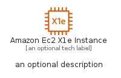

# AmazonEc2X1EInstance


```text
aws-q1-2023/Resource/Compute/AmazonEc2X1EInstance
```

```text
include('aws-q1-2023/Resource/Compute/AmazonEc2X1EInstance')
```


| Illustration | AmazonEc2X1EInstance | AmazonEc2X1EInstanceCard | AmazonEc2X1EInstanceGroup |
| :---: | :---: | :---: | :---: |
|  |  |  |  |


## AmazonEc2X1EInstance

### Load remotely
```plantuml
@startuml
' configures the library
!global $LIB_BASE_LOCATION="https://raw.githubusercontent.com/tmorin/plantuml-libs/master/distribution"

' loads the library's bootstrap
!include $LIB_BASE_LOCATION/bootstrap.puml

' loads the package bootstrap
include('aws-q1-2023/bootstrap')

' loads the Item which embeds the element AmazonEc2X1EInstance
include('aws-q1-2023/Resource/Compute/AmazonEc2X1EInstance')

' renders the element
AmazonEc2X1EInstance('AmazonEc2X1eInstance', 'Amazon Ec2 X1e Instance', 'an optional tech label', 'an optional description')
@enduml
```

### Load locally
```plantuml
@startuml
' configures the library
!global $INCLUSION_MODE="local"
!global $LIB_BASE_LOCATION="../../.."

' loads the library's bootstrap
!include $LIB_BASE_LOCATION/bootstrap.puml

' loads the package bootstrap
include('aws-q1-2023/bootstrap')

' loads the Item which embeds the element AmazonEc2X1EInstance
include('aws-q1-2023/Resource/Compute/AmazonEc2X1EInstance')

' renders the element
AmazonEc2X1EInstance('AmazonEc2X1eInstance', 'Amazon Ec2 X1e Instance', 'an optional tech label', 'an optional description')
@enduml
```

## AmazonEc2X1EInstanceCard

### Load remotely
```plantuml
@startuml
' configures the library
!global $LIB_BASE_LOCATION="https://raw.githubusercontent.com/tmorin/plantuml-libs/master/distribution"

' loads the library's bootstrap
!include $LIB_BASE_LOCATION/bootstrap.puml

' loads the package bootstrap
include('aws-q1-2023/bootstrap')

' loads the Item which embeds the element AmazonEc2X1EInstanceCard
include('aws-q1-2023/Resource/Compute/AmazonEc2X1EInstance')

' renders the element
AmazonEc2X1EInstanceCard('AmazonEc2X1eInstanceCard', 'Amazon Ec2 X1e Instance Card', 'an optional description')
@enduml
```

### Load locally
```plantuml
@startuml
' configures the library
!global $INCLUSION_MODE="local"
!global $LIB_BASE_LOCATION="../../.."

' loads the library's bootstrap
!include $LIB_BASE_LOCATION/bootstrap.puml

' loads the package bootstrap
include('aws-q1-2023/bootstrap')

' loads the Item which embeds the element AmazonEc2X1EInstanceCard
include('aws-q1-2023/Resource/Compute/AmazonEc2X1EInstance')

' renders the element
AmazonEc2X1EInstanceCard('AmazonEc2X1eInstanceCard', 'Amazon Ec2 X1e Instance Card', 'an optional description')
@enduml
```

## AmazonEc2X1EInstanceGroup

### Load remotely
```plantuml
@startuml
' configures the library
!global $LIB_BASE_LOCATION="https://raw.githubusercontent.com/tmorin/plantuml-libs/master/distribution"

' loads the library's bootstrap
!include $LIB_BASE_LOCATION/bootstrap.puml

' loads the package bootstrap
include('aws-q1-2023/bootstrap')

' loads the Item which embeds the element AmazonEc2X1EInstanceGroup
include('aws-q1-2023/Resource/Compute/AmazonEc2X1EInstance')

' renders the element
AmazonEc2X1EInstanceGroup('AmazonEc2X1eInstanceGroup', 'Amazon Ec2 X1e Instance Group', 'an optional tech label') {
    note as note
        the content of the group
    end note
}
@enduml
```

### Load locally
```plantuml
@startuml
' configures the library
!global $INCLUSION_MODE="local"
!global $LIB_BASE_LOCATION="../../.."

' loads the library's bootstrap
!include $LIB_BASE_LOCATION/bootstrap.puml

' loads the package bootstrap
include('aws-q1-2023/bootstrap')

' loads the Item which embeds the element AmazonEc2X1EInstanceGroup
include('aws-q1-2023/Resource/Compute/AmazonEc2X1EInstance')

' renders the element
AmazonEc2X1EInstanceGroup('AmazonEc2X1eInstanceGroup', 'Amazon Ec2 X1e Instance Group', 'an optional tech label') {
    note as note
        the content of the group
    end note
}
@enduml
```

