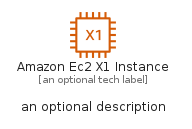
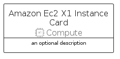

# AmazonEc2X1Instance


```text
aws-q1-2023/Resource/Compute/AmazonEc2X1Instance
```

```text
include('aws-q1-2023/Resource/Compute/AmazonEc2X1Instance')
```


| Illustration | AmazonEc2X1Instance | AmazonEc2X1InstanceCard | AmazonEc2X1InstanceGroup |
| :---: | :---: | :---: | :---: |
|  |  |  |  |


## AmazonEc2X1Instance

### Load remotely
```plantuml
@startuml
' configures the library
!global $LIB_BASE_LOCATION="https://raw.githubusercontent.com/tmorin/plantuml-libs/master/distribution"

' loads the library's bootstrap
!include $LIB_BASE_LOCATION/bootstrap.puml

' loads the package bootstrap
include('aws-q1-2023/bootstrap')

' loads the Item which embeds the element AmazonEc2X1Instance
include('aws-q1-2023/Resource/Compute/AmazonEc2X1Instance')

' renders the element
AmazonEc2X1Instance('AmazonEc2X1Instance', 'Amazon Ec2 X1 Instance', 'an optional tech label', 'an optional description')
@enduml
```

### Load locally
```plantuml
@startuml
' configures the library
!global $INCLUSION_MODE="local"
!global $LIB_BASE_LOCATION="../../.."

' loads the library's bootstrap
!include $LIB_BASE_LOCATION/bootstrap.puml

' loads the package bootstrap
include('aws-q1-2023/bootstrap')

' loads the Item which embeds the element AmazonEc2X1Instance
include('aws-q1-2023/Resource/Compute/AmazonEc2X1Instance')

' renders the element
AmazonEc2X1Instance('AmazonEc2X1Instance', 'Amazon Ec2 X1 Instance', 'an optional tech label', 'an optional description')
@enduml
```

## AmazonEc2X1InstanceCard

### Load remotely
```plantuml
@startuml
' configures the library
!global $LIB_BASE_LOCATION="https://raw.githubusercontent.com/tmorin/plantuml-libs/master/distribution"

' loads the library's bootstrap
!include $LIB_BASE_LOCATION/bootstrap.puml

' loads the package bootstrap
include('aws-q1-2023/bootstrap')

' loads the Item which embeds the element AmazonEc2X1InstanceCard
include('aws-q1-2023/Resource/Compute/AmazonEc2X1Instance')

' renders the element
AmazonEc2X1InstanceCard('AmazonEc2X1InstanceCard', 'Amazon Ec2 X1 Instance Card', 'an optional description')
@enduml
```

### Load locally
```plantuml
@startuml
' configures the library
!global $INCLUSION_MODE="local"
!global $LIB_BASE_LOCATION="../../.."

' loads the library's bootstrap
!include $LIB_BASE_LOCATION/bootstrap.puml

' loads the package bootstrap
include('aws-q1-2023/bootstrap')

' loads the Item which embeds the element AmazonEc2X1InstanceCard
include('aws-q1-2023/Resource/Compute/AmazonEc2X1Instance')

' renders the element
AmazonEc2X1InstanceCard('AmazonEc2X1InstanceCard', 'Amazon Ec2 X1 Instance Card', 'an optional description')
@enduml
```

## AmazonEc2X1InstanceGroup

### Load remotely
```plantuml
@startuml
' configures the library
!global $LIB_BASE_LOCATION="https://raw.githubusercontent.com/tmorin/plantuml-libs/master/distribution"

' loads the library's bootstrap
!include $LIB_BASE_LOCATION/bootstrap.puml

' loads the package bootstrap
include('aws-q1-2023/bootstrap')

' loads the Item which embeds the element AmazonEc2X1InstanceGroup
include('aws-q1-2023/Resource/Compute/AmazonEc2X1Instance')

' renders the element
AmazonEc2X1InstanceGroup('AmazonEc2X1InstanceGroup', 'Amazon Ec2 X1 Instance Group', 'an optional tech label') {
    note as note
        the content of the group
    end note
}
@enduml
```

### Load locally
```plantuml
@startuml
' configures the library
!global $INCLUSION_MODE="local"
!global $LIB_BASE_LOCATION="../../.."

' loads the library's bootstrap
!include $LIB_BASE_LOCATION/bootstrap.puml

' loads the package bootstrap
include('aws-q1-2023/bootstrap')

' loads the Item which embeds the element AmazonEc2X1InstanceGroup
include('aws-q1-2023/Resource/Compute/AmazonEc2X1Instance')

' renders the element
AmazonEc2X1InstanceGroup('AmazonEc2X1InstanceGroup', 'Amazon Ec2 X1 Instance Group', 'an optional tech label') {
    note as note
        the content of the group
    end note
}
@enduml
```

