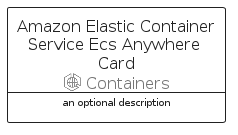

# AmazonElasticContainerServiceEcsAnywhere


```text
aws-q1-2023/Resource/Containers/AmazonElasticContainerServiceEcsAnywhere
```

```text
include('aws-q1-2023/Resource/Containers/AmazonElasticContainerServiceEcsAnywhere')
```


| Illustration | AmazonElasticContainerServiceEcsAnywhere | AmazonElasticContainerServiceEcsAnywhereCard | AmazonElasticContainerServiceEcsAnywhereGroup |
| :---: | :---: | :---: | :---: |
|  |  |  |  |


## Sprites
The item provides the following sriptes:

- `<$AmazonElasticContainerServiceEcsAnywhereXs>`
- `<$AmazonElasticContainerServiceEcsAnywhereSm>`
- `<$AmazonElasticContainerServiceEcsAnywhereMd>`
- `<$AmazonElasticContainerServiceEcsAnywhereLg>`


## AmazonElasticContainerServiceEcsAnywhere

### Load remotely
```plantuml
@startuml
' configures the library
!global $LIB_BASE_LOCATION="https://raw.githubusercontent.com/tmorin/plantuml-libs/master/distribution"

' loads the library's bootstrap
!include $LIB_BASE_LOCATION/bootstrap.puml

' loads the package bootstrap
include('aws-q1-2023/bootstrap')

' loads the Item which embeds the element AmazonElasticContainerServiceEcsAnywhere
include('aws-q1-2023/Resource/Containers/AmazonElasticContainerServiceEcsAnywhere')

' renders the element
AmazonElasticContainerServiceEcsAnywhere('AmazonElasticContainerServiceEcsAnywhere', 'Amazon Elastic Container Service Ecs Anywhere', 'an optional tech label', 'an optional description')
@enduml
```

### Load locally
```plantuml
@startuml
' configures the library
!global $INCLUSION_MODE="local"
!global $LIB_BASE_LOCATION="../../.."

' loads the library's bootstrap
!include $LIB_BASE_LOCATION/bootstrap.puml

' loads the package bootstrap
include('aws-q1-2023/bootstrap')

' loads the Item which embeds the element AmazonElasticContainerServiceEcsAnywhere
include('aws-q1-2023/Resource/Containers/AmazonElasticContainerServiceEcsAnywhere')

' renders the element
AmazonElasticContainerServiceEcsAnywhere('AmazonElasticContainerServiceEcsAnywhere', 'Amazon Elastic Container Service Ecs Anywhere', 'an optional tech label', 'an optional description')
@enduml
```

## AmazonElasticContainerServiceEcsAnywhereCard

### Load remotely
```plantuml
@startuml
' configures the library
!global $LIB_BASE_LOCATION="https://raw.githubusercontent.com/tmorin/plantuml-libs/master/distribution"

' loads the library's bootstrap
!include $LIB_BASE_LOCATION/bootstrap.puml

' loads the package bootstrap
include('aws-q1-2023/bootstrap')

' loads the Item which embeds the element AmazonElasticContainerServiceEcsAnywhereCard
include('aws-q1-2023/Resource/Containers/AmazonElasticContainerServiceEcsAnywhere')

' renders the element
AmazonElasticContainerServiceEcsAnywhereCard('AmazonElasticContainerServiceEcsAnywhereCard', 'Amazon Elastic Container Service Ecs Anywhere Card', 'an optional description')
@enduml
```

### Load locally
```plantuml
@startuml
' configures the library
!global $INCLUSION_MODE="local"
!global $LIB_BASE_LOCATION="../../.."

' loads the library's bootstrap
!include $LIB_BASE_LOCATION/bootstrap.puml

' loads the package bootstrap
include('aws-q1-2023/bootstrap')

' loads the Item which embeds the element AmazonElasticContainerServiceEcsAnywhereCard
include('aws-q1-2023/Resource/Containers/AmazonElasticContainerServiceEcsAnywhere')

' renders the element
AmazonElasticContainerServiceEcsAnywhereCard('AmazonElasticContainerServiceEcsAnywhereCard', 'Amazon Elastic Container Service Ecs Anywhere Card', 'an optional description')
@enduml
```

## AmazonElasticContainerServiceEcsAnywhereGroup

### Load remotely
```plantuml
@startuml
' configures the library
!global $LIB_BASE_LOCATION="https://raw.githubusercontent.com/tmorin/plantuml-libs/master/distribution"

' loads the library's bootstrap
!include $LIB_BASE_LOCATION/bootstrap.puml

' loads the package bootstrap
include('aws-q1-2023/bootstrap')

' loads the Item which embeds the element AmazonElasticContainerServiceEcsAnywhereGroup
include('aws-q1-2023/Resource/Containers/AmazonElasticContainerServiceEcsAnywhere')

' renders the element
AmazonElasticContainerServiceEcsAnywhereGroup('AmazonElasticContainerServiceEcsAnywhereGroup', 'Amazon Elastic Container Service Ecs Anywhere Group', 'an optional tech label') {
    note as note
        the content of the group
    end note
}
@enduml
```

### Load locally
```plantuml
@startuml
' configures the library
!global $INCLUSION_MODE="local"
!global $LIB_BASE_LOCATION="../../.."

' loads the library's bootstrap
!include $LIB_BASE_LOCATION/bootstrap.puml

' loads the package bootstrap
include('aws-q1-2023/bootstrap')

' loads the Item which embeds the element AmazonElasticContainerServiceEcsAnywhereGroup
include('aws-q1-2023/Resource/Containers/AmazonElasticContainerServiceEcsAnywhere')

' renders the element
AmazonElasticContainerServiceEcsAnywhereGroup('AmazonElasticContainerServiceEcsAnywhereGroup', 'Amazon Elastic Container Service Ecs Anywhere Group', 'an optional tech label') {
    note as note
        the content of the group
    end note
}
@enduml
```

