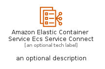
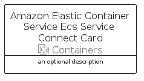

# AmazonElasticContainerServiceEcsServiceConnect


```text
aws-q1-2023/Resource/Containers/AmazonElasticContainerServiceEcsServiceConnect
```

```text
include('aws-q1-2023/Resource/Containers/AmazonElasticContainerServiceEcsServiceConnect')
```


| Illustration | AmazonElasticContainerServiceEcsServiceConnect | AmazonElasticContainerServiceEcsServiceConnectCard | AmazonElasticContainerServiceEcsServiceConnectGroup |
| :---: | :---: | :---: | :---: |
|  |  |  |  |


## Sprites
The item provides the following sriptes:

- `<$AmazonElasticContainerServiceEcsServiceConnectXs>`
- `<$AmazonElasticContainerServiceEcsServiceConnectSm>`
- `<$AmazonElasticContainerServiceEcsServiceConnectMd>`
- `<$AmazonElasticContainerServiceEcsServiceConnectLg>`


## AmazonElasticContainerServiceEcsServiceConnect

### Load remotely
```plantuml
@startuml
' configures the library
!global $LIB_BASE_LOCATION="https://raw.githubusercontent.com/tmorin/plantuml-libs/master/distribution"

' loads the library's bootstrap
!include $LIB_BASE_LOCATION/bootstrap.puml

' loads the package bootstrap
include('aws-q1-2023/bootstrap')

' loads the Item which embeds the element AmazonElasticContainerServiceEcsServiceConnect
include('aws-q1-2023/Resource/Containers/AmazonElasticContainerServiceEcsServiceConnect')

' renders the element
AmazonElasticContainerServiceEcsServiceConnect('AmazonElasticContainerServiceEcsServiceConnect', 'Amazon Elastic Container Service Ecs Service Connect', 'an optional tech label', 'an optional description')
@enduml
```

### Load locally
```plantuml
@startuml
' configures the library
!global $INCLUSION_MODE="local"
!global $LIB_BASE_LOCATION="../../.."

' loads the library's bootstrap
!include $LIB_BASE_LOCATION/bootstrap.puml

' loads the package bootstrap
include('aws-q1-2023/bootstrap')

' loads the Item which embeds the element AmazonElasticContainerServiceEcsServiceConnect
include('aws-q1-2023/Resource/Containers/AmazonElasticContainerServiceEcsServiceConnect')

' renders the element
AmazonElasticContainerServiceEcsServiceConnect('AmazonElasticContainerServiceEcsServiceConnect', 'Amazon Elastic Container Service Ecs Service Connect', 'an optional tech label', 'an optional description')
@enduml
```

## AmazonElasticContainerServiceEcsServiceConnectCard

### Load remotely
```plantuml
@startuml
' configures the library
!global $LIB_BASE_LOCATION="https://raw.githubusercontent.com/tmorin/plantuml-libs/master/distribution"

' loads the library's bootstrap
!include $LIB_BASE_LOCATION/bootstrap.puml

' loads the package bootstrap
include('aws-q1-2023/bootstrap')

' loads the Item which embeds the element AmazonElasticContainerServiceEcsServiceConnectCard
include('aws-q1-2023/Resource/Containers/AmazonElasticContainerServiceEcsServiceConnect')

' renders the element
AmazonElasticContainerServiceEcsServiceConnectCard('AmazonElasticContainerServiceEcsServiceConnectCard', 'Amazon Elastic Container Service Ecs Service Connect Card', 'an optional description')
@enduml
```

### Load locally
```plantuml
@startuml
' configures the library
!global $INCLUSION_MODE="local"
!global $LIB_BASE_LOCATION="../../.."

' loads the library's bootstrap
!include $LIB_BASE_LOCATION/bootstrap.puml

' loads the package bootstrap
include('aws-q1-2023/bootstrap')

' loads the Item which embeds the element AmazonElasticContainerServiceEcsServiceConnectCard
include('aws-q1-2023/Resource/Containers/AmazonElasticContainerServiceEcsServiceConnect')

' renders the element
AmazonElasticContainerServiceEcsServiceConnectCard('AmazonElasticContainerServiceEcsServiceConnectCard', 'Amazon Elastic Container Service Ecs Service Connect Card', 'an optional description')
@enduml
```

## AmazonElasticContainerServiceEcsServiceConnectGroup

### Load remotely
```plantuml
@startuml
' configures the library
!global $LIB_BASE_LOCATION="https://raw.githubusercontent.com/tmorin/plantuml-libs/master/distribution"

' loads the library's bootstrap
!include $LIB_BASE_LOCATION/bootstrap.puml

' loads the package bootstrap
include('aws-q1-2023/bootstrap')

' loads the Item which embeds the element AmazonElasticContainerServiceEcsServiceConnectGroup
include('aws-q1-2023/Resource/Containers/AmazonElasticContainerServiceEcsServiceConnect')

' renders the element
AmazonElasticContainerServiceEcsServiceConnectGroup('AmazonElasticContainerServiceEcsServiceConnectGroup', 'Amazon Elastic Container Service Ecs Service Connect Group', 'an optional tech label') {
    note as note
        the content of the group
    end note
}
@enduml
```

### Load locally
```plantuml
@startuml
' configures the library
!global $INCLUSION_MODE="local"
!global $LIB_BASE_LOCATION="../../.."

' loads the library's bootstrap
!include $LIB_BASE_LOCATION/bootstrap.puml

' loads the package bootstrap
include('aws-q1-2023/bootstrap')

' loads the Item which embeds the element AmazonElasticContainerServiceEcsServiceConnectGroup
include('aws-q1-2023/Resource/Containers/AmazonElasticContainerServiceEcsServiceConnect')

' renders the element
AmazonElasticContainerServiceEcsServiceConnectGroup('AmazonElasticContainerServiceEcsServiceConnectGroup', 'Amazon Elastic Container Service Ecs Service Connect Group', 'an optional tech label') {
    note as note
        the content of the group
    end note
}
@enduml
```

