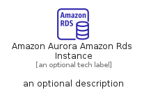
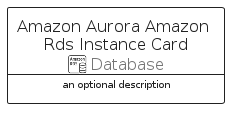

# AmazonAuroraAmazonRdsInstance


```text
aws-q1-2023/Resource/Database/AmazonAuroraAmazonRdsInstance
```

```text
include('aws-q1-2023/Resource/Database/AmazonAuroraAmazonRdsInstance')
```


| Illustration | AmazonAuroraAmazonRdsInstance | AmazonAuroraAmazonRdsInstanceCard | AmazonAuroraAmazonRdsInstanceGroup |
| :---: | :---: | :---: | :---: |
|  |  |  |  |


## AmazonAuroraAmazonRdsInstance

### Load remotely
```plantuml
@startuml
' configures the library
!global $LIB_BASE_LOCATION="https://raw.githubusercontent.com/tmorin/plantuml-libs/master/distribution"

' loads the library's bootstrap
!include $LIB_BASE_LOCATION/bootstrap.puml

' loads the package bootstrap
include('aws-q1-2023/bootstrap')

' loads the Item which embeds the element AmazonAuroraAmazonRdsInstance
include('aws-q1-2023/Resource/Database/AmazonAuroraAmazonRdsInstance')

' renders the element
AmazonAuroraAmazonRdsInstance('AmazonAuroraAmazonRdsInstance', 'Amazon Aurora Amazon Rds Instance', 'an optional tech label', 'an optional description')
@enduml
```

### Load locally
```plantuml
@startuml
' configures the library
!global $INCLUSION_MODE="local"
!global $LIB_BASE_LOCATION="../../.."

' loads the library's bootstrap
!include $LIB_BASE_LOCATION/bootstrap.puml

' loads the package bootstrap
include('aws-q1-2023/bootstrap')

' loads the Item which embeds the element AmazonAuroraAmazonRdsInstance
include('aws-q1-2023/Resource/Database/AmazonAuroraAmazonRdsInstance')

' renders the element
AmazonAuroraAmazonRdsInstance('AmazonAuroraAmazonRdsInstance', 'Amazon Aurora Amazon Rds Instance', 'an optional tech label', 'an optional description')
@enduml
```

## AmazonAuroraAmazonRdsInstanceCard

### Load remotely
```plantuml
@startuml
' configures the library
!global $LIB_BASE_LOCATION="https://raw.githubusercontent.com/tmorin/plantuml-libs/master/distribution"

' loads the library's bootstrap
!include $LIB_BASE_LOCATION/bootstrap.puml

' loads the package bootstrap
include('aws-q1-2023/bootstrap')

' loads the Item which embeds the element AmazonAuroraAmazonRdsInstanceCard
include('aws-q1-2023/Resource/Database/AmazonAuroraAmazonRdsInstance')

' renders the element
AmazonAuroraAmazonRdsInstanceCard('AmazonAuroraAmazonRdsInstanceCard', 'Amazon Aurora Amazon Rds Instance Card', 'an optional description')
@enduml
```

### Load locally
```plantuml
@startuml
' configures the library
!global $INCLUSION_MODE="local"
!global $LIB_BASE_LOCATION="../../.."

' loads the library's bootstrap
!include $LIB_BASE_LOCATION/bootstrap.puml

' loads the package bootstrap
include('aws-q1-2023/bootstrap')

' loads the Item which embeds the element AmazonAuroraAmazonRdsInstanceCard
include('aws-q1-2023/Resource/Database/AmazonAuroraAmazonRdsInstance')

' renders the element
AmazonAuroraAmazonRdsInstanceCard('AmazonAuroraAmazonRdsInstanceCard', 'Amazon Aurora Amazon Rds Instance Card', 'an optional description')
@enduml
```

## AmazonAuroraAmazonRdsInstanceGroup

### Load remotely
```plantuml
@startuml
' configures the library
!global $LIB_BASE_LOCATION="https://raw.githubusercontent.com/tmorin/plantuml-libs/master/distribution"

' loads the library's bootstrap
!include $LIB_BASE_LOCATION/bootstrap.puml

' loads the package bootstrap
include('aws-q1-2023/bootstrap')

' loads the Item which embeds the element AmazonAuroraAmazonRdsInstanceGroup
include('aws-q1-2023/Resource/Database/AmazonAuroraAmazonRdsInstance')

' renders the element
AmazonAuroraAmazonRdsInstanceGroup('AmazonAuroraAmazonRdsInstanceGroup', 'Amazon Aurora Amazon Rds Instance Group', 'an optional tech label') {
    note as note
        the content of the group
    end note
}
@enduml
```

### Load locally
```plantuml
@startuml
' configures the library
!global $INCLUSION_MODE="local"
!global $LIB_BASE_LOCATION="../../.."

' loads the library's bootstrap
!include $LIB_BASE_LOCATION/bootstrap.puml

' loads the package bootstrap
include('aws-q1-2023/bootstrap')

' loads the Item which embeds the element AmazonAuroraAmazonRdsInstanceGroup
include('aws-q1-2023/Resource/Database/AmazonAuroraAmazonRdsInstance')

' renders the element
AmazonAuroraAmazonRdsInstanceGroup('AmazonAuroraAmazonRdsInstanceGroup', 'Amazon Aurora Amazon Rds Instance Group', 'an optional tech label') {
    note as note
        the content of the group
    end note
}
@enduml
```

