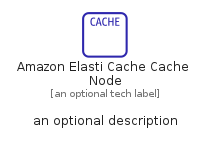
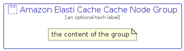

# AmazonElastiCacheCacheNode


```text
aws-q1-2023/Resource/Database/AmazonElastiCacheCacheNode
```

```text
include('aws-q1-2023/Resource/Database/AmazonElastiCacheCacheNode')
```


| Illustration | AmazonElastiCacheCacheNode | AmazonElastiCacheCacheNodeCard | AmazonElastiCacheCacheNodeGroup |
| :---: | :---: | :---: | :---: |
|  |  |  |  |


## AmazonElastiCacheCacheNode

### Load remotely
```plantuml
@startuml
' configures the library
!global $LIB_BASE_LOCATION="https://raw.githubusercontent.com/tmorin/plantuml-libs/master/distribution"

' loads the library's bootstrap
!include $LIB_BASE_LOCATION/bootstrap.puml

' loads the package bootstrap
include('aws-q1-2023/bootstrap')

' loads the Item which embeds the element AmazonElastiCacheCacheNode
include('aws-q1-2023/Resource/Database/AmazonElastiCacheCacheNode')

' renders the element
AmazonElastiCacheCacheNode('AmazonElastiCacheCacheNode', 'Amazon Elasti Cache Cache Node', 'an optional tech label', 'an optional description')
@enduml
```

### Load locally
```plantuml
@startuml
' configures the library
!global $INCLUSION_MODE="local"
!global $LIB_BASE_LOCATION="../../.."

' loads the library's bootstrap
!include $LIB_BASE_LOCATION/bootstrap.puml

' loads the package bootstrap
include('aws-q1-2023/bootstrap')

' loads the Item which embeds the element AmazonElastiCacheCacheNode
include('aws-q1-2023/Resource/Database/AmazonElastiCacheCacheNode')

' renders the element
AmazonElastiCacheCacheNode('AmazonElastiCacheCacheNode', 'Amazon Elasti Cache Cache Node', 'an optional tech label', 'an optional description')
@enduml
```

## AmazonElastiCacheCacheNodeCard

### Load remotely
```plantuml
@startuml
' configures the library
!global $LIB_BASE_LOCATION="https://raw.githubusercontent.com/tmorin/plantuml-libs/master/distribution"

' loads the library's bootstrap
!include $LIB_BASE_LOCATION/bootstrap.puml

' loads the package bootstrap
include('aws-q1-2023/bootstrap')

' loads the Item which embeds the element AmazonElastiCacheCacheNodeCard
include('aws-q1-2023/Resource/Database/AmazonElastiCacheCacheNode')

' renders the element
AmazonElastiCacheCacheNodeCard('AmazonElastiCacheCacheNodeCard', 'Amazon Elasti Cache Cache Node Card', 'an optional description')
@enduml
```

### Load locally
```plantuml
@startuml
' configures the library
!global $INCLUSION_MODE="local"
!global $LIB_BASE_LOCATION="../../.."

' loads the library's bootstrap
!include $LIB_BASE_LOCATION/bootstrap.puml

' loads the package bootstrap
include('aws-q1-2023/bootstrap')

' loads the Item which embeds the element AmazonElastiCacheCacheNodeCard
include('aws-q1-2023/Resource/Database/AmazonElastiCacheCacheNode')

' renders the element
AmazonElastiCacheCacheNodeCard('AmazonElastiCacheCacheNodeCard', 'Amazon Elasti Cache Cache Node Card', 'an optional description')
@enduml
```

## AmazonElastiCacheCacheNodeGroup

### Load remotely
```plantuml
@startuml
' configures the library
!global $LIB_BASE_LOCATION="https://raw.githubusercontent.com/tmorin/plantuml-libs/master/distribution"

' loads the library's bootstrap
!include $LIB_BASE_LOCATION/bootstrap.puml

' loads the package bootstrap
include('aws-q1-2023/bootstrap')

' loads the Item which embeds the element AmazonElastiCacheCacheNodeGroup
include('aws-q1-2023/Resource/Database/AmazonElastiCacheCacheNode')

' renders the element
AmazonElastiCacheCacheNodeGroup('AmazonElastiCacheCacheNodeGroup', 'Amazon Elasti Cache Cache Node Group', 'an optional tech label') {
    note as note
        the content of the group
    end note
}
@enduml
```

### Load locally
```plantuml
@startuml
' configures the library
!global $INCLUSION_MODE="local"
!global $LIB_BASE_LOCATION="../../.."

' loads the library's bootstrap
!include $LIB_BASE_LOCATION/bootstrap.puml

' loads the package bootstrap
include('aws-q1-2023/bootstrap')

' loads the Item which embeds the element AmazonElastiCacheCacheNodeGroup
include('aws-q1-2023/Resource/Database/AmazonElastiCacheCacheNode')

' renders the element
AmazonElastiCacheCacheNodeGroup('AmazonElastiCacheCacheNodeGroup', 'Amazon Elasti Cache Cache Node Group', 'an optional tech label') {
    note as note
        the content of the group
    end note
}
@enduml
```

