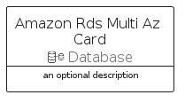
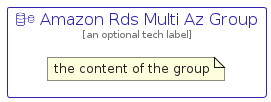

# AmazonRdsMultiAz


```text
aws-q1-2023/Resource/Database/AmazonRdsMultiAz
```

```text
include('aws-q1-2023/Resource/Database/AmazonRdsMultiAz')
```


| Illustration | AmazonRdsMultiAz | AmazonRdsMultiAzCard | AmazonRdsMultiAzGroup |
| :---: | :---: | :---: | :---: |
|  |  |  |  |


## AmazonRdsMultiAz

### Load remotely
```plantuml
@startuml
' configures the library
!global $LIB_BASE_LOCATION="https://raw.githubusercontent.com/tmorin/plantuml-libs/master/distribution"

' loads the library's bootstrap
!include $LIB_BASE_LOCATION/bootstrap.puml

' loads the package bootstrap
include('aws-q1-2023/bootstrap')

' loads the Item which embeds the element AmazonRdsMultiAz
include('aws-q1-2023/Resource/Database/AmazonRdsMultiAz')

' renders the element
AmazonRdsMultiAz('AmazonRdsMultiAz', 'Amazon Rds Multi Az', 'an optional tech label', 'an optional description')
@enduml
```

### Load locally
```plantuml
@startuml
' configures the library
!global $INCLUSION_MODE="local"
!global $LIB_BASE_LOCATION="../../.."

' loads the library's bootstrap
!include $LIB_BASE_LOCATION/bootstrap.puml

' loads the package bootstrap
include('aws-q1-2023/bootstrap')

' loads the Item which embeds the element AmazonRdsMultiAz
include('aws-q1-2023/Resource/Database/AmazonRdsMultiAz')

' renders the element
AmazonRdsMultiAz('AmazonRdsMultiAz', 'Amazon Rds Multi Az', 'an optional tech label', 'an optional description')
@enduml
```

## AmazonRdsMultiAzCard

### Load remotely
```plantuml
@startuml
' configures the library
!global $LIB_BASE_LOCATION="https://raw.githubusercontent.com/tmorin/plantuml-libs/master/distribution"

' loads the library's bootstrap
!include $LIB_BASE_LOCATION/bootstrap.puml

' loads the package bootstrap
include('aws-q1-2023/bootstrap')

' loads the Item which embeds the element AmazonRdsMultiAzCard
include('aws-q1-2023/Resource/Database/AmazonRdsMultiAz')

' renders the element
AmazonRdsMultiAzCard('AmazonRdsMultiAzCard', 'Amazon Rds Multi Az Card', 'an optional description')
@enduml
```

### Load locally
```plantuml
@startuml
' configures the library
!global $INCLUSION_MODE="local"
!global $LIB_BASE_LOCATION="../../.."

' loads the library's bootstrap
!include $LIB_BASE_LOCATION/bootstrap.puml

' loads the package bootstrap
include('aws-q1-2023/bootstrap')

' loads the Item which embeds the element AmazonRdsMultiAzCard
include('aws-q1-2023/Resource/Database/AmazonRdsMultiAz')

' renders the element
AmazonRdsMultiAzCard('AmazonRdsMultiAzCard', 'Amazon Rds Multi Az Card', 'an optional description')
@enduml
```

## AmazonRdsMultiAzGroup

### Load remotely
```plantuml
@startuml
' configures the library
!global $LIB_BASE_LOCATION="https://raw.githubusercontent.com/tmorin/plantuml-libs/master/distribution"

' loads the library's bootstrap
!include $LIB_BASE_LOCATION/bootstrap.puml

' loads the package bootstrap
include('aws-q1-2023/bootstrap')

' loads the Item which embeds the element AmazonRdsMultiAzGroup
include('aws-q1-2023/Resource/Database/AmazonRdsMultiAz')

' renders the element
AmazonRdsMultiAzGroup('AmazonRdsMultiAzGroup', 'Amazon Rds Multi Az Group', 'an optional tech label') {
    note as note
        the content of the group
    end note
}
@enduml
```

### Load locally
```plantuml
@startuml
' configures the library
!global $INCLUSION_MODE="local"
!global $LIB_BASE_LOCATION="../../.."

' loads the library's bootstrap
!include $LIB_BASE_LOCATION/bootstrap.puml

' loads the package bootstrap
include('aws-q1-2023/bootstrap')

' loads the Item which embeds the element AmazonRdsMultiAzGroup
include('aws-q1-2023/Resource/Database/AmazonRdsMultiAz')

' renders the element
AmazonRdsMultiAzGroup('AmazonRdsMultiAzGroup', 'Amazon Rds Multi Az Group', 'an optional tech label') {
    note as note
        the content of the group
    end note
}
@enduml
```

