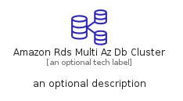
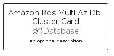

# AmazonRdsMultiAzDbCluster


```text
aws-q1-2023/Resource/Database/AmazonRdsMultiAzDbCluster
```

```text
include('aws-q1-2023/Resource/Database/AmazonRdsMultiAzDbCluster')
```


| Illustration | AmazonRdsMultiAzDbCluster | AmazonRdsMultiAzDbClusterCard | AmazonRdsMultiAzDbClusterGroup |
| :---: | :---: | :---: | :---: |
|  |  |  |  |


## AmazonRdsMultiAzDbCluster

### Load remotely
```plantuml
@startuml
' configures the library
!global $LIB_BASE_LOCATION="https://raw.githubusercontent.com/tmorin/plantuml-libs/master/distribution"

' loads the library's bootstrap
!include $LIB_BASE_LOCATION/bootstrap.puml

' loads the package bootstrap
include('aws-q1-2023/bootstrap')

' loads the Item which embeds the element AmazonRdsMultiAzDbCluster
include('aws-q1-2023/Resource/Database/AmazonRdsMultiAzDbCluster')

' renders the element
AmazonRdsMultiAzDbCluster('AmazonRdsMultiAzDbCluster', 'Amazon Rds Multi Az Db Cluster', 'an optional tech label', 'an optional description')
@enduml
```

### Load locally
```plantuml
@startuml
' configures the library
!global $INCLUSION_MODE="local"
!global $LIB_BASE_LOCATION="../../.."

' loads the library's bootstrap
!include $LIB_BASE_LOCATION/bootstrap.puml

' loads the package bootstrap
include('aws-q1-2023/bootstrap')

' loads the Item which embeds the element AmazonRdsMultiAzDbCluster
include('aws-q1-2023/Resource/Database/AmazonRdsMultiAzDbCluster')

' renders the element
AmazonRdsMultiAzDbCluster('AmazonRdsMultiAzDbCluster', 'Amazon Rds Multi Az Db Cluster', 'an optional tech label', 'an optional description')
@enduml
```

## AmazonRdsMultiAzDbClusterCard

### Load remotely
```plantuml
@startuml
' configures the library
!global $LIB_BASE_LOCATION="https://raw.githubusercontent.com/tmorin/plantuml-libs/master/distribution"

' loads the library's bootstrap
!include $LIB_BASE_LOCATION/bootstrap.puml

' loads the package bootstrap
include('aws-q1-2023/bootstrap')

' loads the Item which embeds the element AmazonRdsMultiAzDbClusterCard
include('aws-q1-2023/Resource/Database/AmazonRdsMultiAzDbCluster')

' renders the element
AmazonRdsMultiAzDbClusterCard('AmazonRdsMultiAzDbClusterCard', 'Amazon Rds Multi Az Db Cluster Card', 'an optional description')
@enduml
```

### Load locally
```plantuml
@startuml
' configures the library
!global $INCLUSION_MODE="local"
!global $LIB_BASE_LOCATION="../../.."

' loads the library's bootstrap
!include $LIB_BASE_LOCATION/bootstrap.puml

' loads the package bootstrap
include('aws-q1-2023/bootstrap')

' loads the Item which embeds the element AmazonRdsMultiAzDbClusterCard
include('aws-q1-2023/Resource/Database/AmazonRdsMultiAzDbCluster')

' renders the element
AmazonRdsMultiAzDbClusterCard('AmazonRdsMultiAzDbClusterCard', 'Amazon Rds Multi Az Db Cluster Card', 'an optional description')
@enduml
```

## AmazonRdsMultiAzDbClusterGroup

### Load remotely
```plantuml
@startuml
' configures the library
!global $LIB_BASE_LOCATION="https://raw.githubusercontent.com/tmorin/plantuml-libs/master/distribution"

' loads the library's bootstrap
!include $LIB_BASE_LOCATION/bootstrap.puml

' loads the package bootstrap
include('aws-q1-2023/bootstrap')

' loads the Item which embeds the element AmazonRdsMultiAzDbClusterGroup
include('aws-q1-2023/Resource/Database/AmazonRdsMultiAzDbCluster')

' renders the element
AmazonRdsMultiAzDbClusterGroup('AmazonRdsMultiAzDbClusterGroup', 'Amazon Rds Multi Az Db Cluster Group', 'an optional tech label') {
    note as note
        the content of the group
    end note
}
@enduml
```

### Load locally
```plantuml
@startuml
' configures the library
!global $INCLUSION_MODE="local"
!global $LIB_BASE_LOCATION="../../.."

' loads the library's bootstrap
!include $LIB_BASE_LOCATION/bootstrap.puml

' loads the package bootstrap
include('aws-q1-2023/bootstrap')

' loads the Item which embeds the element AmazonRdsMultiAzDbClusterGroup
include('aws-q1-2023/Resource/Database/AmazonRdsMultiAzDbCluster')

' renders the element
AmazonRdsMultiAzDbClusterGroup('AmazonRdsMultiAzDbClusterGroup', 'Amazon Rds Multi Az Db Cluster Group', 'an optional tech label') {
    note as note
        the content of the group
    end note
}
@enduml
```

