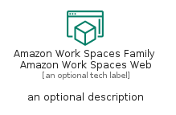
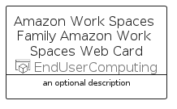

# AmazonWorkSpacesFamilyAmazonWorkSpacesWeb


```text
aws-q1-2023/Resource/EndUserComputing/AmazonWorkSpacesFamilyAmazonWorkSpacesWeb
```

```text
include('aws-q1-2023/Resource/EndUserComputing/AmazonWorkSpacesFamilyAmazonWorkSpacesWeb')
```


| Illustration | AmazonWorkSpacesFamilyAmazonWorkSpacesWeb | AmazonWorkSpacesFamilyAmazonWorkSpacesWebCard | AmazonWorkSpacesFamilyAmazonWorkSpacesWebGroup |
| :---: | :---: | :---: | :---: |
|  |  |  |  |


## Sprites
The item provides the following sriptes:

- `<$AmazonWorkSpacesFamilyAmazonWorkSpacesWebXs>`
- `<$AmazonWorkSpacesFamilyAmazonWorkSpacesWebSm>`
- `<$AmazonWorkSpacesFamilyAmazonWorkSpacesWebMd>`
- `<$AmazonWorkSpacesFamilyAmazonWorkSpacesWebLg>`


## AmazonWorkSpacesFamilyAmazonWorkSpacesWeb

### Load remotely
```plantuml
@startuml
' configures the library
!global $LIB_BASE_LOCATION="https://raw.githubusercontent.com/tmorin/plantuml-libs/master/distribution"

' loads the library's bootstrap
!include $LIB_BASE_LOCATION/bootstrap.puml

' loads the package bootstrap
include('aws-q1-2023/bootstrap')

' loads the Item which embeds the element AmazonWorkSpacesFamilyAmazonWorkSpacesWeb
include('aws-q1-2023/Resource/EndUserComputing/AmazonWorkSpacesFamilyAmazonWorkSpacesWeb')

' renders the element
AmazonWorkSpacesFamilyAmazonWorkSpacesWeb('AmazonWorkSpacesFamilyAmazonWorkSpacesWeb', 'Amazon Work Spaces Family Amazon Work Spaces Web', 'an optional tech label', 'an optional description')
@enduml
```

### Load locally
```plantuml
@startuml
' configures the library
!global $INCLUSION_MODE="local"
!global $LIB_BASE_LOCATION="../../.."

' loads the library's bootstrap
!include $LIB_BASE_LOCATION/bootstrap.puml

' loads the package bootstrap
include('aws-q1-2023/bootstrap')

' loads the Item which embeds the element AmazonWorkSpacesFamilyAmazonWorkSpacesWeb
include('aws-q1-2023/Resource/EndUserComputing/AmazonWorkSpacesFamilyAmazonWorkSpacesWeb')

' renders the element
AmazonWorkSpacesFamilyAmazonWorkSpacesWeb('AmazonWorkSpacesFamilyAmazonWorkSpacesWeb', 'Amazon Work Spaces Family Amazon Work Spaces Web', 'an optional tech label', 'an optional description')
@enduml
```

## AmazonWorkSpacesFamilyAmazonWorkSpacesWebCard

### Load remotely
```plantuml
@startuml
' configures the library
!global $LIB_BASE_LOCATION="https://raw.githubusercontent.com/tmorin/plantuml-libs/master/distribution"

' loads the library's bootstrap
!include $LIB_BASE_LOCATION/bootstrap.puml

' loads the package bootstrap
include('aws-q1-2023/bootstrap')

' loads the Item which embeds the element AmazonWorkSpacesFamilyAmazonWorkSpacesWebCard
include('aws-q1-2023/Resource/EndUserComputing/AmazonWorkSpacesFamilyAmazonWorkSpacesWeb')

' renders the element
AmazonWorkSpacesFamilyAmazonWorkSpacesWebCard('AmazonWorkSpacesFamilyAmazonWorkSpacesWebCard', 'Amazon Work Spaces Family Amazon Work Spaces Web Card', 'an optional description')
@enduml
```

### Load locally
```plantuml
@startuml
' configures the library
!global $INCLUSION_MODE="local"
!global $LIB_BASE_LOCATION="../../.."

' loads the library's bootstrap
!include $LIB_BASE_LOCATION/bootstrap.puml

' loads the package bootstrap
include('aws-q1-2023/bootstrap')

' loads the Item which embeds the element AmazonWorkSpacesFamilyAmazonWorkSpacesWebCard
include('aws-q1-2023/Resource/EndUserComputing/AmazonWorkSpacesFamilyAmazonWorkSpacesWeb')

' renders the element
AmazonWorkSpacesFamilyAmazonWorkSpacesWebCard('AmazonWorkSpacesFamilyAmazonWorkSpacesWebCard', 'Amazon Work Spaces Family Amazon Work Spaces Web Card', 'an optional description')
@enduml
```

## AmazonWorkSpacesFamilyAmazonWorkSpacesWebGroup

### Load remotely
```plantuml
@startuml
' configures the library
!global $LIB_BASE_LOCATION="https://raw.githubusercontent.com/tmorin/plantuml-libs/master/distribution"

' loads the library's bootstrap
!include $LIB_BASE_LOCATION/bootstrap.puml

' loads the package bootstrap
include('aws-q1-2023/bootstrap')

' loads the Item which embeds the element AmazonWorkSpacesFamilyAmazonWorkSpacesWebGroup
include('aws-q1-2023/Resource/EndUserComputing/AmazonWorkSpacesFamilyAmazonWorkSpacesWeb')

' renders the element
AmazonWorkSpacesFamilyAmazonWorkSpacesWebGroup('AmazonWorkSpacesFamilyAmazonWorkSpacesWebGroup', 'Amazon Work Spaces Family Amazon Work Spaces Web Group', 'an optional tech label') {
    note as note
        the content of the group
    end note
}
@enduml
```

### Load locally
```plantuml
@startuml
' configures the library
!global $INCLUSION_MODE="local"
!global $LIB_BASE_LOCATION="../../.."

' loads the library's bootstrap
!include $LIB_BASE_LOCATION/bootstrap.puml

' loads the package bootstrap
include('aws-q1-2023/bootstrap')

' loads the Item which embeds the element AmazonWorkSpacesFamilyAmazonWorkSpacesWebGroup
include('aws-q1-2023/Resource/EndUserComputing/AmazonWorkSpacesFamilyAmazonWorkSpacesWeb')

' renders the element
AmazonWorkSpacesFamilyAmazonWorkSpacesWebGroup('AmazonWorkSpacesFamilyAmazonWorkSpacesWebGroup', 'Amazon Work Spaces Family Amazon Work Spaces Web Group', 'an optional tech label') {
    note as note
        the content of the group
    end note
}
@enduml
```

