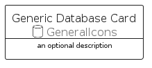

# GenericDatabase


```text
aws-q1-2023/Resource/GeneralIcons/GenericDatabase
```

```text
include('aws-q1-2023/Resource/GeneralIcons/GenericDatabase')
```


| Illustration | GenericDatabase | GenericDatabaseCard | GenericDatabaseGroup |
| :---: | :---: | :---: | :---: |
|  |  |  |  |


## GenericDatabase

### Load remotely
```plantuml
@startuml
' configures the library
!global $LIB_BASE_LOCATION="https://raw.githubusercontent.com/tmorin/plantuml-libs/master/distribution"

' loads the library's bootstrap
!include $LIB_BASE_LOCATION/bootstrap.puml

' loads the package bootstrap
include('aws-q1-2023/bootstrap')

' loads the Item which embeds the element GenericDatabase
include('aws-q1-2023/Resource/GeneralIcons/GenericDatabase')

' renders the element
GenericDatabase('GenericDatabase', 'Generic Database', 'an optional tech label', 'an optional description')
@enduml
```

### Load locally
```plantuml
@startuml
' configures the library
!global $INCLUSION_MODE="local"
!global $LIB_BASE_LOCATION="../../.."

' loads the library's bootstrap
!include $LIB_BASE_LOCATION/bootstrap.puml

' loads the package bootstrap
include('aws-q1-2023/bootstrap')

' loads the Item which embeds the element GenericDatabase
include('aws-q1-2023/Resource/GeneralIcons/GenericDatabase')

' renders the element
GenericDatabase('GenericDatabase', 'Generic Database', 'an optional tech label', 'an optional description')
@enduml
```

## GenericDatabaseCard

### Load remotely
```plantuml
@startuml
' configures the library
!global $LIB_BASE_LOCATION="https://raw.githubusercontent.com/tmorin/plantuml-libs/master/distribution"

' loads the library's bootstrap
!include $LIB_BASE_LOCATION/bootstrap.puml

' loads the package bootstrap
include('aws-q1-2023/bootstrap')

' loads the Item which embeds the element GenericDatabaseCard
include('aws-q1-2023/Resource/GeneralIcons/GenericDatabase')

' renders the element
GenericDatabaseCard('GenericDatabaseCard', 'Generic Database Card', 'an optional description')
@enduml
```

### Load locally
```plantuml
@startuml
' configures the library
!global $INCLUSION_MODE="local"
!global $LIB_BASE_LOCATION="../../.."

' loads the library's bootstrap
!include $LIB_BASE_LOCATION/bootstrap.puml

' loads the package bootstrap
include('aws-q1-2023/bootstrap')

' loads the Item which embeds the element GenericDatabaseCard
include('aws-q1-2023/Resource/GeneralIcons/GenericDatabase')

' renders the element
GenericDatabaseCard('GenericDatabaseCard', 'Generic Database Card', 'an optional description')
@enduml
```

## GenericDatabaseGroup

### Load remotely
```plantuml
@startuml
' configures the library
!global $LIB_BASE_LOCATION="https://raw.githubusercontent.com/tmorin/plantuml-libs/master/distribution"

' loads the library's bootstrap
!include $LIB_BASE_LOCATION/bootstrap.puml

' loads the package bootstrap
include('aws-q1-2023/bootstrap')

' loads the Item which embeds the element GenericDatabaseGroup
include('aws-q1-2023/Resource/GeneralIcons/GenericDatabase')

' renders the element
GenericDatabaseGroup('GenericDatabaseGroup', 'Generic Database Group', 'an optional tech label') {
    note as note
        the content of the group
    end note
}
@enduml
```

### Load locally
```plantuml
@startuml
' configures the library
!global $INCLUSION_MODE="local"
!global $LIB_BASE_LOCATION="../../.."

' loads the library's bootstrap
!include $LIB_BASE_LOCATION/bootstrap.puml

' loads the package bootstrap
include('aws-q1-2023/bootstrap')

' loads the Item which embeds the element GenericDatabaseGroup
include('aws-q1-2023/Resource/GeneralIcons/GenericDatabase')

' renders the element
GenericDatabaseGroup('GenericDatabaseGroup', 'Generic Database Group', 'an optional tech label') {
    note as note
        the content of the group
    end note
}
@enduml
```

