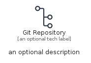
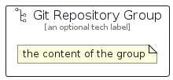

# GitRepository


```text
aws-q1-2023/Resource/GeneralIcons/GitRepository
```

```text
include('aws-q1-2023/Resource/GeneralIcons/GitRepository')
```


| Illustration | GitRepository | GitRepositoryCard | GitRepositoryGroup |
| :---: | :---: | :---: | :---: |
|  |  |  |  |


## Sprites
The item provides the following sriptes:

- `<$GitRepositoryXs>`
- `<$GitRepositorySm>`
- `<$GitRepositoryMd>`
- `<$GitRepositoryLg>`


## GitRepository

### Load remotely
```plantuml
@startuml
' configures the library
!global $LIB_BASE_LOCATION="https://raw.githubusercontent.com/tmorin/plantuml-libs/master/distribution"

' loads the library's bootstrap
!include $LIB_BASE_LOCATION/bootstrap.puml

' loads the package bootstrap
include('aws-q1-2023/bootstrap')

' loads the Item which embeds the element GitRepository
include('aws-q1-2023/Resource/GeneralIcons/GitRepository')

' renders the element
GitRepository('GitRepository', 'Git Repository', 'an optional tech label', 'an optional description')
@enduml
```

### Load locally
```plantuml
@startuml
' configures the library
!global $INCLUSION_MODE="local"
!global $LIB_BASE_LOCATION="../../.."

' loads the library's bootstrap
!include $LIB_BASE_LOCATION/bootstrap.puml

' loads the package bootstrap
include('aws-q1-2023/bootstrap')

' loads the Item which embeds the element GitRepository
include('aws-q1-2023/Resource/GeneralIcons/GitRepository')

' renders the element
GitRepository('GitRepository', 'Git Repository', 'an optional tech label', 'an optional description')
@enduml
```

## GitRepositoryCard

### Load remotely
```plantuml
@startuml
' configures the library
!global $LIB_BASE_LOCATION="https://raw.githubusercontent.com/tmorin/plantuml-libs/master/distribution"

' loads the library's bootstrap
!include $LIB_BASE_LOCATION/bootstrap.puml

' loads the package bootstrap
include('aws-q1-2023/bootstrap')

' loads the Item which embeds the element GitRepositoryCard
include('aws-q1-2023/Resource/GeneralIcons/GitRepository')

' renders the element
GitRepositoryCard('GitRepositoryCard', 'Git Repository Card', 'an optional description')
@enduml
```

### Load locally
```plantuml
@startuml
' configures the library
!global $INCLUSION_MODE="local"
!global $LIB_BASE_LOCATION="../../.."

' loads the library's bootstrap
!include $LIB_BASE_LOCATION/bootstrap.puml

' loads the package bootstrap
include('aws-q1-2023/bootstrap')

' loads the Item which embeds the element GitRepositoryCard
include('aws-q1-2023/Resource/GeneralIcons/GitRepository')

' renders the element
GitRepositoryCard('GitRepositoryCard', 'Git Repository Card', 'an optional description')
@enduml
```

## GitRepositoryGroup

### Load remotely
```plantuml
@startuml
' configures the library
!global $LIB_BASE_LOCATION="https://raw.githubusercontent.com/tmorin/plantuml-libs/master/distribution"

' loads the library's bootstrap
!include $LIB_BASE_LOCATION/bootstrap.puml

' loads the package bootstrap
include('aws-q1-2023/bootstrap')

' loads the Item which embeds the element GitRepositoryGroup
include('aws-q1-2023/Resource/GeneralIcons/GitRepository')

' renders the element
GitRepositoryGroup('GitRepositoryGroup', 'Git Repository Group', 'an optional tech label') {
    note as note
        the content of the group
    end note
}
@enduml
```

### Load locally
```plantuml
@startuml
' configures the library
!global $INCLUSION_MODE="local"
!global $LIB_BASE_LOCATION="../../.."

' loads the library's bootstrap
!include $LIB_BASE_LOCATION/bootstrap.puml

' loads the package bootstrap
include('aws-q1-2023/bootstrap')

' loads the Item which embeds the element GitRepositoryGroup
include('aws-q1-2023/Resource/GeneralIcons/GitRepository')

' renders the element
GitRepositoryGroup('GitRepositoryGroup', 'Git Repository Group', 'an optional tech label') {
    note as note
        the content of the group
    end note
}
@enduml
```

